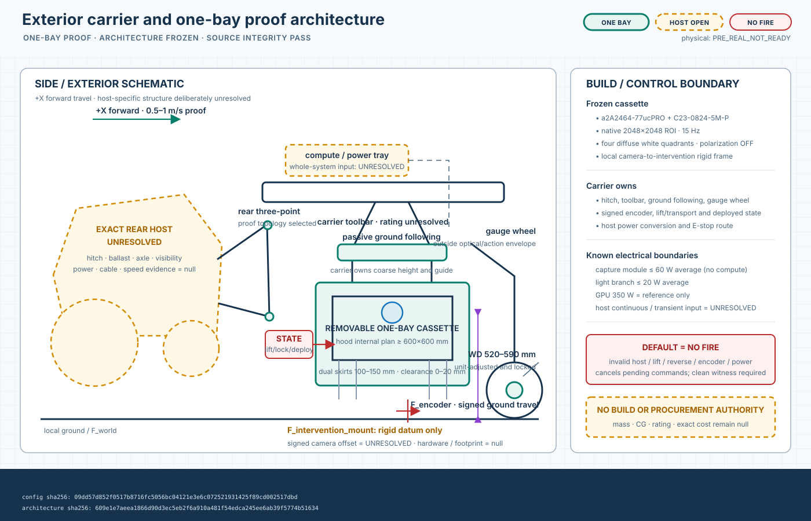
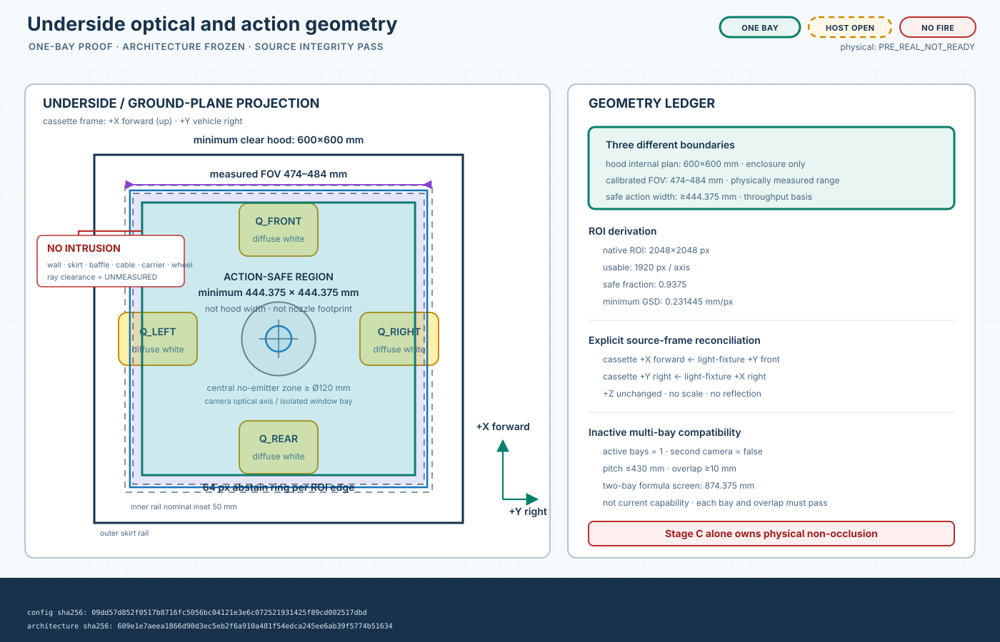
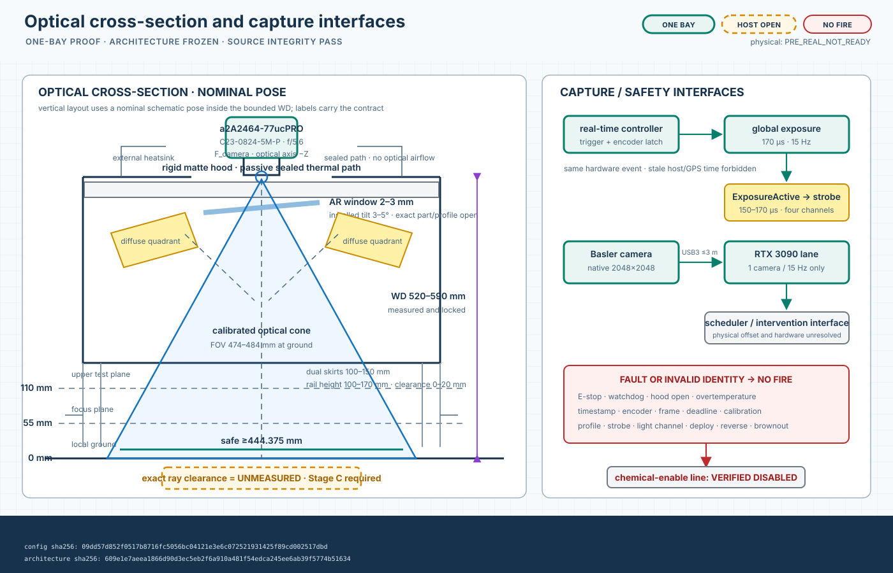

# Spot-Spray Product Architecture V1

> **Canonical outcome:** one controlled, removable spot-spray proof bay is selected at desk-integration level. The result is `INTEGRATION_CONSISTENT_PRE_REAL` with exact source integrity `PASS`; it is **not** physical acceptance, procurement authority, controlled-capture authority, field GO, product GO, dry-marker readiness, certified ingress, or chemical-fire authority.

This document is generated deterministically from the pinned architecture result, normalized BOM and visual manifest. It reconciles the terminal sensor/optics, light/enclosure and platform plans and surveys without transferring their ownership.

## 1. Independent status axes

| Axis | Current state | Meaning |
| --- | --- | --- |
| Architecture | `FROZEN_BASELINE` | One-bay selection is frozen for proof. |
| Source integration | `INTEGRATION_CONSISTENT_PRE_REAL` | 19 exact-byte inputs verified; six terminal files are commit-bound. |
| Exact host | `HOST_UNRESOLVED` | No tractor-specific build authority. |
| Physical acceptance | `PRE_REAL_NOT_READY` | No physical A–E receipt exists. |
| Controlled capture | `false` | Only the existing rig evaluator may grant it. |
| Dry marker | `false` | Requires physical A–F evidence. |
| Field / product GO | `false` / `false` | Not granted. |
| Purchase | `false` | No procurement or fabrication authorization. |
| Chemical fire | `false` | Verified-disabled enable line; agronomic safety evidence absent. |

“Frozen” below means a build-and-test baseline only. It never means physically READY.

### Evidence reading key

| Evidence kind | Machine class | Result locations | Claim limit |
| --- | --- | --- | --- |
| Sourced facts | `FROZEN_REPOSITORY_CONTRACT`, `TERMINAL_LANE_DECISION` | `source_integrity.sources`, `baseline`, `decision_items` | exact_pinned_desk_evidence_not_installed_hardware_evidence |
| Deterministic calculations | `DETERMINISTIC_CALCULATION` | `calculations`, `bom.totals` | arithmetic_from_pinned_primitives_not_physical_measurement |
| Integration hypotheses | `ENGINEERING_INTEGRATION_INFERENCE` | `ownership_boundary`, `coordinate_frames`, `spatial_contract`, `interface_contract` | interface_hypothesis_only_cannot_create_a_physical_PASS |
| Physically unmeasured | `NO_EVIDENCE_NULL` | `decision_items`, `calculations.mechanical_payload`, `calculations.power_status` | unknowns_remain_null_until_owning_physical_evidence_exists |
| Physical measurements | `PHYSICAL_MEASUREMENT` | `acceptance_binding` | reserved_for_hash_bound_rig_evaluator_receipts_none_current; current product receipts = 0 |

Sourced facts retain their owning lane; deterministic calculations are arithmetic, not observations. Integration hypotheses connect interfaces without creating a physical fact. Every physically unmeasured value remains `null`, and the current product-level physical receipt count is zero.

### Source release closure

| Release control | Verified value | Fail-closed meaning |
| --- | --- | --- |
| Implementation base | `a24f7dec956af170436bcb17d679aa53918c9ec8` | reachable from HEAD and contains the exact six terminal source files |
| Terminal source admission | 6/6 committed bytes verified | current plan/survey bytes must equal both SHA-256 pins and the containing commit tree |
| Drift response | `INTEGRATION_INVALID_SOURCE_DRIFT` | missing, modified, uncommitted or commit-mismatched terminal input stops before calculation |

The six terminal lane plans and surveys are admitted only when their current bytes match both their SHA-256 pins and implementation-base commit `a24f7dec956af170436bcb17d679aa53918c9ec8`. This commit binding proves repository provenance for those decision-owning inputs; it does not promote any physical, host, procurement, field or chemical state.

## 2. Selected price-performance proof product

| Subsystem | Frozen proof baseline | Owner / boundary |
| --- | --- | --- |
| Camera | 1× `a2A2464-77ucPRO`, order `109779`, global-shutter visible RGB with factory IR-cut | sensor_optics |
| Lens | `C23-0824-5M-P`, f/5.6 | sensor_optics |
| Raster | native 2048×2048 ROI at offset (200, 0); resize forbidden | sensor_optics |
| Optical geometry | FOV 474–484 mm; WD 520–590 mm; planes 0/55/110 mm | sensor_optics; physical Stage C still required |
| Capture | 170 µs at 15 Hz | compute_capture |
| Light | four diffuse visible-white quadrants, 4500–5500 K, CRI ≥90, simultaneous all-on, polarization OFF | light_enclosure; exact installed profile remains open |
| Enclosure | minimum 600×600 mm internal hood; dual 100–150 mm skirts; 0–20 mm clearance; tilted window | light_enclosure; functional proof enclosure, not certified ingress |
| Carrier | `manual_tractor_rear_three_point_rigid_toolbar` | platform_carrier; exact rear host unresolved |
| Reusable unit | `removable_ground_following_lower_bay_cassette` | cassette is local rigid calibration frame; carrier stays host-specific |
| Travel | ground-contact signed quadrature encoder; proof speeds 0.5 and 1.0 m/s | platform_carrier |
| Compute | existing NVIDIA_RTX_3090; one camera at 15 Hz only; dedicated USB3 root | compute_capture; measured Stage-E proxy is not an end-to-end physical PASS |
| Intervention | rigid local mounting datum only; hardware, footprint, signed offset, deposition and chemistry are null/external | intervention_external |

The selected carrier architecture is a manually driven rear-three-point one-bay proof toolbar with a removable ground-following cassette. A front-three-point carrier is trigger-only; multi-bay/qualified-boom and dedicated-trailed carriers remain later scale routes. No autonomous platform is part of this proof.

## 3. Engineering views

Each SVG is generated from the same architecture result, contains the full config and result hashes, names unresolved values explicitly, and carries **NOT A FABRICATION DRAWING**.

## 4. Geometry, pixels, blur, payload and throughput

| Derived quantity | Exact result | Claim boundary |
| --- | --- | --- |
| Active sensor span | 7.0656 mm | deterministic from 2048 px × 3.45 µm |
| GSD over measured FOV | 0.231445312500–0.236328125000 mm/px | nominal geometry, not installed Stage-C evidence |
| Nominal target support at 480 mm | 10 mm = 42.666667 px; 20 mm = 85.333333 px | 10 mm is an optical witness; 20 mm is the first action service class |
| Smear at 0.5 / 1.0 m/s | 0.085 / 0.170 mm | 170 µs exposure |
| Worst calculated blur | 0.734514767932 px | must remain ≤0.75 px |
| Action-safe widths | 444.375 / 450.000 / 453.750 mm | 474/480/484 mm FOV after 64 px per-edge abstention |
| Bayer10 at 15 Hz | 629.1456 Mbit/s raw; 754.97472 Mbit/s with 20% headroom | data payload, not mechanical payload |
| Gross geometric throughput | 0.0799875 ha/h at 0.5 m/s; 0.159975 ha/h at 1.0 m/s | uses conservative safe width; excludes turns, misses and duty losses |
| Compute proxy | batch-4 p95 52.679592510685 ms; margin 13.987074155981 ms | proxy checkpoint differs from selected foundation; no end-to-end readiness claim |
| Inactive two-bay formula screen | 874.375 mm safe swath at max pitch; hood ≥1030 mm | compatibility-only; second camera is false and every bay/overlap requires new evidence |

### Why 600 mm is not 444.375 mm

- **600×600 mm** is the minimum clear internal hood plan used to package optics, four lights, diffusers, baffles, the window, skirts, cable routes and thermal paths.
- **474–484 mm** is the measured ground FOV range.
- **444.375 mm** is the conservative action-safe width after the 64 px outer ring is abstained: `474 × (2048 − 2×64) / 2048`.
- Only the action-safe width enters the throughput calculation. Hood width, unmasked FOV and an unknown intervention footprint do not.
- Installed optical-cone clearance remains `null`; the existing physical Stage-C authority must prove non-occlusion.

## 5. Ownership and coordinate reconciliation

| Boundary | Owns | Does not silently acquire |
| --- | --- | --- |
| Cassette | rigid_local_coordinate_frame, camera_hood_light_mounting_interfaces, rigid_camera_to_intervention_mount_relationship, fine_working_height_adjustment, local_identity_and_calibration_fiducials, no_intrusion_envelopes, cable_termination_and_strain_relief | host hitch, gross structure or carrier qualification |
| Carrier | exact_host_and_three_point_adapter, transverse_toolbar_and_structural_load_path, passive_ground_following_mechanism_and_gauge_wheel, lift_transport_lock_and_deployed_state, host_power_conversion_and_estop_routing, compute_power_tray_and_host_specific_cable_route, ballast_axle_hitch_and_moment_qualification | camera, lens, light internals or intervention agronomy |
| Sensor / optics | camera, sensor, lens, roi, fov, working_distance | light, carrier or chemical decisions |
| Light / enclosure | emitters, diffuser, window, hood_optical_internals, cooling | sensor modality, platform or chemistry |
| Intervention | nozzle, valve, pressure, tank, deposition, crop_injury, chemistry | camera/light/platform acceptance |

All general product frames use right-handed `+X` forward travel, `+Y` vehicle right and `+Z` up. The light survey’s fixture frame used `+X` vehicle right and `+Y` vehicle front, so the contract records an exact axis permutation: cassette `+X ← light +Y`, cassette `+Y ← light +X`, `+Z` unchanged. It does not silently reinterpret either source.

The required frames are `F_world`, `F_carrier`, `F_cassette`, `F_camera`, `F_ground_calibration`, `F_light_fixture`, `F_encoder` and `F_intervention_mount`. Host, installed-camera, ground-calibration, encoder and intervention transforms remain physically unresolved where their owning evidence is absent.

## 6. Data, timing, tracking and safety flow

`signed ground encoder → same-event trigger + encoder latch → global-shutter camera → ExposureActive → isolated four-channel strobe → dedicated USB3 root → one-camera RTX 3090 tracking/result lane → scheduler/intervention interface`

The scheduler may consume only identity-bound frame, timestamp, encoder, calibration, bay, profile and result records. Host-arrival time, GPS-only speed, display speed, CAD-assumed intervention offset and stale metadata are not control authority.

| Interface | Owner → counterparty | State | Value / limit |
| --- | --- | --- | --- |
| host_structure_to_carrier | host_owner → platform_carrier | HOST_UNRESOLVED | `null`; exact_host_hitch_lift_moment_ballast_and_transport_ratings_absent |
| host_power_to_regulated_distribution | host_owner → safety_acceptance | HOST_UNRESOLVED | `null`; measured_steady_transient_conversion_drop_and_brownout_evidence_absent |
| carrier_to_removable_cassette | platform_carrier → integration_only | FROZEN_BASELINE | `rigid_identified_seat_with_ground_follow_connection_and_hard_deployed_witness`; exact_host_specific_geometry_and_loads_unmeasured |
| trigger_to_camera_and_encoder_latch | compute_capture → platform_carrier | FROZEN_BASELINE | `same_hardware_event`; physical_stage_B_timing_receipt_absent |
| camera_exposureactive_to_strobe | light_enclosure → sensor_optics | FROZEN_BASELINE | `isolated_driver_four_channels_all_on_inside_global_exposure`; exact_installed_strobe_profile_open_bench_variable |
| camera_to_compute_data | compute_capture → sensor_optics | FROZEN_BASELINE | `dedicated_USB3_root_locking_cable_maximum_3m_one_camera_15Hz`; measured_compute_is_proxy_not_end_to_end_physical_PASS |
| camera_to_intervention_mount | integration_only → intervention_external | OPEN_BENCH_VARIABLE | `null`; rigid_datum_exists_but_signed_offset_hardware_and_footprint_are_unmeasured |
| safety_to_strobe_and_intervention_enable | safety_acceptance → intervention_external | FROZEN_BASELINE | `default_no_fire_chemical_enable_verified_disabled`; integration_does_not_grant_controlled_capture_or_dry_marker_authority |

All 16 material fault states are fail-closed: estop, watchdog, hood_open, overtemperature, invalid_timestamp, stale_encoder, frame_drop, deadline_miss, calibration_invalid, profile_mismatch, malformed_strobe, partial_light_channel_failure, invalid_deployed_state, lift_or_transport_state, reverse_or_ambiguous_direction, brownout_or_reboot. Every affected pending command is discarded within its defined scope and recovery requires a fresh valid witness. The chemical-enable hardware line remains verified disabled.

## 7. Illumination, enclosure and agronomic variability

- The baseline is broad visible-white illumination with four cardinal diffuse quadrants, simultaneous all-on firing, factory IR-cut retained and polarization physically OFF.
- Exact LED/bin, diffuser, current vector, optical energy, aim, window installation, thermal interface, skirt material and installed profile remain bench variables. Catalogue values do not populate them.
- Agronomic/optical variability is confronted through the existing installed-rig program: 0/55/110 mm planes, full-field regions, external-light/skirt states, wet-leaf/soil glare attribution and thermal/fault arms.
- Cross-polarization opens only after the paired wet-leaf/soil glare trigger and must reduce glare by at least 50% while every other absolute gate still passes.
- Visible mono, RGB+NIR, multispectral, RGB+thermal and RGB+depth remain closed challengers. Only the sensor lane may open a bounded A/B after an attributable terminal failure.
- The 10 mm target is an optical witness, not an action promise. The first action service class is 20 mm, and no weed-control effectiveness, deposition, dose, crop-injury or yield claim exists.

## 8. Mechanical, power and thermal status

- Required mechanical components are reported separately, but all assembled masses and signed CG distances are physically unmeasured. Therefore payload, moment and combined CG are `null` by rule.
- The light branch ceiling is 20 W average; the capture module ceiling is 60 W average excluding compute; 240 W is a peak electrical ceiling, not a setpoint.
- The RTX 3090 350 W board figure and 750 W reference PSU are reference-only, not vehicle input measurements.
- Whole-compute draw, conversion/distribution losses, integrated continuous draw and integrated transient draw remain `null`. Exact host power qualification therefore remains open.
- The inherited thermal campaign is at least 120 minutes over 5–40 °C, with camera housing ≤50 °C and LED plate ≤60 °C. No physical receipt exists yet.

## 9. BOM and cost boundary

| Cost boundary | USD | Meaning |
| --- | --- | --- |
| Proof module before contingency | 3115.00–6545.00 | source-bound dated module evidence |
| Proof module with 15% contingency | 3582.25–7526.75 | budget screen, not landed quote |
| Rear carrier engineering screen | 4300.00–14000.00 | engineering screen, explicitly not a quote |
| Bounded module + carrier screen | 7882.25–21526.75 | not an integrated product total |
| Integrated one-bay total | `null` | remains null until every required cost and overlap reconciliation is complete |

The normalized line-level BOM is [`bom.csv`](results/spot_spray_product_architecture_v1/bom.csv). Existing RTX 3090 incremental acquisition is allowed to be USD 0 only because it is explicitly an existing asset; its power, opportunity cost and integration cost are not zero. Unknown required costs serialize empty/`null`, never zero. Chemical savings, yield, acreage, labor and autonomy benefits are forbidden credits.

Integrated-total blockers: exact_rear_carrier_cost: exact_host_material_mass_fabrication_and_quote_absent; exact_host_incremental_cost: exact_host_inventory_and_ownership_scenario_absent; compute_opportunity_cost: reuse_does_not_prove_zero_opportunity_or_integration_cost; intervention_external_cost: intervention_lane_has_not_selected_or_quoted_hardware; physical_acceptance_execution_cost: facility_labor_and_instrument_availability_not_quoted; host_integration_shared_pending_reconciliation: source_allowance_overlap_requires_line_by_line_quote_reconciliation.

## 10. Alternatives and opening triggers

| Alternative | Current state | Only opening trigger | Decision rule / owner |
| --- | --- | --- | --- |
| alternative_modalities | CHALLENGER_CLOSED_NOT_TRIGGERED | terminal_sensor_failure_attribution_trigger | owning_sensor_lane_bounded_AB_only / sensor_optics |
| cross_polarization | CHALLENGER_CLOSED_NOT_TRIGGERED | paired_wet_leaf_and_soil_glare_failure | promote_only_with_50pct_glare_reduction_and_all_other_gates_pass / light_enclosure |
| external_heatsink_fan | CHALLENGER_CLOSED_NOT_TRIGGERED | larger_passive_sink_fails_exact_thermal_gate | authority_replanned_single_external_fan_challenger / light_enclosure |
| front_three_point_challenger | CHALLENGER_CLOSED_NOT_TRIGGERED | exact_rear_host_capacity_or_lane_geometry_failure | open_one_front_candidate_with_same_frozen_bay / platform_carrier |
| rate_20hz | CHALLENGER_CLOSED_NOT_TRIGGERED | 15Hz_physical_A_to_E_pass_then_new_end_to_end_benchmark | p95_at_most_50ms_zero_miss_zero_drop / compute_capture |
| second_camera | CHALLENGER_CLOSED_NOT_TRIGGERED | product_swath_need_plus_single_bay_A_to_E_plus_independent_compute | separate_compute_lane_or_new_multi_camera_end_to_end_benchmark / compute_capture |
| scale_carrier | OUT_OF_SCOPE | physical_A_to_E_and_independent_multi_bay_compute_evidence | exact_host_gate_then_TCO_tie_break / platform_carrier |

Cost or preference cannot compensate for a failed provenance, geometry, safety, compute, host or acceptance gate. One trigger opens at most the bounded challenger owned by that lane.

## 11. Physically unmeasured values and next evidence

| Unresolved item | Value | Evidence trigger | Who may resolve it |
| --- | --- | --- | --- |
| installed_light_profile | `null` | installed_D0_to_D9_candidate_sequence | first_eligible_exact_profile_passing_all_absolute_gates |
| exact_rear_host | `null` | exact_host_intake_complete | pass_all_structural_geometry_speed_power_cable_and_safety_hard_gates |
| whole_compute_system_power | `null` | exact_installed_compute_power_measurement | measure_steady_transient_startup_and_brownout_at_15Hz |
| cassette_mass | `null` | exact_assembly_mass_measurement | weigh_each_required_subassembly_with_uncertainty |
| cassette_center_of_gravity | `null` | exact_assembly_CG_measurement | measure_signed_CG_relative_to_declared_carrier_datum |
| camera_to_intervention_offset | `null` | physical_stage_F_measurement | populate_only_from_hash_bound_physical_registration_receipt |
| controlled_capture_authority | `false` | physical_A_to_E_hash_bound_receipt | existing_rig_evaluator_only |
| dry_marker_authority | `false` | physical_A_to_F_hash_bound_receipt | existing_rig_evaluator_only |
| chemical_enable | `false` | new_separately_authorized_chemical_safety_scope | full_replan_required |

The next highest-value physical step is **one exact-host-qualified, hash-bound one-bay A–E bench campaign**, after exact host intake and installed BOM identities—not another market survey. Physical A–F may authorize a non-chemical dry marker only through the existing evaluator. Chemical operation requires a separate authorized safety/agronomy scope and full re-plan.

## 12. Re-plan triggers

- `sensor_lane_rejects_Basler_PRO_or_C23`
- `measured_safe_width_below_444p375mm`
- `600x600mm_enclosure_cannot_package_frozen_optical_light_stack_without_occlusion`
- `no_bounded_light_profile_passes_existing_gates`
- `one_camera_15Hz_stage_E_failure`
- `required_speed_above_1m_s`
- `required_safe_swath_above_444p375mm`
- `action_service_class_below_20mm`
- `second_camera_or_multi_bay_becomes_required`
- `certified_ingress_washdown_dust_shock_or_vibration_required`
- `no_rear_or_triggered_front_host_preserves_the_frozen_bay`
- `exact_host_power_or_structure_cannot_support_measured_one_bay_assembly`
- `intervention_or_crop_safety_contract_changes_action_geometry`
- `acceptance_authority_changes_materially`
- `chemical_operation_enters_scope`

Any terminal lane plan or survey byte drift invalidates this generated package. Capture or acceptance authority drift requires explicit source re-freeze or full integration re-plan before any consistent result can be emitted.

## 13. Source lock

| Source ID | Pinned file | Owner / role | SHA-256 | Containing commit |
| --- | --- | --- | --- | --- |
| capture_optimization_contract | [`configs/deploy/spot_spray_capture_optimization_v2.yaml`](../configs/deploy/spot_spray_capture_optimization_v2.yaml) | compute_capture / frozen_numeric_capture_contract | `f9fd1cbed95118b4606199e9b67b317c07384e2cb063b60a00e5466848f657e9` | — |
| capture_optimization_document | [`docs/CONTROLLED_CAPTURE_OPTIMIZATION_V2.md`](CONTROLLED_CAPTURE_OPTIMIZATION_V2.md) | compute_capture / frozen_capture_derivation_document | `c5eb80d8eb074b36463906a4dee993776d2415ae1e41ad50a988c8592e8ed7aa` | — |
| capture_optimization_result | [`docs/results/controlled_capture_optimization_v2.json`](results/controlled_capture_optimization_v2.json) | compute_capture / frozen_golden_calculation_result | `0808c68d40285ff3eba5fb3d13603bc42c12c16d9bacc4fd87470a3c26eafbc8` | — |
| compute_summary | [`docs/results/spot_spray_deploy_compute_summary_v1.json`](results/spot_spray_deploy_compute_summary_v1.json) | compute_capture / measured_compute_proxy_without_halo | `b03898f35891e304631bfb410089aefdea7f4c5e339f4a9ccef27dc947d28804` | — |
| halo_compute_summary | [`docs/results/spot_spray_deploy_compute_halo_summary_v1.json`](results/spot_spray_deploy_compute_halo_summary_v1.json) | compute_capture / measured_64px_halo_compute_proxy | `945c1e43ed9e672d58cc44a57a6a046f202bb285a43b9f385751e297e22de4e7` | — |
| integrated_contract_release | [`docs/SPOT_SPRAY_INTEGRATED_CONTRACT_RELEASE_V1.md`](SPOT_SPRAY_INTEGRATED_CONTRACT_RELEASE_V1.md) | safety_acceptance / current_provenance_and_claim_boundary | `ad867317332dc2421188bad5903b47e6c0deeb08912243103d74e1ead5d426ad` | — |
| light_enclosure_plan | [`docs/plans/part-spot-spray-light-enclosure-adaptive-plan.md`](plans/part-spot-spray-light-enclosure-adaptive-plan.md) | light_enclosure / terminal_light_enclosure_ownership_challenger_and_stopping_rules | `b90d73200f4384cd00ee466d43420d22ff078b3d97c5619cd581eefc8e893bb5` | `a24f7dec956af170436bcb17d679aa53918c9ec8` |
| light_enclosure_survey | [`docs/research/SPOT_SPRAY_LIGHT_ENCLOSURE_SURVEY_V1.md`](research/SPOT_SPRAY_LIGHT_ENCLOSURE_SURVEY_V1.md) | light_enclosure / terminal_light_enclosure_decision | `ddb34ff6db4eac7065cd0c4fed5d103b119b5a46c430cf2ba08fb5fa7dba7dc1` | `a24f7dec956af170436bcb17d679aa53918c9ec8` |
| platform_product_plan | [`docs/plans/part-spot-spray-platform-product-adaptive-plan.md`](plans/part-spot-spray-platform-product-adaptive-plan.md) | platform_carrier / terminal_platform_ownership_challenger_and_stopping_rules | `6ef6d94819bffdb303b3e121f52a0d6cb19e91ee49f10a5ddba84f217f6c1292` | `a24f7dec956af170436bcb17d679aa53918c9ec8` |
| platform_product_survey | [`docs/research/SPOT_SPRAY_PLATFORM_PRODUCT_SURVEY_V1.md`](research/SPOT_SPRAY_PLATFORM_PRODUCT_SURVEY_V1.md) | platform_carrier / terminal_platform_product_decision | `38ccf561fff37f64e4f1aed192b06e03196ca13f40734fc876188c3e817c50e5` | `a24f7dec956af170436bcb17d679aa53918c9ec8` |
| product_imaging_contract | [`configs/deploy/spot_spray_product_imaging_decision_v1.yaml`](../configs/deploy/spot_spray_product_imaging_decision_v1.yaml) | sensor_optics / frozen_product_imaging_contract | `052241b48ad675945f8628c1618d1d337bca0818cd109c825197636dd5d98123` | — |
| product_imaging_document | [`docs/SPOT_SPRAY_PRODUCT_IMAGING_DECISION_V1.md`](SPOT_SPRAY_PRODUCT_IMAGING_DECISION_V1.md) | sensor_optics / frozen_product_imaging_decision | `c4b7ee5d77fb897576c322a35ab820d882986a096eff225a5364f354b2d0269f` | — |
| rig_acceptance_contract | [`configs/deploy/spot_spray_rig_acceptance_v1.yaml`](../configs/deploy/spot_spray_rig_acceptance_v1.yaml) | safety_acceptance / sole_physical_acceptance_policy | `a6c0e69f1c489e58b7a6c94a92bf50d9dfd97eef0c1b6ec709b872b2f7b66e3c` | — |
| rig_acceptance_evaluator | [`scripts/evaluate_spot_spray_rig_acceptance_v1.py`](../scripts/evaluate_spot_spray_rig_acceptance_v1.py) | safety_acceptance / sole_physical_acceptance_evaluator | `596c6db31e6ce90f06b1019657e58631415f1b90fdeeb9fdbd917b4ab461fda2` | — |
| rig_acceptance_runbook | [`docs/SPOT_SPRAY_RIG_ACCEPTANCE_RUNBOOK_V1.md`](SPOT_SPRAY_RIG_ACCEPTANCE_RUNBOOK_V1.md) | safety_acceptance / physical_A_to_F_runbook | `9b73fb34741d8862f27abc4aab30e42268fadb2ad05233d3b201f098fb1acb78` | — |
| sensor_optics_plan | [`docs/plans/part-spot-spray-sensor-optics-adaptive-plan.md`](plans/part-spot-spray-sensor-optics-adaptive-plan.md) | sensor_optics / terminal_sensor_optics_ownership_challenger_and_stopping_rules | `d3e65e265052b7d47e7d6522f8679145951b9bd7bbc8c9d2aa4dccef7e67c19b` | `a24f7dec956af170436bcb17d679aa53918c9ec8` |
| sensor_optics_survey | [`docs/research/SPOT_SPRAY_SENSOR_OPTICS_SURVEY_V1.md`](research/SPOT_SPRAY_SENSOR_OPTICS_SURVEY_V1.md) | sensor_optics / terminal_sensor_optics_decision | `36bb374664d4a799706facc1ac7914cc8913757510b0bb618e9a765557aa52e8` | `a24f7dec956af170436bcb17d679aa53918c9ec8` |
| track_action_contract | [`configs/benchmark/spot_spray_target_rig_action_eval_v1.yaml`](../configs/benchmark/spot_spray_target_rig_action_eval_v1.yaml) | intervention_external / frozen_track_action_contract | `210e6feddb93ca269d78a9947b48c2a84d0fb382828ba3265ff7debe06b74b09` | — |
| track_action_evaluator | [`scripts/evaluate_spot_spray_target_rig_action_v1.py`](../scripts/evaluate_spot_spray_target_rig_action_v1.py) | intervention_external / frozen_track_action_evaluator | `3943090f5b34d730426bbb23e255757f1af28a89b3bbfc2f5a093a57e8ce9e45` | — |

The acceptance contract’s exact bytes and canonical policy are separately checked. This integration layer references the existing evaluator; it does not imitate it or evaluate physical receipts.

## 14. Artifact identities

| Artifact | Path | SHA-256 |
| --- | --- | --- |
| Canonical config | [`configs/deploy/spot_spray_product_architecture_v1.yaml`](../configs/deploy/spot_spray_product_architecture_v1.yaml) | `09dd57d852f0517b8716fc5056bc04121e3e6c072521931425f89cd002517dbd` |
| Architecture JSON | [`architecture.json`](results/spot_spray_product_architecture_v1/architecture.json) | `609e1e7aeea1866d90d3ec5eb2f6a910a481f54edca245ee6ab39f5774b51634` |
| Normalized BOM | [`bom.csv`](results/spot_spray_product_architecture_v1/bom.csv) | `d25e399ef864ee7656b48d9eb2a344de03bffe9bd8e47a47e5810d9d68f56b1c` |
| Visual manifest | [`visual_manifest.json`](results/spot_spray_product_architecture_v1/visual_manifest.json) | `103235690689ba8bc0c7b98744c05505e8abba46f7f6ee743eabc2dea8ac926f` |
| exterior | [`exterior.svg`](results/spot_spray_product_architecture_v1/exterior.svg) | `1794c6f2d49a21a7afd56d96bb7c6b6517301513e197928c2a7f3709947f3825` |
| underside | [`underside.svg`](results/spot_spray_product_architecture_v1/underside.svg) | `2f533e5a7393f512f8563058e7f54541958842141aad424cc14f2f553aef824b` |
| optical_cross_section | [`optical_cross_section.svg`](results/spot_spray_product_architecture_v1/optical_cross_section.svg) | `ff17dc7ea99b6001de00cc0ce8ea3b30f2bbb77f981677a1c0db37e3579b0383` |

The package-wide artifact ledger is [`package_manifest.json`](results/spot_spray_product_architecture_v1/package_manifest.json). It intentionally excludes its own digest to avoid a recursive hash; the builder reports that final digest externally. Generated-artifact hashes contain no timestamp, hostname or absolute path.

## 15. Terminal claim boundary

This package proves only that the six commit-bound terminal inputs, other exact pinned desk evidence, explicit ownership boundaries and deterministic calculations are mutually consistent for the selected one-bay proof architecture. It makes **no procurement, fabrication, physical READY, controlled-capture, dry-marker READY, field GO, product GO, autonomous-operation, certified-ingress, chemical-fire, deposition, crop-injury, weed-kill, yield, acreage or commercial-return claim**.
