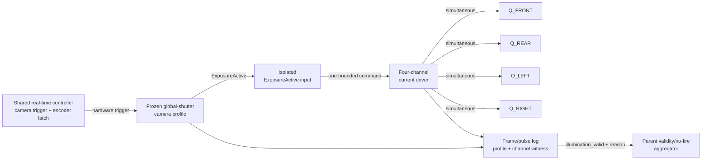
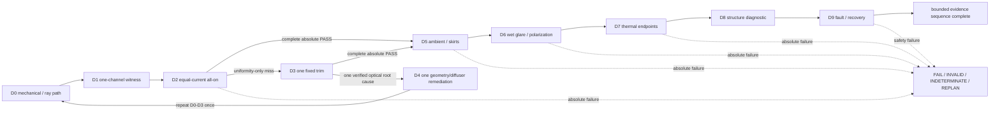

# Controlled Spot-Spray Lighting and Enclosure Survey V1

Status: `PRE_REAL / PHYSICALLY_UNMEASURED`

Lane: `light-enclosure-survey-v1`

Evidence checked on: `2026-08-14`

Repository planning base: `main@509aeef8189dfa50dbcba973e871b0d41febe239`

## 0. Reading contract

This document is a source-verified engineering survey and decision record for the
lighting and light-exclusion subsystem. It is not a test report, a purchase
authorization, or a field release.

Every material statement uses one of these labels:

- **[SOURCE FACT]**: stated by the cited source, within that source's scope.
- **[CALCULATION]**: arithmetic from explicitly named inputs; not a measurement.
- **[ENGINEERING HYPOTHESIS]**: a proposed causal explanation or design choice
  that still requires a bench test.
- **[BENCH VARIABLE]**: a deliberately unresolved setting or part variant.
- **[PHYSICAL RESULT]**: measured on the exact assembly with a traceable artifact.
- **[LIMITATION]**: a boundary on transfer, evidence, ownership, or interpretation.

There are **no [PHYSICAL RESULT] claims in V1**. No cited component has been
received, assembled, or measured for this lane.

## 1. Authority, source pins, and ownership boundary

### 1.1 Frozen repository authority

**[SOURCE FACT]** The quantitative PASS authority is
[`configs/deploy/spot_spray_rig_acceptance_v1.yaml`](../../configs/deploy/spot_spray_rig_acceptance_v1.yaml),
not this survey. Its frozen upstream inputs are:

| Authority item | Frozen value |
|---|---|
| Acceptance source freeze | `dfd4fad4c5675cd1d23b484ce465d1616460c095` |
| Capture optimization YAML | `configs/deploy/spot_spray_capture_optimization_v2.yaml` |
| Capture optimization YAML SHA-256 | `f9fd1cbed95118b4606199e9b67b317c07384e2cb063b60a00e5466848f657e9` |
| Controlled-capture document | `docs/CONTROLLED_CAPTURE_OPTIMIZATION_V2.md` |
| Controlled-capture document SHA-256 | `c5eb80d8eb074b36463906a4dee993776d2415ae1e41ad50a988c8592e8ed7aa` |

**[LIMITATION]** This survey may explain those gates, propose a build that can be
tested against them, and define challenger triggers. It may not weaken, replace,
or silently restate them. A copied number that conflicts with the acceptance YAML
is invalid; the YAML wins.

### 1.2 Frozen sensor/capture interface

The following are upstream interface inputs, not decisions made by this lane:

| Upstream input | Frozen interface value |
|---|---|
| Camera | Basler `a2A2464-77ucPRO`; color, factory IR-cut, global shutter |
| Lens | `C23-0824-5M-P` |
| Capture ROI | centered `2048 × 2048` |
| Ground FOV | `474–484 mm` |
| Working distance | `520–590 mm` |
| Aperture / focus | `f/5.6`; focus `+55 mm` |
| Validation planes | `0 / 55 / 110 mm` |
| Exposure | `170 µs` |
| Rate | `15 Hz` baseline; `20 Hz` challenge |

**[LIMITATION]** The sensor lane owns camera modality and count, sensor, lens,
resolution/ROI, FOV, working distance, focus, aperture, exposure, capture rate,
and compute. This lane does not reopen any of them. Naming the Basler camera above
records an electrical, spectral, and mechanical interface only.

This lane owns emitter selection and geometry, driver interface requirements,
diffuser, visible-light polarization challenger, hood, optical window, baffles,
skirts, functional light sealing, and subsystem cooling. It may require metadata
or trigger behavior at the interface, but it does not select the camera or compute.

### 1.3 Stage-D and change boundary

**[SOURCE FACT]** Stage D in the acceptance YAML owns the exact-assembly lighting,
ambient rejection, uniformity, clipping, SNR, wet-glare, power, duration, and
thermal PASS gates. A paper survey, manufacturer specification, optical
simulation, or component coupon cannot PASS Stage D.

**[LIMITATION]** Changing the window part, thickness, coating, tilt, gasket, or
installation invalidates Stage C through E. Changing the LED, diffuser, current,
pulse profile, quadrant geometry, internal finish, hood, skirt, baffle,
polarizer, or thermal path invalidates the applicable Stage B/D/E evidence under
the acceptance contract. A UV, far-red, or NIR concept that needs removal or
replacement of the factory IR-cut filter is a sensor-lane handback, not a
light-only challenger.

### 1.4 Claim boundary

V1 makes no claim of purchase approval, certified ingress protection, production
readiness, field readiness, deposition quality, crop-injury safety, chemical
safety, or chemical GO. It also makes no patentability, freedom-to-operate, or
exclusive-IP claim. `PRE_REAL` means every build choice below remains physically
unmeasured until the acceptance authority receives exact-assembly artifacts.

## 2. Evidence policy

### 2.1 Source tiers

| Tier | Admitted use | Examples in this survey |
|---|---|---|
| `T0 — frozen local authority` | PASS ownership, frozen interfaces, invalidation rules | acceptance YAML and its pinned inputs |
| `T1 — normative primary` | safety scope and assessment requirement; never self-certification | IEC catalogue records |
| `T2 — manufacturer primary` | part ratings, optical/mechanical limits, controller interfaces | Basler, Lumileds, Bridgelux, Gardasoft, Luminit, Edmund, 3M, Trelleborg |
| `T3 — peer reviewed` | architecture rationale and transfer risks | Elstone, Piron, Ruigrok, Panneton |
| `T4 — official commercial architecture` | existence proof and maintainability prompts only | Ecorobotix and Carbon Robotics |
| `T5 — secondary/contextual` | discovery only; no material design fact | not used for a material claim |
| `V0 — volatile market observation` | non-landed public price, separate from performance | Edmund catalogue observations |

Search-result snippets, reseller specifications, unattributed diagrams, and
vendor marketing outcome metrics are rejected as design proof. A `T2` data sheet
can constrain a component but cannot prove installed-system timing, uniformity,
thermal margin, glare, ingress, reliability, or agronomic performance. A `T3`
crop study can motivate a bench challenge but cannot transfer its performance to
this crop mix, camera, illumination geometry, field state, or model.

### 2.2 Source-integrity rule

Every external source below records both its publication/revision date and the
date it was checked. `revision absent` means the live page presented no revision
date; the missing date is not inferred from copyright text. The stable repository
or publisher record is preferred over an unstable download endpoint. In
particular, [S23] is the canonical Piron record: an intermediary extraction of a
raw bitstream initially returned inconsistent identity text, while the publisher
handle and subsequently opened paper content matched the DOI and title. The raw
bitstream is therefore not used as the citation authority.

## 3. Primary component shortlist

Shortlist status has a narrow meaning:

- `BENCH_CANDIDATE`: enough primary data exists to buy only after a later explicit
  bill-of-materials decision; it is not selected or approved here.
- `COUPON_REFERENCE`: useful for a small optical/material trial but not sized or
  qualified as the installed part.
- `CHALLENGER_ONLY`: cannot replace the baseline without its named promotion gate.
- `NO_ADMITTED_SKU`: the function is required, but the evidence is not yet enough
  to name a defensible part.

### 3.1 Visible-white LED candidates

| ID / status | Primary-source facts | Admission boundary |
|---|---|---|
| `LED-A` — `BENCH_CANDIDATE`: Lumileds LUXEON COB Core Range Gen 6 order-code pattern `L2C5-50901202I060x` | **[SOURCE FACT]** [S05] identifies the 5000 K, minimum-CRI-90 variant at a 200 mA test current; the electrical table gives 31.2/33.9/36.6 V minimum/typical/maximum and `Rθj-c = 0.78 °C/W`. Its DC maximum is two times test current, or 400 mA, with `Tj,max = 125 °C`. [S06] lists the same 5000 K/CRI-90 family row. | **[LIMITATION]** [S05] does not publish an admissible peak-pulse overdrive rating for this candidate. No current above the documented DC maximum is assumed. Exact suffix/bin, flux, board, connector, optics, and four-quadrant quantity remain procurement and bench variables. Embedded PDF date `2024-03-12`; product index says data-sheet last modification `2026-06-02`; both are retained rather than reconciled by inference. |
| `LED-B` — `BENCH_CANDIDATE`: Bridgelux Vero SE 13 `BXRC-50G2001-B-74-SE` | **[SOURCE FACT]** [S07] identifies the 5000 K/CRI-90 B-format part at a 450 mA nominal drive current; its pulsed selection table gives 34.8 V and 15.7 W, while its DC table gives 33.9 V and 15.3 W. Its performance table gives about 36.1 V and 24.3 W at 675 mA. The sheet limits drive current to 900 mA and peak pulsed current to 1290 mA with the stated maximum-duty and pulse-width conditions; it gives `Tj,max = 150 °C` and case maximum `105 °C`. | **[LIMITATION]** The manufacturer's pulse envelope is a component ceiling, not a command to overdrive. The 450 mA point is the only admitted starting screen; 675 mA is a documented comparison point below the candidate controller's 30 W/channel catalogue limit, not an approved setting. Installed rise time, droop, flux, thermal margin, and safety classification still require the exact assembly. |

**[ENGINEERING HYPOTHESIS]** Four independently limited, high-CRI 5000 K white
quadrants are the lowest-complexity path compatible with the frozen RGB/IR-cut
camera and the existing 4500–5500 K/CRI ≥90 acceptance envelope. High CRI and
CCT compliance do **not** by themselves prove crop/weed separability.

### 3.2 Strobe controller candidate

| ID / status | Primary-source facts | Admission boundary |
|---|---|---|
| `DRV-A` — `BENCH_CANDIDATE`: Gardasoft `RT420F-20` class | **[SOURCE FACT]** [S08] specifies four independently controlled constant-current outputs, up to 2 A continuous/20 A pulsed for the named class, 5 mA current steps, 30 W maximum per channel, four opto-isolated 3–24 V trigger inputs, 0–40 V output, and 24–48 V supply. It lists pulse/delay settings from 1 µs to 999 ms, minimum delay of 3 µs, and the stated short-interval repeatability values. | **[LIMITATION]** Page revision is absent. The controller is screened, not selected. Its catalogue timing is not installed trigger-to-light proof. Exact LED/controller compatibility, quadrant fault observability, common trigger behavior, current rise, optical pulse containment, jitter, pulse error, droop, fault output, cable loss, supply transient, and local energy storage must be measured. A 24 V machine bus does not eliminate controller, supply, or boost-path validation. |

### 3.3 Diffuser candidates and gap

| ID / status | Primary-source facts | Admission boundary |
|---|---|---|
| `DIF-A` — `BENCH_CANDIDATE`: Luminit Light Shaping Diffuser, 60° circular, `P3` polycarbonate 0.030 in format | **[SOURCE FACT]** [S09] describes 400–700 nm LED homogenization, nominal 85–92% family transmission, and −30 to 80 °C exposure data; it gives ≥85% for the 20–80° circular range. [S10] lists 60° circular availability and `P3 = 0.030 in` sheet/panel format. | **[BENCH VARIABLE]** Exact order code, surface orientation, clear size, stand-off, frame, contamination protection, four-quadrant cut pattern, and angular distribution on the ground. Family transmission is not installed throughput or uniformity. |
| `DIF-B` — `COUPON_REFERENCE`: Edmund Optics stock `#37-975` white diffusing glass | **[SOURCE FACT]** [S11] lists a 15 mm diameter, 1.25 ± 0.10 mm thick, uncoated 400–700 nm opal diffuser with a near-Lambertian transmitted pattern. | **[LIMITATION]** It is too small to be the proposed quadrant panel and has no cited installed-size transmission. It is retained only as an opal-glass coupon reference. No full-quadrant opal SKU is admitted in this pass. |

**[ENGINEERING HYPOTHESIS]** A removable diffuser per quadrant can suppress LED
images and local hot spots. The acceptance luma map, throughput, wet-glare, and
thermal tests—not the word “diffuser”—decide whether it works.

### 3.4 Protective-window candidates

| ID / status | Primary-source facts | Admission boundary |
|---|---|---|
| `WIN-A` — `BENCH_CANDIDATE`: Edmund Optics stock `#23-375` | **[SOURCE FACT]** [S12] lists a 50 × 50 mm, 2.0 ± 0.2 mm N-BK7 window, 45 × 45 mm clear aperture, MgF2 coating for 400–700 nm, and average reflectance ≤1.75% over the stated band. | **[BENCH VARIABLE]** Lens-ray clearance, installed angle, ghost location, coating orientation, gasket compression, abrasion/soil response, cleaning method, and whether 50 mm square is mechanically sufficient. |
| `WIN-B` — `CHALLENGER_ONLY`: Edmund Optics stock `#37-018` | **[SOURCE FACT]** [S13] lists a 50 mm diameter, 3.0 ± 0.2 mm N-BK7 window with 45 mm clear aperture and VIS-NIR coating; average reflectance is ≤1.25% across the cited 400–870 nm and 890–1000 nm ranges, with an 880 nm absolute-reflectance value. | **[LIMITATION]** A broad coating does not authorize NIR capture or change the factory IR-cut interface. It is only a coating/ghost/cleaning challenger. Any installed-window change invalidates Stage C–E evidence. |

### 3.5 Polarization challenger

| ID / status | Primary-source facts | Admission boundary |
|---|---|---|
| `POL-A` — `CHALLENGER_ONLY`: Edmund Optics stock `#71-363`, XP42-70 linear polarizing film | **[SOURCE FACT]** [S14] lists 40 mm diameter, 0.72 ± 0.10 mm PMMA, 400–700 nm use, 42 ± 2% single-sheet transmission, 36.4% parallel transmission, <0.004% crossed transmission at 555 nm, >99.98% polarizing efficiency, and −10 to 60 °C operating range. [S26] describes crossed source/analyzer orientation as a general glare-control method. | **[LIMITATION]** This stock item is an analyzer-sized coupon, not a complete crossed-polarizer system. Its quoted crossed value does not predict wet-leaf/soil glare over field angles and spectra. Emitter-side sheet, extinction across the full band, mounting, heat, contamination, and compensation are unresolved. Baseline remains polarization off; promotion requires the acceptance YAML's paired wet-glare A/B gate without sacrificing any other gate. |

### 3.6 Thermal-interface and skirt-material candidates

| ID / status | Primary-source facts | Admission boundary |
|---|---|---|
| `TIM-A` — `BENCH_CANDIDATE`: 3M Thermally Conductive Acrylic Interface Pad `5578H` | **[SOURCE FACT]** [S15] lists 0.5 and 1.0 mm formats and, for the footnoted 1.0 mm test specimen, thermal conductivity 2.39 W/m·K typical / 2.00 W/m·K minimum under ASTM D5470. The document is dated January 2024 and supersedes June 2015. [S16] says displayed values are representative/typical and regional availability varies. | **[LIMITATION]** This is an interface-pad screen, not a heatsink selection or installed `θJA` result. Surface flatness, compression, die-cut, bond area, LED-board isolation, ageing, rework, and allowable-use review remain open. No heatsink extrusion/fan SKU is admitted until the exact LED operating point and loss budget are frozen. |
| `SKIRT-A` — `BENCH_CANDIDATE`: Trelleborg EF51 black EPDM sheet | **[SOURCE FACT]** [S18], dated 2026-01-13, specifies 65 ± 5 Shore A, tensile strength ≥5 MPa, elongation ≥200%, tear strength ≥20 N/mm, −25 to +120 °C service range, and no ozone cracking under its stated test. [S17] is the official product landing page. The sheet warns that oils and hydrocarbons are unsuitable. | **[LIMITATION]** The data do not establish visible/NIR reflectance, light sealing in motion, crop-contact safety, snag load, breakaway behavior, abrasion life, dust pumping, agrochemical compatibility, or cleanability. The material can enter coupon tests only; geometry and fail-safe retention remain bench/safety variables. |

`NO_ADMITTED_SKU` remains deliberate for the structural hood panel, low-reflectance
internal finish, labyrinth inserts, rear gasket, breakaway skirt rail, passive
external heatsink, and optional external fan. Naming an arbitrary catalogue part
before optical, thermal, structural, cleanability, and safety loads are defined
would create false buildability.

## 4. Fixed light/capture interface contract

**[SOURCE FACT]** The interface below is subordinate to the frozen
[`spot_spray_capture_optimization_v2.yaml`](../../configs/deploy/spot_spray_capture_optimization_v2.yaml),
[`spot_spray_rig_acceptance_v1.yaml`](../../configs/deploy/spot_spray_rig_acceptance_v1.yaml),
and their pinned hashes in Section 1. The camera supports hardware triggering
[S01]; Basler documents `ExposureActive` as a line source [S02], global-shutter
light control [S03], and the need to account for light rise time [S04]. Those
manufacturer facts support the interface class; only the installed Stage-B/D
evidence can prove its timing.

**[LIMITATION]** The sensor/capture lane supplies and owns the camera profile.
This lane consumes it, records it, and rejects mismatches. The exact isolator,
driver topology, telemetry bus, connector, and safety-controller implementation
remain implementation choices as long as the observable behavior below is met.
This lane has no valve-command authority.

### 4.1 Interface matrix

| Domain | Owned input | Lighting/enclosure obligation | Observable binding | Fail-closed behavior |
|---|---|---|---|---|
| Mechanical | **[SOURCE FACT]** Sensor lane's frozen Basler body, lens, `520–590 mm` WD, and service/cable envelope | **[ENGINEERING HYPOTHESIS]** Package the optical bay without moving the camera or obstructing service and cooling access. | Rig and hardware revision; mount witness; measured WD | Hand back to sensor lane if packaging requires a camera/lens/WD change; do not improvise a new optical state. |
| Optical | **[SOURCE FACT]** Centered `2048 × 2048` ROI, `474–484 mm` FOV, `f/5.6`, `+55 mm` focus, and `0/55/110 mm` validation planes | Keep sources, diffuser edges, baffles, gasket, and window outside the calibrated ray cone; validate with the installed window. | `capture_profile_id`, window/diffuser/hood revisions, Stage-C artifact IDs | Occlusion, direct return, changed window, or failing plane/region invalidates the profile; no crop/resize workaround. |
| Electrical | **[SOURCE FACT]** One camera `ExposureActive` output and the frozen fused camera/light/controller branch requirement | Feed an isolated strobe input and four independently current-limited quadrant channels; power-up/reset enable is off. | Channel map, commanded current vector, enable state, driver status, supply/droop evidence | Isolation, supply, driver, enable, or channel fault inhibits the strobe and marks affected records invalid. |
| Timing | **[SOURCE FACT]** Real-time controller hardware trigger, `170 µs` global exposure, `150–170 µs` strobe envelope, baseline `15 Hz` and `20 Hz` challenge | Fire exactly one simultaneous all-on pulse fully inside each accepted exposure; no free-running or image-dependent light. | Trigger-event ID, camera timestamp/frame counter, pulse-observation ID, pulse width/start, jitter evidence | Missing, extra, late, early, clipped, or profile-mismatched pulse invalidates the frame/profile and produces downstream no-fire. |
| Camera controls | **[SOURCE FACT]** Sensor lane's fixed exposure, gain, white balance, ROI, pixel format, rate, focus, and aperture | Verify the named profile is loaded before arming; never modify a camera setpoint to make lighting pass. | Exact values and `capture_profile_id` in the run manifest and frame record | Auto or silent drift, unknown value, or profile mismatch makes Stage-D evidence noncomparable and the frame intervention-invalid. |
| Thermal | **[SOURCE FACT]** Stage B/D requires a 120-minute envelope, camera housing `≤50 °C`, LED plate `≤60 °C`, zero frame drops, and zero thermal throttling | Timestamp camera/LED temperatures and bind them to the run; overtemperature is a hard inhibit. | Temperature channels, limits, sampling timestamps, fault state, soak artifact | Overtemperature, missing required thermal telemetry, or sensor fault disables strobe enable and invalidates the affected profile. |
| Metadata | **[SOURCE FACT]** Frozen receipt identity, hardware/software revision, frame counter, camera timestamp, and camera/light profile metadata are mandatory upstream interfaces | Bind each frame, pulse, installed optical state, and current vector to immutable IDs; never reuse an ID for changed contents. | Run manifest plus one-to-one frame/pulse log defined in Section 4.4 | Missing, duplicate, stale, or contradictory binding makes `illumination_valid=false`; no inference from filenames or operator memory. |
| Fault/safety | **[SOURCE FACT]** E-stop, hood-open, watchdog, overtemperature, invalid timing, and driver faults are fail-closed | Default off; publish channel-specific fault and a reason-coded validity result; require an explicit clean recovery witness. | Safety inputs, fault latch, `illumination_valid`, `illumination_invalid_reason` | No fault may silently create an intervention-valid frame. A stale pre-fault profile cannot re-arm itself. |
| Actuation boundary | **[LIMITATION]** Registration, deadline, valve, deposition, crop-injury, and chemical decisions are owned elsewhere | Publish lighting validity only; expose no operation that commands, schedules, or enables a valve. | One-way validity/status interface to the parent safety aggregator | `illumination_valid=false` contributes to global no-fire. `true` is necessary but never sufficient to fire. |

### 4.2 Trigger-to-strobe control flow

The diagram is a logical contract, not a wiring schematic.



**[ENGINEERING HYPOTHESIS]** The default sequence is:

1. The shared real-time controller creates one camera hardware-trigger event
   and latches the encoder under the upstream time contract.
2. The sensor-owned camera profile starts one global exposure.
3. Camera `ExposureActive` passes through isolation to the strobe driver.
4. The driver commands all four frozen quadrant channels simultaneously for
   one bounded pulse; no alternate quadrant pattern is used in the baseline.
5. The frame and pulse records join on one `trigger_event_id`. Only a complete,
   noncontradictory join may publish `illumination_valid=true`.

The light is never free-running. Equal current is searched first; any later
fixed trim vector is immutable inside `strobe_profile_id`. Dynamic per-frame
brightness, auto-exposure coupling, and image-dependent current are prohibited.

### 4.3 Fixed manual camera-control prerequisite

**[SOURCE FACT]** Before final Stage-D measurement, the sensor/capture lane must
provide one immutable `capture_profile_id` containing the exact exposure, gain,
white balance, centered ROI/offset, pixel format, capture rate, focus, aperture,
and installed-window state. Exposure remains the frozen `170 µs`; this lane
does not invent gain or white-balance values.

**[ENGINEERING HYPOTHESIS]** Arming requires auto exposure, auto gain, and auto
white balance to be disabled and the loaded values to match the manifest.
Changing exposure, gain, white balance, pixel format, rate, focus, aperture,
camera, lens, mount, or window creates a new profile identity and invalidates
the applicable Stage B–E evidence. A lighting candidate fails rather than
requesting a longer exposure or automatic camera correction.

### 4.4 Immutable identities and metadata

The minimal binding is split so immutable hardware strings are not duplicated
in every frame while each light event remains auditable.

| Record | Required fields or references | Rule |
|---|---|---|
| Run manifest | **[SOURCE FACT]** `receipt_id`/evidence run ID, UTC creation time, `rig_unit_id`, `hardware_revision`, `software_commit`, both frozen-source SHA-256 values, evidence kind, artifact IDs, and `bench_setting_id` | Must follow the acceptance receipt; a physical claim requires hash-matching artifacts. |
| Capture profile | **[SOURCE FACT]** `capture_profile_id`; camera/lens/window identity; ROI/offset; exposure; gain; white balance; pixel format; rate; WD; focus; aperture | Sensor/capture-owned, immutable, and exact-value—not a label such as “manual.” |
| Strobe profile | **[ENGINEERING HYPOTHESIS]** `strobe_profile_id`; LED family/bin and board revision; fixed quadrant-to-channel map; fixed current vector; commanded pulse; all-on firing mask; diffuser, hood, window, driver and power-path revisions; polarization state | Light-lane-owned. Any material content change requires a new ID and applicable retest. |
| Frame record | **[SOURCE FACT]** frame counter, camera timestamp, `trigger_event_id`, encoder-latch reference, `capture_profile_id`, `strobe_profile_id`, `bench_setting_id`, exact camera-control values, and validity/result code | One frame maps to at most one expected strobe event; duplicate or missing bindings are invalid. |
| Pulse/channel record | **[ENGINEERING HYPOTHESIS]** `trigger_event_id`, commanded and observed pulse presence/start/width, commanded current vector, `quadrant_present_mask`, per-channel fault bits, driver fault, enable state, polarization state, supply/droop evidence reference, and timestamped camera/LED temperatures | May be a one-to-one controller record plus referenced Stage-B/D waveform artifact; filenames alone are not a binding. |
| Validity record | **[ENGINEERING HYPOTHESIS]** `illumination_valid`, enumerated `illumination_invalid_reason`, fault-latch state, and recovery-witness ID | Absence, null, unknown enumeration, or contradictory state is invalid, never implicitly true. |

`capture_profile_id`, `strobe_profile_id`, and `bench_setting_id` are distinct:
the first owns camera settings, the second owns commanded illumination, and the
third names the exact installed Stage-D bench state. One cannot substitute for
another. A frame may reference the immutable run manifest rather than repeat
all hardware strings, but the reference must resolve without external memory.

### 4.5 Default-off validity and recovery

| Condition | Immediate behavior | Record/result | Recovery requirement |
|---|---|---|---|
| Power-up, reset, software restart, missing profile, or telemetry loss | `strobe_enable=false` | `illumination_valid=false`; reason identifies the unmet prerequisite | Load matching immutable profiles, clear safety inputs, and record a fresh startup witness. |
| E-stop, hood-open, watchdog, overtemperature, isolation/driver/supply fault | Inhibit the pulse and latch disabled | All affected frame/track candidates are no-fire; channel/fault identity recorded | Explicit fault clear plus startup witness; no automatic stale-profile re-arm. |
| Missing strobe pulse | Invalidate the paired frame and latch disabled | `pulse_missing`; no-fire | Prove trigger/driver path and a valid four-channel witness before re-arm. |
| Extra, malformed, clipped, or out-of-envelope pulse | Invalidate the paired frame/profile and latch disabled | Reason-coded timing fault; no-fire | Timing cause removed; repeat applicable Stage B/D evidence. |
| Any missing quadrant or wrong channel/current-vector identity | Invalidate the paired frame and latch disabled | Expected mask `0b1111` did not match observed mask; named channel recorded | Repair/reconfigure, verify all four channels, and repeat the affected evidence. |
| Capture/strobe/bench profile mismatch or missing one-to-one frame/pulse join | Do not arm when known beforehand; otherwise invalidate the record | `profile_mismatch` or `binding_invalid`; no-fire | Load matching IDs and create a new startup witness. |
| All prerequisites and event witnesses valid | Permit the requested pulse and publish light validity after binding | `illumination_valid=true` | This remains only one input to the parent safety decision, never valve permission. |

**[LIMITATION]** The table defines observable behavior, not a claim that the
current candidate controller already provides it. A driver/controller that
cannot support the required inhibit, telemetry, or external witness is rejected
or supplemented before physical acceptance.

### 4.6 Partial-quadrant observability

**[ENGINEERING HYPOTHESIS]** Quadrants have fixed rig-coordinate identities
`Q_FRONT`, `Q_REAR`, `Q_LEFT`, and `Q_RIGHT`, permanently mapped to driver
channels and current-vector indices. A valid all-on event has
`quadrant_present_mask = 0b1111`.

Each channel must expose an independent electrical presence/fault witness via
driver diagnostics or a dedicated current monitor. Image brightness can be a
confirmatory Stage-D symptom but is not the sole detector because plant and
soil content varies. Bench fault injection removes one quadrant at a time and
must identify the missing channel, invalidate the event, and hold the strobe
off until recovery. Any sequential low-duty diagnostic occurs outside accepted
data capture; the baseline capture pattern remains simultaneous all-on.

### 4.7 No-valve-control boundary

**[LIMITATION]** The light/enclosure interface exports only status,
`illumination_valid`, and reason codes. It does not expose a call, message, or
hardware output that can assert `valve_enable=true`, calculate a spray deadline,
or schedule a valve. The parent safety/actuation owner combines light validity
with capture, calibration, tracking, deadline, registration, and intervention
safety gates. Light invalidity forces no-fire; light validity cannot authorize
dry-marker or chemical action. The acceptance authority continues to prohibit
chemical fire.

### 4.8 Package-3 acceptance checklist

- The frozen camera, lens, ROI, FOV, WD, focus, aperture, exposure, rate, and
  window inputs are reproduced without selecting or modifying them.
- The real-time trigger → global exposure → isolated `ExposureActive` →
  four-channel driver chain is explicit.
- Simultaneous all-on is the only default capture firing pattern.
- Fixed manual camera controls and exact-value profile matching precede Stage D.
- Capture, strobe, bench, hardware, frame, pulse, and evidence identities are
  distinct and joinable.
- Strobe enable defaults off; every material anomaly invalidates the affected
  frame/profile and produces a reason-coded no-fire input.
- A missing quadrant is electrically observable and channel-specific.
- The lane exports no valve-enable authority.
- Mechanical, optical, electrical, timing, thermal, metadata, fault, and
  actuation-boundary rows all have explicit failure behavior.

## 5. Buildable single-bay proof baseline

### 5.1 Frozen architecture decision

**[ENGINEERING HYPOTHESIS]** Build one manually adjustable proof bay with:

- one centered, light-isolated optical cassette consuming the frozen camera,
  lens, window, WD, focus, aperture, ROI, exposure, and rate interface;
- four visible-white emitter cassettes at the front, rear, left, and right of
  the optical axis;
- one independently current-limited channel and one removable opal-diffuser face
  per cassette;
- one simultaneous all-on pulse per valid exposure;
- a rigid matte-black hood, two flexible skirt layers, a two-stage cable
  labyrinth, and a replaceable tilted AR window;
- passive heat conduction to the exterior, with no optical-volume airflow; and
- polarization physically absent/off in the baseline profile.

The visible-white source contract is `4500–5500 K`, CRI `≥90`. The exact LED,
diffuser, spectrum/bin, aim, current vector, lux, optical energy, thermal
interface, heatsink, gasket, skirt, coating, and structural material remain
bench variables. Factory IR-cut remains installed. Nothing in this architecture
changes the sensor interface or claims plant height.

### 5.2 Dimensioned adjustable fixture

The coordinate origin is the camera optical axis. `+Y` is vehicle/front,
`+X` is vehicle/right, and `Z=0` is the local ground reference. Dimensions
below describe the proof fixture, not a certified production enclosure.

```text
TOP VIEW — minimum clear internal plan 600 × 600 mm

                         +Y / FRONT
              ┌──────────────────────────────┐
              │        Q_FRONT cassette      │
              │          on radial slot       │
              │                               │
              │ Q_LEFT    Ø120 mm minimum    Q_RIGHT
              │ cassette  no-emitter optical cassette
              │              bay              │
              │                               │
              │         Q_REAR cassette       │
              │          on radial slot       │
              └──────────────────────────────┘
               outer skirt rail at perimeter
               inner skirt rail nominally 50 mm inward

Quadrant center radius r: 140–210 mm adjustable
Maximum proof-cassette mounting face: 140 × 140 mm
Inward face tilt: 10–35° adjustable, then locked
LED-to-diffuser stand-off: 20–80 mm adjustable, then keyed
```

**[CALCULATION]** A `140 × 140 mm` cassette at the inner rail endpoint
`r=140 mm` leaves `140 - 70 = 70 mm` to the optical axis, giving `10 mm`
fixture clearance around a `Ø120 mm` no-emitter zone. At `r=210 mm`, its outer
edge is `210 + 70 = 280 mm`, leaving `20 mm` to a `300 mm` half-width wall.
These are packaging checks only; the calibrated lens-cone template can require
a larger central exclusion zone and therefore a smaller cassette or narrower
travel range.

**[CALCULATION]** If the emitter plane is approximately level with the lens,
the center-aim angle over the bounded geometry is approximately
`atan(140/590)=13.3°` to `atan(210/(520-110))=27.1°`. A manual `10–35°`
fixture range brackets that prescreen. The installed source-plane offset,
window, canopy relief, and nine-region images—not this calculation—select and
freeze the final angle.

```text
SIDE SECTION — parametric height, not to scale

       exterior air only
       [passive fin sink]
              │ sealed conductive path
  ┌───────────┴──────────────── rigid top ─────────────┐
  │ LED plate ─ aim hinge ─ diffuser cassette          │
  │                         central isolated optical bay│
  │ camera/lens ─── tilted 2–3 mm AR window            │
  │                                                    │
  │ rigid matte wall / internal light traps            │
  ├──────────── skirt rail datum z_rail ───────────────┤
  │ outer skirt 100–150 mm                             │
  │   inner skirt 100–150 mm, seams offset             │
  └──────── operating clearance 0–20 mm ───────────────┘
  ───────────────────── local ground ───────────────────

  lens reference to ground: measured WD = 520–590 mm
  skirt-rail datum: z_rail = skirt free length + clearance
```

**[CALCULATION]** The manually set skirt-rail datum is therefore
`100+0 = 100 mm` to `150+20 = 170 mm` above the local proof ground. Absolute
top and rigid-wall height are cut from the measured camera-unit WD, camera/body
clearance, window cassette, and selected `z_rail`; a fixed catalogue height is
not permitted. The platform lane supplies the mounting datum. This lane
requires manual vertical adjustment and hard stops sufficient to set the
accepted WD and clearance, but does not select tractor or standalone suspension.

All translation, tilt, stand-off, window-wedge, and height adjustments use
slots, keyed spacers, or fixed shims. After selection they receive fastener
torque/retention records and witness marks. There is no motorized aim, focus,
height, diffuser, or current adjustment in the baseline.

### 5.3 Four quadrant modules

| Feature | Frozen proof-baseline requirement | Bounded implementation detail |
|---|---|---|
| Identity | Four fixed rig-coordinate IDs: `Q_FRONT`, `Q_REAR`, `Q_LEFT`, `Q_RIGHT` | Channel mapping is keyed and recorded in `strobe_profile_id`. |
| Source | Broad visible white, `4500–5500 K`, CRI `≥90`, one cited family/bin per profile | `LED-A` and `LED-B` remain alternatives; an exact orderable suffix and board are not selected. |
| Drive | One independent constant-current limit and diagnostic witness per quadrant | One documented four-channel controller or four documented channels; no hidden parallel sharing that defeats channel observability. |
| Firing | All four simultaneously for every valid default capture | Independent enable exists for installation/fault tests only; no alternating baseline frames. |
| Diffuser | One removable, keyed opal-diffuser face per quadrant; no sheet crosses the optical bay | No full-size opal SKU is yet admitted: `DIF-B` is coupon-only. The same cassette may separately test microstructured `DIF-A`, but that candidate may not be called opal or satisfy the opal-baseline item. Exact full-size opal identity remains a bench variable and procurement gate. |
| Adjustment | Manual radial position, inward aim, and LED-to-diffuser stand-off within the fixture ranges | Freeze exact values after the bounded nine-region search; any later change invalidates applicable evidence. |
| Optical exclusion | Emitter face and baffle lips remain outside the calibrated lens cone; no direct LED-to-window path | Use a physical ray-cone/no-go template with the installed lens/window before energizing; Stage C remains decisive. |
| Search order | Equal commanded current first; increase from the lowest practical cited operating point | A fixed four-value trim is allowed only after equal current misses uniformity and every absolute gate passes under the trim. |
| Runtime | Fixed current vector, fixed all-on mask, fixed camera profile | Dynamic per-frame current, image-dependent lighting, auto-exposure coupling, and random source choice are prohibited. |

**[LIMITATION]** The `140–210 mm`, `10–35°`, and `20–80 mm` ranges are fixture
search capacity, not agronomic or optical PASS values. If a cited board,
diffuser, ray cone, or service envelope cannot fit them without occlusion, the
fixture is revised before component purchase; the camera/FOV/WD is not changed.

### 5.4 Hood, skirts, seams, and labyrinth

| Element | Buildable proof form | Freeze/acceptance boundary |
|---|---|---|
| Shell | Clear internal plan at least `600 × 600 mm`; rigid top and four sidewalls; centered camera datum; overlapping or gasketed seams; matte-black low-reflectance interior | Panel material, thickness, exact coating, fasteners, and exterior finish are bench/fabrication variables. No unbaffled ground-to-sky line is allowed. |
| Service access | Rear/top service panel with a normally-safe hood-open interlock and an internal overlap/light trap | Capture only with panel closed. Interlock fault defaults strobe off; this is functional sealing, not an ingress certificate. |
| Outer skirt | Replaceable flat flexible segments, `100–150 mm` free length, on a removable perimeter rail | Segment material/thickness/width and breakaway force remain unresolved; stationary/non-contact proof only until mechanical-safety ownership freezes and passes them. |
| Inner skirt | Independent second `100–150 mm` layer, nominal rail inset `50 mm`, with cuts/seams offset from the outer layer | Both layers set `0–20 mm` operating clearance. Deflecting one layer must not reveal a direct sky path through the other. |
| Segment seams | Adjacent segments overlap `30–50 mm`; inner and outer seam lines are staggered | No cords, closed loops, dangling wiring, or geometry likely to wrap vegetation/rotating equipment. Light PASS is not snag/entanglement PASS. |
| Rigid/internal baffles | Matte-black optical-bay lips plus two distinct light-trap stages, each providing at least `50 mm` baffle depth/overlap without entering the ray cone | Nine-region Stage C/D evidence rejects occlusion, a weak edge, direct return, or leak. |
| Cable entry | Rear-facing, gasketed S-path with two offset turns and no straight external-to-optical sight line | Driver/power electronics remain outside the optical volume. Cable service loop is retained and secured outside the capture cone. |

**[ENGINEERING HYPOTHESIS]** The nominal `50 mm` inner skirt inset creates a
second shadowed perimeter behind a deflected outer layer while retaining a
`500 × 500 mm` central opening in the 600 mm proof plan. This remains a fixture
choice: the installed FOV/plane tests must show that the rail, fabric, and
deflection never intrude or produce a failing region.

Functional sealing means closed service panels, sealed window, baffled cable
entry, no direct sky path, and passing dark-corrected ambient off/on ratios in
all nine regions. It does not mean IP65/IP67, rain, dust-chamber, pressure-wash,
chemical, stone-impact, or production environmental readiness.

### 5.5 Central optical cassette and protective window

The center module reserves at least a `Ø120 mm` no-emitter/service zone around
the optical axis and isolates it from all four emitter cassettes with
matte-black baffle lips. That zone is a fixture packaging minimum, not the lens
clear aperture; the calibrated ray cone owns the final exclusion surface.

The replaceable window cassette:

- accepts `2–3 mm` AR-coated optical glass;
- provides keyed `3°`, `4°`, and `5°` tilt shims;
- supports square or round 50 mm candidate adapters without forcing either
  candidate to pass;
- keeps every gasket and retainer outside the measured clear ray cone;
- allows exterior cleaning without opening the optical volume;
- records part, coating, lot where available, tilt, tilt axis, orientation,
  gasket, retainer/torque state, and adapter revision; and
- remains installed for focus, calibration, and all Stage C–E evidence.

`WIN-A` is the visible 2 mm lead and `WIN-B` the 3 mm coating challenger, but
neither is promoted until its `45 mm` cited clear aperture is proven sufficient
for the installed lens cone. The tilt axis is selected so the dominant direct
strobe reflection leaves the active image. Direct ghost, flare, MTF,
reprojection, clipping, or regional-uniformity failure rejects the candidate.
Any part, coating, thickness, orientation, tilt, gasket, or retention change
invalidates Stage C–E.

### 5.6 Timing, electrical, and power envelope

The baseline operating search stays inside every bound below at one frozen
profile. A ceiling is never multiplied, targeted, or treated as a measured
setpoint.

| Quantity | Frozen envelope | Architecture rule |
|---|---:|---|
| Camera exposure | `170 µs` | Never lengthened to rescue lighting. |
| Strobe pulse | `150–170 µs` | Exactly one all-on pulse, fully contained inside exposure. |
| Rate | `15 Hz` baseline; `20 Hz` challenge/maximum | No free-running illumination. |
| Trigger-to-light jitter p95 | `≤5 µs` | Installed optical/electrical measurement required. |
| Pulse-width error | `≤5%` | Installed measurement required. |
| Machine light-bus input | `24 V` | Any needed conversion is named, fused, profile-bound, and included in power/thermal evidence. |
| Acceptance peak-current envelope | `0–10 A` | Treat as the contract's measured system strobe-current range; do not infer `10 A` per quadrant or multiply by four. Component and driver limits may be lower. |
| Peak electrical ceiling | `240 W` | Prescreen ceiling only, not operating power. |
| Bus droop during pulse | `≤5%` | Measure at the defined bus/load points with the exact harness and storage. |
| Light-branch average power | `≤20 W` | Includes the installed light branch under the acceptance accounting boundary. |
| Capture-module average, excluding compute | `≤60 W` | Includes the exact camera/light/control path under the acceptance boundary. |
| Thermal evidence | `120 min`, exterior envelope `5–40 °C` | Camera housing `≤50 °C`, every monitored LED-plate maximum `≤60 °C`, zero drops and throttles. |

The four channels begin at equal current from the selected LED's documented
test/operating point and move only as high as needed to pass the image gates,
never above the lowest of the LED, driver, wiring, connector, thermal, and
acceptance limits. `LED-A` has no admitted pulse-overdrive rating; none is
assumed. `LED-B` begins at its documented 450 mA nominal point; higher cited
points remain comparisons, not settings. Exact current and pulse optical output
are physical bench variables.

The active baseline subsystem list is closed: upstream camera and real-time
trigger; one isolated four-channel current-driver function; hood-open/E-stop/
watchdog inhibit inputs; channel witness; and camera/LED temperature sensing.
There is no motor, automatic brightness controller, purge blower, or fan in the
proof baseline. If a chosen driver cannot accept the machine bus directly, its
documented and fused conversion stage is an explicit hardware/profile item—not
a hidden auxiliary.

### 5.7 Passive sealed thermal path

```text
LED junction/board → cited TIM or direct qualified interface
                   → sealed conductive plate/thermal bridge
                   → external passive finned heatsink
                   → exterior air

optical volume  ║ sealed wall ║  external heatsink volume
                no ventilation or fan path across this boundary
```

Each quadrant provides a flat, serviceable LED-plate mounting face and a sealed
conductive path to an exterior sink mounting face. A shared exterior spreader
or four independent sinks may be compared passively, but the chosen topology,
TIM, contact area, fastener torque, sink, orientation, and surface state become
profile-bound. The camera has an independent mount/thermal path and is never
used as the LED heatsink. Driver and conversion losses remain outside the
optical bay and do not exhaust across the camera or window.

At minimum, timestamp the camera housing and each quadrant LED plate or prove
that one instrumented point is the conservative maximum for all plates. Missing
or failed required temperature telemetry is fail-closed. Passive cooling is the
only baseline. If it fails the exact two-hour test, first test a larger external
sink; only then may one external fan across the heatsink become a single bounded
challenger. No fan may exchange ambient air through the optical volume, and fan
failure remains covered by overtemperature no-fire. Failure after that bounded
remediation is `REPLAN_REQUIRED`, not permission to raise exposure or current.

### 5.8 Polarization state

Baseline `polarization_state = OFF`: there is no emitter polarizer sheet and no
lens analyzer in the proof profile. `POL-A` remains a coupon for a separately
identified challenger only. Promotion still requires the paired wet-leaf and
wet-soil gate, at least 50% saturated-glare-area reduction, and every absolute
timing, luma, uniformity, clipping, SNR, ambient, power, and thermal gate. A
same-current OFF/ON pair is required before any compensated-current ON run.

### 5.9 Explicit bench and fabrication variables

| Variable not frozen by this survey | Bounded selection evidence | Change consequence after freeze |
|---|---|---|
| LED exact SKU/suffix, CCT bin, SPD, board, count | Direct manufacturer identity plus installed optical/electrical/thermal gates | New LED identity repeats Stage D and dependent E. |
| Full-size diffuser material/SKU/lot, thickness, transmission/haze, surface | Direct optical data plus die-image, uniformity, SNR, glare, thermal and drift evidence | Repeat Stage D and dependent E. |
| Quadrant radius, aim, diffuser stand-off | Search only within the adjustable fixture; freeze the first complete passing geometry | Geometry change repeats Stage C–E. |
| Equal current or fixed four-value trim | Lowest-current complete PASS; trim only after equal-current uniformity failure | Current/pulse change repeats Stage B–E. |
| Lux and optical energy | Measured, not selected independently; report at the complete passing image profile | Never a standalone promotion metric. |
| Driver, converter, harness, storage, connector | Cited ratings plus installed timing, current, droop, fault and thermal evidence | Electrical-path change repeats Stage B–E. |
| TIM, contact area/pressure, plate, passive sink | Cited material data plus exact-load 120-minute evidence | Thermal-path change repeats B/D thermal and dependent E. |
| Hood panel, finish, seam, baffle, gasket | Coupon/identity plus ray-cone, leak, ambient, cleaning and image gates | Optical enclosure change repeats Stage D/E; ray-path changes also repeat C. |
| Skirt material, thickness, segment, rail, breakaway | Optical proof plus separately owned mechanical-safety fixture and force criterion | No plant-contact/field claim until mechanical gate exists and passes. |
| Window exact part, adapter, tilt axis/angle, gasket/retention | Installed ray cone, ghost, Stage C optics and complete D evidence | Any change repeats Stage C–E. |

No exact lux, optical joules, current vector, capacitance, heatsink capacity,
fan state, material thickness, ingress rating, breakaway force, or field
clearance performance has physical-result status in this survey.

### 5.10 Fabrication packet and acceptance checklist

The one-bay proof fixture can be fabricated from this closed functional packet:

1. a rigid frame with `≥600 × 600 mm` clear internal plan and parametric wall
   height from the measured WD/skirt datum;
2. one centered `Ø120 mm` minimum no-emitter optical cassette with keyed tilted
   window adapters and ray-cone baffles;
3. four manual radial/tilt carriers accepting `≤140 × 140 mm` emitter modules;
4. four removable opal-diffuser retainers with keyed `20–80 mm` stand-off
   spacers; the exact full-size opal is deliberately not selected;
5. four independently limited/witnessed electrical channels and one isolated
   `ExposureActive` input;
6. sealed thermal plates/bridges and exterior passive-sink mounting faces;
7. a rear two-turn gasketed cable S-path, closed/interlocked service panel, and
   internal matte light traps;
8. independent outer/inner skirt rails, replaceable `100–150 mm` segments,
   `30–50 mm` overlaps, and manual `0–20 mm` clearance setting; and
9. camera/LED temperature points, hood-open/E-stop/watchdog inhibits, and the
   immutable metadata/fault interface from Section 4.

This packet specifies every active function needed for the proof baseline; it
does not hide a fan, motor, adaptive controller, second sensor, or modality
change. Exact passive parts and fabrication materials remain the explicit bench
variables in Section 5.9. Fabrication readiness means an adjustable stationary
bench fixture can be made; it does not mean purchase approval, physical READY,
plant-contact safety, certified ingress, field readiness, or chemical GO.

Package-4 completion requires all of the following to remain explicit:

- four cardinal visible-white quadrants around one isolated central optical bay;
- one current-limited, fault-observable channel and removable diffuse face per
  quadrant;
- simultaneous all-on, equal-current-first, fixed-profile operation with no
  dynamic per-frame control;
- `4500–5500 K`, CRI `≥90`, and `150–170 µs` pulse containment inside the
  `170 µs` exposure;
- the full electrical, power, droop, rate, duration, and thermal envelope;
- `≥600 × 600 mm` rigid matte hood, dual `100–150 mm` skirts, `30–50 mm`
  stagger/overlap, and `0–20 mm` clearance;
- two-stage `≥50 mm` light traps and rear gasketed S-path;
- replaceable `2–3 mm`, `3–5°` AR window installed during calibration;
- passive exterior cooling with no optical-volume through-flow;
- polarization off; and
- every exact source, optical setting, current, energy, thermal interface, and
  fabrication material labeled unmeasured until exact-assembly evidence exists.

## 6. Transparent electrical and multi-bay prescreens

Every result in this section is a **[CALCULATION]** from frozen authority inputs
and explicitly stated idealizations. None is an installed measurement, a
component selection, or a substitute for Stage B–E evidence.

### 6.1 Input and assumption ledger

| Symbol / input | Value used | Authority or status | Boundary |
|---|---:|---|---|
| `V_bus` | `24 V` | **[SOURCE FACT]** Frozen electrical-design input in the [capture optimization YAML](../../configs/deploy/spot_spray_capture_optimization_v2.yaml) | Machine light-bus prescreen voltage; not necessarily LED forward voltage. |
| `I_env` | `10 A` | **[SOURCE FACT]** Upper endpoint of the `0–10 A` system strobe-current envelope in the [acceptance YAML](../../configs/deploy/spot_spray_rig_acceptance_v1.yaml) | One system-envelope current, not `10 A` per quadrant and never multiplied by four. |
| `t_nom` / `t_max` | `150 µs` / `170 µs` | **[SOURCE FACT]** Nominal and maximum pulse inputs in the capture YAML; the acceptance range is `150–170 µs` | One pulse per valid exposure, contained in the frozen `170 µs` exposure. |
| `f_base` / `f_max` | `15 Hz` / `20 Hz` | **[SOURCE FACT]** Frozen baseline and challenge/maximum capture rates | No free-running or extra light pulses. |
| `d_bus` | `5%` | **[SOURCE FACT]** Maximum bus-droop fraction in the acceptance YAML | Used only to form the idealized `1.2 V` droop allowance. |
| `W_1` | `600 mm` | **[SOURCE FACT]** One-bay minimum continuous-hood internal width in the [controlled-capture authority](../CONTROLLED_CAPTURE_OPTIMIZATION_V2.md) | Internal width only; it excludes wall thickness and external hardware. |
| `p` | `≤430 mm` | **[SOURCE FACT]** Future camera-center pitch ceiling in the controlled-capture authority | Read-only future scale interface; this lane does not select another camera. |
| `S_safe` | `444.375 mm` | **[SOURCE FACT]** Worst-case calibrated safe width in the controlled-capture authority | Used only to reproduce its `14.375 mm` adjacent-safe-swath overlap at `p=430 mm`. |

The arithmetic uses the following **[ENGINEERING HYPOTHESIS]** model
assumptions:

- the voltage and current in one multiplication refer to the same declared
  electrical boundary;
- the ceiling prescreen is an ideal rectangular pulse at constant voltage and
  current, with zero rise/fall time;
- exactly one simultaneous all-on system pulse occurs per valid frame;
- idealized average pulse power contains no quiescent, conversion, control,
  camera, fan, or other auxiliary consumption;
- the storage prescreen is an ideal capacitor initially at `24 V`, supplying a
  constant `10 A` while the upstream source contributes zero pulse current;
- capacitance is constant and ESR, ESL, wiring/connector impedance, converter
  dynamics, recharge, tolerance, temperature, ageing, protection, and inrush
  are omitted from that prescreen; and
- multi-bay width repeats a complete bay at one selected validated center
  pitch and adds no fabrication or service margin.

If voltage and current are measured on opposite sides of a converter, the
`V × I` calculation is invalid. The installed evidence must declare the bus,
driver-input, and per-channel-output measurement points separately.

### 6.2 Rectangular pulse-energy ceiling

For a rectangular electrical pulse at one boundary:

`E_pulse = V_bus × I_env × t`

Unit reduction is `V × A × s = W × s = J`.

| Pulse input | Full substitution | Electrical result |
|---:|---|---:|
| `150 µs` | `24 V × 10 A × 150×10⁻⁶ s` | `0.036 J = 36.0 mJ` |
| `170 µs` | `24 V × 10 A × 170×10⁻⁶ s` | `0.0408 J = 40.8 mJ` |

These are system electrical-ceiling prescreens. They are not selected pulse
energies, per-quadrant energies, LED electrical energies after conversion, or
optical joules. For the exact assembly, electrical pulse energy is obtained
from the synchronized waveform integral `∫v(t)i(t)dt` at a named measurement
boundary; optical energy requires a separate calibrated optical measurement.

### 6.3 Duty-cycle envelope

For exactly one pulse per valid frame:

`D = t × f`

The seconds cancel, so `D` is dimensionless. Multiplying by 100 gives percent.

| Pulse width | `15 Hz` baseline | `20 Hz` challenge/maximum |
|---:|---:|---:|
| `150 µs` | `150×10⁻⁶ s × 15 s⁻¹ = 0.00225 = 0.225%` | `150×10⁻⁶ s × 20 s⁻¹ = 0.00300 = 0.300%` |
| `170 µs` | `170×10⁻⁶ s × 15 s⁻¹ = 0.00255 = 0.255%` | `170×10⁻⁶ s × 20 s⁻¹ = 0.00340 = 0.340%` |

A fault-inhibited or dropped pulse can reduce observed duty but cannot validate
the corresponding frame. These values do not permit an extra diagnostic,
alternating, or free-running pulse during the acceptance profile.

### 6.4 Ideal rectangular pulse contribution to average power

The idealized peak electrical ceiling is:

`P_peak = V_bus × I_env = 24 V × 10 A = 240 W`

The ideal rectangular pulse contribution to time-average power is equivalently:

`P_pulse,avg = P_peak × D = E_pulse × f`

| Pulse width | `15 Hz` baseline | `20 Hz` challenge/maximum |
|---:|---:|---:|
| `150 µs` | `240 W × 0.00225 = 0.540 W` | `240 W × 0.00300 = 0.720 W` |
| `170 µs` | `240 W × 0.00255 = 0.612 W` | `240 W × 0.00340 = 0.816 W` |

The results do not replace the measured `≤20 W` light-branch or `≤60 W`
capture-module average-power gates. Those accounting boundaries include the
installed waveform, conversion and driver losses, quiescent/control loads, and
every other load assigned by the acceptance authority. Likewise, the low
idealized pulse average does not prove junction, LED-plate, diffuser, window,
driver, or enclosure temperature.

### 6.5 Zero-upstream-current local-storage prescreen

The ideal capacitor charge relation gives:

`C ≥ I_env × t / ΔV`, where `ΔV = d_bus × V_bus`

First reproduce the allowed droop:

`ΔV = 0.05 × 24 V = 1.2 V`

Then reproduce both pulse endpoints:

| Pulse input | Full substitution | Ideal capacitance lower bound |
|---:|---|---:|
| `150 µs` nominal | `(10 A × 150×10⁻⁶ s) / 1.2 V` | `0.00125 F = 1.25 mF = 1250 µF` |
| `170 µs` maximum | `(10 A × 170×10⁻⁶ s) / 1.2 V` | `0.0014167 F = 1.4167 mF = 1416.7 µF` |

The frozen `1250 µF` figure is conservative only with respect to assuming zero
upstream pulse-current contribution at the `150 µs` nominal pulse. It is not a
bound for the `170 µs` endpoint: the same ideal model gives `1416.7 µF` before
any component tolerance, bias/temperature derating, ESR, ESL, wiring drop,
converter stability, recharge, protection, or ageing allowance.

Therefore neither number selects a capacitor or proves `≤5%` droop. The exact
driver topology first determines where storage belongs and which voltage and
current apply. Circuit analysis must then include the named capacitor's
effective capacitance and impedance, harness and converter dynamics, pulse
repetition, recharge/inrush, fuse and fault behavior; the exact assembly must
finally pass waveform and droop measurement. If storage is placed at a voltage
other than `24 V`, this substitution is not reused.

### 6.6 Continuous-hood future-width prescreen

For integer bay count `N ≥ 1` and one selected validated center pitch `p`:

`W_hood,min(N,p) = 600 mm + (N - 1) × p`, with `p ≤430 mm`

At the authority's limiting `p = 430 mm` scale point:

| `N` bays | Substitution | Minimum continuous internal hood width |
|---:|---|---:|
| `1` | `600 + (1-1)×430` | `600 mm` |
| `2` | `600 + (2-1)×430` | `1030 mm` |
| `3` | `600 + (3-1)×430` | `1460 mm` |

The associated upstream overlap consistency check is:

`O_safe = S_safe - p = 444.375 mm - 430 mm = 14.375 mm`

and the upstream minimum safe combined swath at that pitch is
`W_safe(N) = 444.375 mm + (N-1)×430 mm`, giving `444.375`, `874.375`,
and `1304.375 mm` for one, two, and three bays. Inter-bay baffles may not cover
that overlap strip, and every repeated bay remains subject to its own complete
optical and acceptance evidence.

This is a geometric interface calculation only. It does not select `N`, add a
camera, authorize shared trigger/compute/control, prove a multi-bay mount, or
set exterior product width. Wall thickness, seals, skirt/baffle construction,
manufacturing tolerances, service clearance, suspension, collision envelope,
and exterior hardware require additional dimensions after ownership freezes.

### 6.7 What the calculations do not freeze

| Prescreen output | Permitted use | Prohibited inference |
|---|---|---|
| `36.0–40.8 mJ` electrical ceiling | Bound an electrical bench search at one declared boundary | Required lux, optical joules, plant irradiance, LED count/current, or crop/weed performance |
| `0.225–0.340%` duty | Check trigger/profile arithmetic | Thermal sufficiency, pulse-overdrive permission, lifetime, or an extra pulse mode |
| `0.540–0.816 W` ideal pulse average | Reconcile ideal pulse arithmetic | Measured light-branch/module power or cooling capacity |
| `1250 / 1416.7 µF` ideal storage bounds | Size the first circuit-analysis search under the named assumptions | Capacitor value/SKU, droop PASS, driver stability, protection, or recharge margin |
| `600 / 1030 / 1460 mm` internal widths | Preserve the frozen future-pitch geometry | Camera count, multi-bay readiness, exterior width, compute capacity, or platform selection |

Lux, optical joules, exact LED current, capacitance, and cooling remain bench or
design variables because the calculations omit the exact LED SPD/efficiency,
driver and waveform, optical geometry and loss, component impedance/derating,
thermal resistance/contact, airflow, contamination, ambient condition, and
image-space result. A generic camera equation, catalogue lumen value, TDP, or
polarizer extinction ratio cannot close those gaps.

### 6.8 Package-5 reproducibility checklist

- Every equation names its variables and reduces its units.
- Both `150 µs` and `170 µs`, and both `15 Hz` and `20 Hz`, are calculated.
- `10 A` remains the total system-envelope input; it is never multiplied by
  four quadrants.
- `1250 µF` is reproduced exactly and its failure to bound `170 µs` is explicit.
- Hood widths for one, two, and three bays reproduce the upstream values.
- Every numeric input is tied to frozen local authority or labeled as an
  engineering assumption.
- Exact lux, optical energy/current, capacitor, and cooling selections remain
  unresolved until exact-assembly evidence.
- No calculated value is worded as installed PASS, physical readiness, field
  readiness, certified ingress, or chemical GO.

## 7. Preregistered single-bay bench protocol

This section defines how future exact-assembly evidence must be collected. It
contains no bench result. Before any candidate image is inspected, create a
versioned `protocol_manifest` that freezes every item marked `PREREGISTER` below
and hash it as specified in Section 7.12. An unregistered choice, missing file,
or post-result method change makes the affected comparison `INVALID`.

### 7.1 Bounded candidate matrix and entry gate

The candidate set is deliberately capped; it is not an invitation to fill every
cell with a catalogue part.

| Function | Maximum admitted identities | Current V1 state | Scheduling rule |
|---|---:|---|---|
| High-CRI visible-white LED family | `2` | `LED-A`, `LED-B` are screened families | At most four preregistered LED×diffuser optical arms; no unrecorded bin/board substitution. |
| Full-quadrant opal diffuser | `2` | No exact full-size opal SKU is admitted; `DIF-B` is coupon-only and `DIF-A` is a non-opal microstructured candidate | Physical comparison remains `NOT_MEASURED` until exact full-size identities, lots, dimensions, and retention are frozen. A non-opal arm is labeled separately. |
| AR optical window | `2` | `WIN-A` lead, `WIN-B` challenger | Freeze one installed Stage-C candidate for the optical-arm comparison. Do not multiply every arm by both windows; open the challenger only on the stated window trigger. |
| Passive heatsink topology | `1` | Exact topology/part unset | Used by all comparable baseline arms after thermal analysis identifies a safe fixture. |
| External heatsink-fan challenger | `1` | Not triggered | Open only after passive exact-profile thermal failure; never ventilate the optical volume. |
| Cross-polarization challenger | `1` complete source/analyzer pair | `POL-A` is analyzer coupon only | Open only for the mandatory paired wet-glare A/B after a complete pair is identified. |

`PREREGISTER`: immutable candidate ID; manufacturer; exact orderable part and
suffix/bin; lot where available; quantity; board; driver/channel map; diffuser
part, surface and stand-off; window part/orientation/tilt; current-search vector;
geometry; thermal path; and candidate order. The comparison is not a full
factorial search. Window, fan, and polarization challengers are conditional
single-variable arms, not multipliers of the base LED/diffuser matrix.

A candidate may enter image comparison only after its direct identity and
electrical, optical, thermal, and safety ceilings are recorded. Missing
pulse-capable CCT/CRI measurement, unverified Stage-B timing, or unresolved
Stage-C window state stays `NOT_MEASURED`; vendor data cannot manufacture a
Stage-D result.

### 7.2 Required fixture and instruments

| Capability | Required bench element | Preregistered evidence |
|---|---|---|
| Frozen capture | Installed camera/lens/window at the sensor-owned ROI, WD, focus, aperture, exposure, pixel format, manual gain and manual WB | Profile ID, exact values, witness marks, receipt hashes, camera/driver timestamps |
| Adjustable light geometry | Four measurable quadrant carriers with locked radius, aim and diffuser stand-off | Dimensioned drawing, calibrated scale/readout resolution, photographs and witness marks |
| Optical path | Installed `2–3 mm`, `3–5°` window, ray-cone template and FOV target | Window identity/orientation, ray-cone/FOV witness, no direct LED-window path |
| Image targets | Full-FOV matte neutral diffuse target, nominal 18% gray target, matte-white and matte-black targets | Target identity/lot, dimensions, reflectance or calibration record, pose and cleanliness state |
| Wet glare | Indexed leaf and soil specimen carriers with fixed fiducials and repeatable wetting apparatus | Specimen ID, polygon-mask hash, pose, liquid identity/volume/application/time-to-capture |
| Structure diagnostic | Indexed XY carrier and fixed `0 / 55 / 110 mm` Z shims with vegetation-like relief and plant specimens where available | Placement map, shim measurements, specimen IDs and photographs |
| External light | Controllable exterior source movable to the five positions in Section 7.9; measured natural light is a separately labeled arm | Source identity/SPD or lamp class, aperture, position/aim, output setting and exterior lux |
| Spectral | Pulse-capable spectroradiometer/colorimeter able to report CCT and CRI for the installed pulse, or a documented validated equivalent | Make/model/serial, calibration status, acquisition/integration method, resolution and uncertainty |
| Timing | Fast photodiode, oscilloscope, trigger probe and synchronized capture of trigger/exposure/light | Probe and scope IDs, bandwidth/sample rate, timing definition, trace and uncertainty |
| Electrical | Current probe or characterized shunt, differential bus-voltage probe, and average-power analyzer/logger at named boundaries | Boundary diagram, probe factors, bandwidth/sample rate, calibration, current/voltage/droop/power logs |
| Thermal | Exterior-air sensor, camera-housing sensor, and one sensor on each of `Q_FRONT`, `Q_REAR`, `Q_LEFT`, `Q_RIGHT` LED plates | Sensor IDs/locations, attachment, calibration, `≤1 s` timestamped samples |
| Exterior illuminance | Calibrated lux meter at the position defined for each external-light arm | Make/model/serial, calibration, coordinate/orientation, range, resolution and uncertainty |
| Evidence | Raw/native or lossless image recorder plus immutable clock and storage | Frame counter/timestamp, no auto processing, filesystem manifest and SHA-256 receipt |

Every instrument records make, model, serial, range, resolution, calibration
date/status, stated accuracy, processing mode, time base, and expanded
uncertainty where available. A required instrument with unknown range,
resolution, calibration, or measurement boundary cannot support PASS. No exact
instrument model is selected or purchased by this survey.

### 7.3 Nine-region masks and neutral targets

The centered `2048 × 2048` active ROI is partitioned once, with image origin at
top-left, `x` increasing right and `y` increasing down. Half-open intervals
below cover every active pixel exactly once.

| Region | `x` pixels | `y` pixels | Image position |
|---|---:|---:|---|
| `R1` | `[0,683)` | `[0,683)` | top-left |
| `R2` | `[683,1365)` | `[0,683)` | top-center |
| `R3` | `[1365,2048)` | `[0,683)` | top-right |
| `R4` | `[0,683)` | `[683,1365)` | middle-left |
| `R5` | `[683,1365)` | `[683,1365)` | center |
| `R6` | `[1365,2048)` | `[683,1365)` | middle-right |
| `R7` | `[0,683)` | `[1365,2048)` | bottom-left |
| `R8` | `[683,1365)` | `[1365,2048)` | bottom-center |
| `R9` | `[1365,2048)` | `[1365,2048)` | bottom-right |

`PREREGISTER`: serialize these masks in active-ROI coordinates and hash the mask
file. No erosion, crop, center-only subset, target-edge deletion, glare deletion,
or failed-pixel deletion is permitted after candidate images are seen. A
predeclared sensor bad-pixel map may be applied only if it is profile-bound,
hash-recorded, and identical for every arm.

The flat neutral target and the nominal 18% gray target each fill the calibrated
FOV at the tested plane without a visible edge in any mask. Target identity,
reflectance evidence, orientation, pose, surface state, and cleaning record are
fixed. `R1–R9` uniformity uses the same neutral surface, not nine independently
chosen patches. Matte-white and matte-black frames exercise the clipping path;
they do not replace the neutral/gray measurements.

### 7.4 Frozen image-processing definitions

`PREREGISTER`: native pixel format and code limits; decoder/demosaic identity and
version; black-level handling; fixed manual WB/gain; RGB scaling to 8-bit
equivalent; script or notebook identity; dependency/container identity; and all
parameters. Raw/native frames remain the authority. No auto exposure, gain, WB,
tone mapping, denoising, local contrast, highlight recovery, or per-arm
normalization is allowed.

For the fixed decoded `R8,G8,B8` values, define the luma proxy:

`Y8 = 0.2126 R8 + 0.7152 G8 + 0.0722 B8`

This is a reproducible analysis proxy, not a calibrated radiometric luminance.
Dark frames are optically blocked and captured at the same exposure, gain,
pixel format, and thermal block. Let `D(p)` be the mean of the 100-frame native
dark stack at sample `p`; apply `q_corr(k,p)=max(q(k,p)-D(p),0)` before the fixed
decode/luma path.

For state `s`, region mask `M_r`, and its 100 consecutive valid frames:

`L(r,s) = mean_k mean_(p in M_r) Y8_corr(k,p)`

The preregistered calculations are:

| Metric | Frozen calculation | Invalid/edge behavior |
|---|---|---|
| Ambient rejection per region | `A_r = L(r,strobe_off) / L(r,strobe_on)` | Off/on frames share pose, exterior light and camera profile. Nonpositive on denominator or missing pair is `INVALID`, never zero. |
| Nine-region uniformity | `U = min_r L(r,strobe_on) / max_r L(r,strobe_on)` | All nine masks required; a missing/invalid region invalidates `U`. |
| Frame mean luma | For each on frame `m_k=mean_p Y8_corr(k,p)`; receipt scalar is `mean_k m_k`, with frame minimum/maximum also reported | The receipt mean must be `40–205`; any individual frame outside the range is separately reported and blocks promotion. |
| White clipping | In each native frame/region, `Cw(k,r)=count(q_native=Qmax)/count(M_r)`; receipt value is `max_k Cw(k,r)` | Use native active samples before demosaic; `Qmax` comes from the frozen pixel format. |
| Black clipping | `Cb(k,r)=count(q_native=Qmin)/count(M_r)`; receipt value is `max_k Cb(k,r)` | `Qmin` is frozen from the pixel format; dark subtraction does not redefine native clipping. |
| Temporal SNR on 18% gray | For each pixel, calculate sample variance across frames about that pixel's temporal mean; `sigma_r=sqrt(mean_p variance_k(Y8_corr(k,p)))`, `mu_r=mean_(k,p)Y8_corr`, `SNR_r=20 log10(mu_r/sigma_r)` | If `mu_r≤0`, `sigma_r≤0`, or either is below declared analysis resolution, result is `NOT_MEASURED`, not infinity. |

The hard authority remains: `A_r≤0.10` for every region, `U≥0.75`, receipt
mean luma `40–205`, `Cw≤0.002`, `Cb≤0.001`, and `SNR_r≥20 dB` for every
required region. No regional average can hide one failed region.

### 7.5 Wet-leaf and wet-soil glare definition

Use one indexed leaf carrier and one indexed soil carrier in the same image or
in separately preregistered, repeatable poses. Before wet images are opened:

- freeze leaf and soil polygon masks from dry fiducial/reference frames;
- exclude carrier/fiducial pixels with a separately frozen exclusion mask;
- freeze specimen identity, pose, surface preparation, liquid, applied volume,
  application method, dwell time and capture deadline;
- freeze the selected baseline current, same-current polarization arm, and the
  optional lowest-passing compensated-current arm; and
- hash masks and recipes. No ROI redraw follows wet-image inspection.

On lossless decoded 8-bit-equivalent RGB, define a saturated-glare pixel as
`max(R8,G8,B8) ≥254`; perform no morphology or connected-component filtering.
For ROI `j`:

`G(j,state) = saturated pixels in ROI j / valid pixels in ROI j`

`glare_reduction(j) = [G(j,OFF) - G(j,ON)] / G(j,OFF)`

If `G(j,OFF)=0`, that ROI is `NOT_TRIGGERED` for promotion and division is not
performed. Report leaf, soil, and pooled values, but promotion requires the
lower of the leaf and soil reductions to be `≥0.50` and every absolute gate to
pass. Same-current OFF/ON is the causal comparison; a compensated-current ON
arm is separately labeled and cannot erase the same-current result.

### 7.6 Structure-cue diagnostic fixture

Use an indexed XY carriage to place the same diagnostic coupon successively in
the center of `R1–R9`, with measured Z shims at `0`, `55`, and `110 mm` above
the local ground datum: `9 regions × 3 planes = 27` placements. The coupon set
contains matte vegetation-like flat/curved surfaces, a sharp edge, fine texture,
one overlap/crossing, and one curled or angled leaf form; real crop/weed samples
may be added only with identity and pose recorded.

For every placement, retain the 100-frame static block and report shadow
direction/consistency, local edge and texture visibility, luma, clipping,
temporal stability and occlusion. The fixed qualitative codes are `NONE`,
`SHADOW_MISSING`, `SHADOW_DIRECTION_DRIFT`, `EDGE_LOST`, `TEXTURE_LOST`,
`CLIP_WHITE`, `CLIP_BLACK`, `OCCLUDED`, and `TEMPORAL_DRIFT`; multiple codes may
be retained without turning them into a score. This is a diagnostic handoff to
the sensor/model lane. It neither fits metric height nor changes the three
planes, Stage-D gates, sensor, firing pattern, or downstream task threshold. No
directional-light challenger opens from visual preference.

### 7.7 Frame count, warm-up and collection order

`PREREGISTER` the following before unblinding candidate metrics:

- `N_static = 100` consecutive valid frames for every static on, off, dark,
  polarization, target, external-light, and structure-placement state;
- one pulse per captured valid frame, with immutable frame↔pulse identity;
- `10 min` minimum operation at the exact profile before the first static block;
- exact candidate sequence, current grid and stop rule; and
- fixed setup/cleaning/repositioning intervals and operator instructions.

One hundred frames give 1% empirical event-count granularity; this is an
engineering collection rule, not a confidence or reliability claim. Missing,
duplicate, stale, malformed, or fault-invalid frames are not silently replaced:
the block is `INVALID`, the transport/fault receipt is retained, and the entire
state may be reacquired once only for a documented setup/acquisition correction
without changing protocol or hardware. A second invalid block stops that arm.

Candidate order is written before results; the same reference arm is collected
at the beginning and end to expose drift. Current steps are a safe, finite list
derived from the selected component/driver ceilings before image inspection.
The search stops at the first complete passing setting; operators cannot insert
an attractive intermediate setting after viewing results. If any start/end
reference gate metric differs by more than the greater of its declared
repeatability and combined `U95`, or either reference crosses a hard gate, the
comparison batch is `INVALID`; no interpolation or candidate-specific drift
correction is allowed.

### 7.8 Uncertainty, guard bands and ties

Report raw values, instrument resolution, repeatability and expanded uncertainty
`U95`. For frame-derived metrics, calculate a paired/stratified nonparametric
bootstrap over frame indices with `10,000` resamples and fixed seed `20260814`;
preserve on/off, region and polarization pairing. Store the bootstrap code and
output hash.

The acceptance YAML's point thresholds are never weakened. This protocol adds
a conservative promotion guard:

- for an upper-bound gate, the estimate and its upper 95% bound (plus applicable
  instrument `U95`) must not exceed the threshold;
- for a lower-bound gate, the estimate and its lower 95% bound (minus applicable
  `U95`) must not fall below the threshold;
- for a bounded range, both guarded ends must remain inside the range; and
- a confidence/uncertainty interval crossing a hard threshold is
  `INDETERMINATE`, never PASS.

Two candidate values are tied when their paired 95% difference interval
contains zero or their absolute difference is no larger than the greater of
declared measurement resolution and repeatability. A tie advances intact to
the next frozen criterion: lower measured light-branch average power; lower
selected peak current; lower maximum LED-plate temperature; equal-current over
trimmed; fewer optical layers/components; then lower budgetary cost and simpler
replacement. No weighted score compensates for an absolute-gate failure.

### 7.9 External-light positions and worst-case rule

Use the proof-bay coordinates from Section 5.2. The controlled external source
axis always aims at local ground center. Freeze source aperture, beam/SPD class,
output setting, and the exact measured coordinates. Nominal fixture positions
are:

| Position ID | Source-aperture center |
|---|---|
| `EXT_FRONT` | `x=0`, `1000 mm` outside the front skirt plane, `z=100 mm` above local ground |
| `EXT_REAR` | `x=0`, `1000 mm` outside the rear skirt plane, `z=100 mm` |
| `EXT_LEFT` | `y=0`, `1000 mm` outside the left skirt plane, `z=100 mm` |
| `EXT_RIGHT` | `y=0`, `1000 mm` outside the right skirt plane, `z=100 mm` |
| `EXT_OVERHEAD` | above the optical axis, source aperture `1000 mm` above the rigid hood top |

For lateral positions, measure horizontal distance from the corresponding
outer skirt plane. Record actual position/aim tolerances and exterior lux at a
preregistered reference detector `50 mm` outside that skirt midpoint at local
ground height; for overhead, record the detector on the hood top beside—but not
shadowed by—the optical axis. A measured natural-sun/shade arm records UTC,
location, sky state, azimuth/elevation, detector pose and lux and is never
silently pooled with the controlled lamp.

Evaluate every position under the fixed profile at `0`, `10`, and `20 mm`
operating skirt clearance; add the single preregistered local-deflection state
without replacing those clearances. All positions must meet the absolute gates.
Define the worst condition as the position/clearance pair with the largest
`max_r A_r`. If uncertainty ties positions, choose the one with higher measured
exterior lux; a remaining tie is resolved by fixed ID order `EXT_OVERHEAD`,
`EXT_FRONT`, `EXT_RIGHT`, `EXT_REAR`, `EXT_LEFT`. Report and retain the exact
geometry; do not generalize sunlight tolerance beyond the measured
lux/SPD/angle envelope.

### 7.10 Thermal endpoint coverage

The final selected hardware/profile and each separately claimed rate/cooling
state require two endpoint runs:

- low endpoint: measured exterior ambient plus `U95` is `≤5 °C`;
- high endpoint: measured exterior ambient minus `U95` is `≥40 °C`;
- duration: at least `120 continuous min` after the endpoint condition and
  exact operating profile are established; and
- timestamped temperature, power, pulse, frame/drop/throttle and fault records
  continue throughout at `≤1 s` thermal/electrical logging intervals.

Log exterior ambient, camera housing, and all four LED plates. The guarded
camera maximum must remain `≤50 °C`, each guarded LED-plate maximum `≤60 °C`,
frame drops and thermal-throttle events must remain zero, and the start/end
image gates must pass without target, focus, geometry or profile change. Record
diffuser, window, gasket, adhesive, alignment and condensation observations.

A `15 Hz` baseline receipt does not prove `20 Hz`; a 20 Hz claim receives its
own endpoint evidence. A passive result does not transfer to a fan topology or
vice versa. Chamber/ramp control, dwell and spatial-air uniformity are recorded.
The protocol authorizes no test beyond component, facility or personnel safety
limits; an unsafe endpoint is an authority blocker, not permission to infer it.

### 7.11 Preregistered status and pass/fail implementation

Before collection, the `protocol_manifest` freezes region/ROI masks, target and
specimen identities, dark/luma/clipping/SNR/glare equations, `N_static`, warm-up,
instrument/uncertainty rules, candidate and current order, external-light
positions, thermal method, hard-threshold source and status mapping.

Allowed state labels are `NOT_MEASURED`, `INVALID`, `INDETERMINATE`, `FAIL`,
and `PASS`. Only a complete exact profile with every applicable absolute gate,
guard and artifact satisfied may be `PASS`. Relative improvement, a good-looking
image, or a missing measurement never becomes provisional PASS. Reanalysis
after an error requires a new analysis/protocol revision, retained old output,
documented reason and complete rerun of every affected arm; it cannot overwrite
the preregistered receipt.

### 7.12 Raw-artifact and hash manifest

Each run directory preserves at least:

- `protocol_manifest.json` and its detached `protocol_manifest.sha256`;
- run/capture/strobe/bench/hardware/profile IDs and UTC timestamps;
- exact component identities and hardware photographs;
- dimensioned geometry, ray-cone/FOV witness, target/specimen pose and masks;
- frozen camera controls, native pixel format, current vector and pulse profile;
- raw/native or lossless on/off/dark/target/glare/structure frames;
- frame↔pulse log and invalid-frame reason codes;
- oscilloscope traces, trigger/exposure/optical timing and uncertainty;
- raw current, voltage, droop, average-power and exterior-lux logs;
- CCT/CRI raw output and method;
- ambient/camera/four-LED temperature and fault logs;
- region-level raw metrics, bootstrap samples/summary and candidate decision;
- analysis source, dependency/container identity and repository commit; and
- operator notes, deviations, cleaning, calibration and re-acquisition receipts.

`artifact_manifest.json` lists for every artifact its relative path, byte size,
media/schema type, producer ID and SHA-256. It does not list itself. A detached
`artifact_manifest.sha256` hashes the canonical manifest bytes. Hash both the
preregistered masks/recipes and every raw/result artifact before handoff; retain
old manifests on any revision. Missing, null, unreferenced, duplicate-path, or
hash-mismatched evidence is `NOT_MEASURED` or `INVALID`, never PASS.

### 7.13 Package-6 technician lock checklist

- The candidate caps and non-factorial conditional arms are explicit.
- Every fixture, target and measurement capability has a required receipt.
- `R1–R9`, 18% gray, clipping and dark definitions are immutable.
- Leaf/soil ROIs and wetting recipes are frozen before wet images.
- All `27` region/plane structure placements retain diagnostic frames without
  a height claim.
- Ambient, uniformity, luma, clipping, SNR and glare equations are fixed.
- Every static state uses 100 consecutive valid frames and the same warm-up,
  ordering and re-acquisition rule.
- Uncertainty crossing a gate is `INDETERMINATE`; ties have one deterministic
  next-criterion order.
- Five external-light positions, exact lux/geometry and worst-case selection
  are fixed without claiming unmeasured sunlight.
- Both guarded thermal endpoints receive 120-minute exact-profile evidence.
- Raw/native evidence, scripts, masks, logs and manifests are SHA-256 bound.
- A technician has no remaining analysis or candidate-selection choice after
  results are visible.

## 8. Ordered D0–D9 exact-assembly evidence plan

This is a future execution plan, not a record that D0–D9 ran. Section 7's
preregistered manifest, masks, equations, frame counts, uncertainty rules and
artifact schema govern every step. A step may change only its named variable;
every other hardware, geometry, camera, trigger, processing and profile identity
remains byte-for-byte or witness-mark identical unless the step explicitly
invalidates and repeats prior evidence.

### 8.1 Entry contract, order and global stop rule

Before any photometric promotion search:

- exact hardware and candidate identities are receipt-bound;
- the frozen sensor-owned camera controls and installed window state are fixed;
- Stage-B timing, optical pulse containment, pulse width, jitter, current and
  droop evidence exists in the same setup;
- Stage-C installed-window optics has passed, or D0/D1 is explicitly labeled
  diagnostic-only while Stage C remains a blocking prerequisite;
- every required instrument, target, mask, analysis and safety inhibit has a
  valid preregistration receipt; and
- chemical and intervention outputs remain physically/logically disabled.



Every applicable hard gate must pass in one immutable installed profile. A
relative improvement cannot compensate for a failed region, timing/pulse error,
current/droop/power failure, CCT/CRI failure, clipping/SNR/luma failure, window
ghost, ambient leak, thermal endpoint, missing artifact, uncertainty crossing,
automatic camera control, or profile mismatch. `PASS` means only that step's
defined evidence passed; it does not mean field, ingress, plant-contact,
intervention or chemical readiness.

| Step | Purpose | Only permitted test/change variable | Required predecessor | Successful exit |
|---|---|---|---|---|
| `D0` | Mechanical and optical-path inspection | Inspection; at most one diagnosed mechanical correction | Preregistered fixture identities | Dimension/ray/FOV/fault-input evidence complete |
| `D1` | Channel identity and partial-loss witness | One low-safe-current quadrant enable/inhibit at a time | `D0` | Four channels mapped; loss observable; no direct return |
| `D2` | Simplest all-on profile search | One common equal-current value from the frozen grid | `D0–D1`, Stage B/C valid | First equal-current profile passing every applicable non-soak gate |
| `D3` | One fixed quadrant trim | One preregistered four-current vector | D2 misses only uniformity | Trim passes every D2 gate; otherwise no arbitrary tuning |
| `D4` | One optical remediation | Exactly one category: aim/stand-off, diffuser/stand-off, or source baffle | Verified optical root cause after D2/D3 | One revised identity repeats D0–D3 |
| `D5` | Ambient/skirt matrix | External-light position, `0/10/20 mm` clearance, one deflection state | Selected D2/D3 profile | Every region and matrix arm passes; worst arm frozen |
| `D6` | Wet glare and polarization decision | Polarization OFF/ON; one separately labeled compensated-current ON arm | `D5`, fixed wet recipe/ROIs | Valid paired decision: OFF retained or one ON profile promoted |
| `D7` | Cooling state | Low/high ambient endpoint; one larger-passive-sink remediation if needed | Final D6 optical profile | Exact claimed profile passes both 120-minute endpoints |
| `D8` | Structure-cue diagnostic | Region, `0/55/110 mm` shim and fixed specimen placement only | `D7` | All 27 placements and failure codes complete; no height claim |
| `D9` | Fault and recovery witness | One preregistered fault injection at a time | `D0–D8` evidence identities frozen | Every fault fails dark/invalid and recovery requires new valid state |

### 8.2 D0 — Mechanical and optical-path inspection

**Prerequisites:** exact fixture/component IDs, dimensioned design, de-energized
safe-access state, ray-cone template, installed window and observable inhibit
inputs. Stage C may still be pending, but that state is explicit.

**Changed variable:** none during inspection. One correction may later change
one diagnosed mechanical conflict without changing the camera, lens, ROI, FOV,
WD, focus or aperture; it receives a new hardware revision.

**Execute:** verify and measure:

- `≥600 × 600 mm` clear internal plan;
- window thickness `2–3 mm`, tilt `3–5°`, orientation, gasket and retention;
- four quadrant positions/aim/stand-offs and central exclusion;
- outer/inner `100–150 mm` skirts, `30–50 mm` overlap/stagger, settable
  `0–20 mm` clearance, two `≥50 mm` light traps and rear S-path;
- no LED, diffuser, retainer, baffle, gasket, cable or skirt intrusion in the
  calibrated FOV/ray cone;
- no direct LED-to-window, LED-to-lens or ground-to-sky sight line;
- sealed conductive cooling path with no optical-volume through-flow; and
- hood-open, overtemperature, E-stop and watchdog inputs observable with strobe
  default off.

**Artifacts:** signed dimension sheet, ray-cone/FOV witness frame, photographs
from all sides and optical axis, window receipt/orientation, skirt/baffle/cable
measurements, thermal-path drawing and inhibit-input witness.

**PASS:** every item is present, measured, identity-bound and non-occluding;
all inhibit inputs are observable. **FAIL/stop:** correct one mechanical root
cause, create a new revision and repeat complete D0. A repeated same-root
failure, sensor-owned packaging conflict, unsafe skirt retention, or unresolvable
ray-path conflict is `REPLAN_REQUIRED`; digital crop/resize is prohibited.

### 8.3 D1 — Single-channel diagnostic and loss witness

**Prerequisites:** D0 PASS, closed hood, frozen camera profile, low diagnostic
current listed in the preregistered safe grid, and fault recording active.

**Changed variable:** enable exactly one of `Q_FRONT`, `Q_REAR`, `Q_LEFT`,
`Q_RIGHT`; then inhibit/disconnect that same channel using the safe fixture. No
geometry, diffuser, window, camera control or current selection occurs.

**Execute:** for each quadrant, capture its 100-frame diagnostic block, nine-
region response and window/flare witness; verify physical-to-logical channel
identity. Then create its missing-channel condition and observe electrical
witness, frame/profile validity and reason code.

**Artifacts:** four single-channel frame sets, response matrix, keyed channel
map, current/optical trace, window-ghost images, inhibit/disconnect method,
driver status/startup-flat-field witness and invalid-frame/no-fire log.

**PASS:** all four identities are correct; no channel occludes the FOV or makes
a direct window return; each loss is channel-specific and forces
`illumination_valid=false` or blocks startup. **FAIL/stop:** one mapping,
connector or witness correction receives a new hardware/profile ID and repeats
D0–D1. A second failure or any unobservable partial loss is
`REPLAN_REQUIRED`; D2 cannot start.

### 8.4 D2 — Equal-current simultaneous all-on search

**Prerequisites:** D0–D1 PASS; Stage B timing/droop and Stage C window PASS;
fixed manual camera controls; exact LED/diffuser/driver/thermal identities;
finite preregistered equal-current grid; instruments warmed and valid.

**Changed variable:** the one common commanded current applied to all four
quadrants. All four fire simultaneously once per valid exposure. No channel
trim, geometry, diffuser, window, exposure, gain or WB change is permitted.

**Execute:** begin at the lowest safe documented grid point and move upward in
the frozen order. At each setting collect the Section-7 blocks and timing,
current, voltage/droop, CCT/CRI, light/module power and preliminary temperature
receipts. Stop at the first stable complete setting that passes every applicable
non-soak gate; do not sample an unregistered intermediate current.

**Artifacts:** per-setting profile/current IDs, raw target/dark frames and metric
tables, optical/timing waveforms, current/voltage/droop logs, CCT/CRI output,
average-power logs, temperatures, direct-return inspection and selection trace.

**PASS:** one equal-current setting passes pulse `150–170 µs` inside `170 µs`,
jitter `≤5 µs`, pulse error `≤5%`, measured system current inside `0–10 A`,
droop `≤5%`, CCT `4500–5500 K`, CRI `≥90`, light average `≤20 W`, module
average `≤60 W`, all nine luma/uniformity/clipping/SNR gates and no direct
return. It becomes the provisional baseline.

**FAIL/branch:**

- only repeatable spatial uniformity fails while every other absolute gate
  passes: open D3;
- a verified hotspot, edge deficit, die image or source-window reflection
  remains after the permitted current path: D3 may diagnose, then D4 may open;
- SNR, clipping, spectral, timing, electrical or power fails at every setting:
  reject that arm and classify the component/root cause; do not use D3/D4 to
  hide it; and
- missing/uncertain evidence is `INVALID`/`INDETERMINATE`, never PASS.

### 8.5 D3 — One fixed quadrant-current trim

**Prerequisites:** D2 failed solely and repeatably on `U≥0.75`; every other D2
gate passed; contamination, ambient leak, optics and target pose are excluded;
the protocol manifest already hashes one deterministic vector-derivation
algorithm and solver/tolerance.

**Changed variable:** one four-value current vector. Geometry, total firing mask,
pulse timing, camera controls, diffuser, window and analysis remain fixed. The
installed measured system current and all component/channel ceilings still
apply; four commanded values are not summed into a fictional acceptance value.

**Execute:** derive exactly one vector from the D1 response matrix and D2
nine-region data using the preregistered algorithm. Bind that vector to a new
profile ID and repeat every D2 artifact and absolute gate once.

**Artifacts:** immutable D1/D2 inputs, algorithm/script hash, solver output,
derived vector, constraint receipt, new profile ID and complete repeated D2
evidence.

**PASS:** the single vector passes every absolute D2 gate and remains fixed in
metadata. It is eligible only because no equal-current profile passed; the
tie-break still prefers equal current. **FAIL/stop:** no manual second vector or
continued channel tuning. A verified optical root cause may open the single D4
remediation; otherwise reject the arm or set `REPLAN_REQUIRED`.

### 8.6 D4 — Single geometry/diffuser remediation

**Prerequisites:** D2/D3 evidence identifies one repeatable hotspot, edge
deficit, LED-die image, geometric shadow or source-window reflection and rules
out timing, electrical, camera, target, contamination and ambient causes.

**Changed variable:** choose exactly one category and record why:

1. quadrant aim and/or LED-to-diffuser stand-off within the frozen fixture;
2. diffuser identity and its frozen stand-off; or
3. internal source-baffle geometry outside the ray cone.

Do not combine categories, change the window, alter exposure/camera controls,
add a sensor, or weaken a gate. The change creates a new hardware/profile ID.

**Execute/artifacts:** record before/after dimensions and photographs, component
and lot identities, changed-variable declaration and invalidated evidence; then
repeat D0, D1 as affected, D2 and D3 only if its trigger still exists. Preserve
all rejected pre-remediation evidence.

**PASS:** the revised single category produces a complete D2 or justified D3
absolute PASS. **FAIL/stop:** D4 is consumed after one remediation for this
failure class. Continued spacing, angle, diffuser or baffle search is forbidden;
set `LIGHT_HOOD_ARCHITECTURE_REPLAN_REQUIRED`.

### 8.7 D5 — Ambient rejection and skirt-clearance matrix

**Prerequisites:** one selected D2/D3 optical profile, D0 sealing geometry,
closed hood, fixed Section-7 external source/lux method and exact skirt state.

**Changed variable:** test condition only: five external-light positions ×
`0/10/20 mm` operating clearance, followed by the single preregistered local
skirt deflection at the deterministic worst position. Source setting, camera,
light profile and all enclosure hardware stay fixed during the first matrix.

**Execute:** capture paired 100-frame strobe-off/on blocks, exterior lux and
geometry at each of the 15 position/clearance cells; select worst by Section
7.9, then execute its deflection arm. Inspect direct paths and hood-open inhibit.

**Artifacts:** 15 paired frame sets plus deflection pair, region-level corrected
ratios and image metrics, source coordinates/aim/SPD class/lux, skirt clearance
and deflection measurements, photographs, worst-cell receipt and interlock log.

**PASS:** every `R1–R9` has `A_r≤0.10` in every arm; all other absolute image
gates pass; no direct path is visible; hood open invalidates capture. **FAIL:**
one diagnosed skirt overlap or labyrinth change within the frozen ranges is
allowed. It receives a new enclosure ID and repeats D0, selected-profile D2
gates and the entire D5 matrix. A second ambient/sealing failure is
`ENCLOSURE_REPLAN_REQUIRED`; no unmeasured sunlight claim remains.

### 8.8 D6 — Wet glare and polarization OFF/ON

**Prerequisites:** D5 PASS; fixed wet-leaf/soil specimens, masks and recipe;
selected OFF profile; complete source-polarizer/analyzer pair if ON is tested;
same pose, window, ambient worst cell and camera controls.

**Changed variable:** polarization state only for the same-current OFF/ON pair.
If ON fails luma/SNR from attenuation, one separately identified ON arm may use
the lowest preregistered current that passes while exposure remains `170 µs`.
No analyzer-angle, polarizer-family, wetting or ROI search is allowed.

**Execute:** collect dry registration, wet OFF, same-current wet ON and, only if
triggered, compensated-current ON blocks for both leaf and soil. Repeat all
image, timing, current/droop, power and preliminary thermal gates.

**Artifacts:** masks/recipe hashes, specimen/pose/moisture receipts, raw paired
frames, same-current and compensated labels, leaf/soil/pooled glare fractions,
uncertainty, all absolute metrics, polarization part/orientation and power/
temperature cost.

**Valid outcomes:**

- `PASS / POLARIZATION_OFF`: OFF passes all absolute gates, the paired test is
  complete, but ON does not reduce both leaf and soil saturated-glare area by
  at least 50% with all other gates passing;
- `PASS / POLARIZATION_PROMOTED`: the selected ON profile has reduction `≥50%`
  separately for leaf and soil and every absolute gate passes; or
- `FAIL/NOT_MEASURED`: OFF fails an absolute gate, the pair/method/artifact is
  incomplete, or neither complete profile passes.

Same-current evidence is never overwritten by compensation. A relative glare
gain with any absolute failure rejects ON. No additional angles or families are
tested; unresolved absolute wet failure requires root-cause replan.

### 8.9 D7 — Guarded low/high thermal endpoints

**Prerequisites:** final D6 optical/polarization state, exact claimed rate,
passive cooling identity, all D2/D5 gates, Section-7 temperature/power method and
facility/personnel safety authorization.

**Changed variable:** exterior ambient endpoint only for the baseline. Hardware,
current, pulse, rate, geometry and airflow remain fixed. If passive cooling
fails, one larger external passive sink is the sole D7 remediation and receives
a new thermal/profile identity; an external fan is not silently added inside
this remediation loop.

**Execute:** run separate guarded low (`T+U95≤5 °C`) and high (`T-U95≥40 °C`)
endpoints for `≥120 continuous min` each at the exact claimed profile. Log at
`≤1 s`, preserve all frames, and repeat complete image gates at start/end.

**Artifacts:** chamber/ambient method and spatial coverage, exterior/camera/four-
plate raw temperatures, power/current/pulse logs, frame/drop/throttle counters,
start/end frames and metrics, material/alignment/condensation observations and
cooling identity.

**PASS:** guarded camera maximum `≤50 °C`, every guarded LED-plate maximum
`≤60 °C`, zero frame drops/throttle, power and image gates pass, and no optical/
mechanical drift at both endpoints. A 15 Hz receipt does not prove 20 Hz.
**FAIL/stop:** after one larger-passive-sink revision, repeat both complete
endpoints. A second failure is `THERMAL_REPLAN_REQUIRED`. A fan may open only as
the separately controlled Package-8 challenger, not as an unrecorded
continuation.

### 8.10 D8 — Structure-cue diagnostic without height claim

**Prerequisites:** D7 exact-profile PASS, fixed 27-placement fixture, specimens,
failure-code catalogue and sensor/model handoff schema.

**Changed variable:** only indexed region, `0/55/110 mm` shim and fixed specimen
pose. Lighting, camera, window, geometry and analysis remain unchanged.

**Execute/artifacts:** collect one 100-frame block for every placement; retain
raw frames, fixture/pose measurements, luma/clipping/stability, shadows, local
edge/texture observations, occlusion and fixed failure codes. Bind the complete
27-cell receipt and representative plant images where available.

**PASS:** all 27 cells and required artifacts are present and every applicable
absolute image gate passes. A qualitative cue failure remains a diagnostic code;
without a frozen downstream threshold it does not become metric-height error or
authorize directional lighting. **FAIL/stop:** an absolute-gate failure blocks
the profile and returns to its diagnosed D2–D7 cause; missing/invalid cells may
repeat the whole affected fixture block once under unchanged protocol, while a
second invalid block is incomplete. A directional challenger remains closed
unless the sensor/model lane later supplies its frozen task metric, evaluation
set and threshold and the all-on profile misses it.

### 8.11 D9 — Fault injection and recovery witness

**Prerequisites:** D0–D8 identities frozen, intervention outputs disabled,
safe fault-injection method preregistered and complete frame↔pulse/fault logging.

**Changed variable:** inject exactly one fault per arm:

- missing/inhibited quadrant;
- driver fault;
- absent pulse;
- extra or malformed pulse where safely testable;
- hood open;
- overtemperature input;
- profile-ID mismatch; and
- interrupted fan only if a later fan challenger is selected.

**Execute:** record pre-fault valid state, injected fault, affected frames/pulses,
strobe/driver/status lines, `illumination_valid`, reason code and recovery. Clear
the fault only through the documented reset/startup witness and new valid
profile binding.

**Artifacts:** injection procedure/authorization, synchronized electrical and
optical traces, frame/pulse/fault logs, invalidation/no-fire output, status
transition timeline, restart witness and proof that no stale pre-fault profile
is active.

**PASS:** each fault inhibits strobe or invalidates every affected frame/profile;
no fault produces `illumination_valid=true`, no valve-enable authority exists,
and recovery requires a new valid state and startup witness. **FAIL/stop:** any
silent intervention-valid frame, stale recovery, uncontrolled pulse or missing
fault observability is safety-critical `REPLAN_REQUIRED`. A corrected design
receives new hardware/software/profile IDs and repeats all invalidated D0–D9
steps; evidence is never rebound.

### 8.12 Package-7 absolute-gate and stopping checklist

- D0–D9 execute in order; conditional branches have explicit triggers.
- Every step states prerequisites, sole changed variable, artifacts, PASS,
  FAIL and stop/replan behavior.
- Equal current is tried before one deterministic trim; no iterative tuning.
- Only one geometry/diffuser/baffle remediation is allowed per optical failure
  class before architecture replan.
- D5 contains all 15 position/clearance cells plus one deterministic deflection
  arm and repeats the entire matrix after its sole enclosure remediation.
- D6 preserves same-current OFF/ON evidence and promotes polarization only on
  both wet ROIs plus every absolute gate.
- D7 requires two guarded 120-minute endpoints and one larger-passive-sink
  remediation at most inside this sequence.
- D8 records structure cues without creating height accuracy.
- D9 makes every material fault fail dark/invalid and recovery non-stale.
- No relative benefit, average, missing artifact or uncertainty crossing can
  override an absolute failure.
- No D-step claims certified ingress, field/terrain safety, crop contact,
  deposition, intervention safety or chemical GO.

## 9. Closed challenger register

This register prevents the proof baseline from turning into an open-ended
optimization programme. A challenger is dormant unless its exact evidence
trigger is present in the hash manifest. It then gets one predeclared changed
variable, one bounded execution, an absolute promotion rule, and a deterministic
rollback. The only terminal states are:

| Terminal state | Meaning |
|---|---|
| `NOT_TRIGGERED` | The exact opening evidence is absent. The baseline remains unchanged; catalogue appeal, visual preference, or a relative bench improvement cannot open the challenger. |
| `PROMOTED` | The candidate passed every stated absolute gate and its dependent revalidation stages; its exact hardware/profile and artifact hashes replace the baseline identity. |
| `REJECTED` | The opened candidate failed or tied its promotion rule. The recorded rollback identity is restored; if that identity was only a diagnostic/non-ready state, the system remains not ready. |
| `REPLAN_REQUIRED` | The one permitted remediation was exhausted, no fully passing rollback exists, the trigger cannot be isolated to one variable, or the candidate would cross an ownership/interface boundary. No second tuning attempt is allowed. |

`OPEN`, “promising,” and “continue research” are not handoff states. A test may
be in progress locally, but its record must close to one of the four states
above before another challenger for that failure class is considered. No
challenger can pass on relative improvement while an absolute image, timing,
electrical, thermal, safety-inhibit, or artifact-integrity gate fails.

### 9.1 Identity and one-remediation contract

Before a challenger is energized, its ledger row shall bind all of the
following: `challenger_id`, exact trigger artifact and SHA-256, baseline
manifest/profile ID, the one changed variable and old/new values, invalidated
stages, candidate manifest/profile ID, promotion equation and thresholds,
rollback manifest/profile ID, terminal state, reason code, operator, and UTC
time. A named rollback below means the exact pre-challenger hash-bound identity,
not a generic part family or a newly reconstructed configuration.

The failure-class rules are deliberately strict:

- D3 current trim is the single remedy for diagnosed repeatable quadrant-current
  imbalance. If it reveals a separately diagnosed optical-geometry failure,
  exactly one of the diffuser or aim/stand-off challengers may open—not both.
- One optical category, one skirt/light-trap element, one window variable, and
  one thermal topology may be changed per diagnosed failure class. A failed
  candidate closes `REJECTED` or `REPLAN_REQUIRED`; it does not authorize
  another convenient variant.
- A larger passive sink is the only direct D7 passive-cooling remediation. Its
  failure does not automatically start a fan trial. A fan can open only after a
  recorded architecture re-plan accepts externally forced convection as a new
  topology and freezes its fault behavior.
- A tilt trial and an alternate-window trial cannot be chained automatically.
  If the one selected window remediation fails, the record closes
  `REPLAN_REQUIRED`. A later authority-approved re-plan may bind the other
  challenger to a new baseline.
- Stale evidence is never rebound to a changed identity. Revalidation follows
  the minimum invalidation stage in the table and all dependent later stages.

### 9.2 Permitted challengers and current terminal disposition

Every row is currently `NOT_TRIGGERED (PRE_REAL)`: D0–D9 has not been executed
on an exact assembly, so this document has no physical result capable of opening
or promoting a challenger. The “rollback identity” column specifies the exact
identity slot that must be hash-bound when the trigger later occurs.

| ID / challenger | Exact opening trigger | Sole changed variable | Absolute promotion and minimum rerun | Rollback identity | Current V1 status |
|---|---|---|---|---|---|
| `C01` fixed quadrant-current trim | D2 equal-current misses **only** the uniformity gate; the manifest attributes a repeatable spatial imbalance to channel current, while timing, droop, clipping, SNR/luma, CCT/CRI, window, contamination and ambient checks pass | One four-value current-vector identity; pulse timing, all-on pattern, camera controls, geometry, diffuser and window stay fixed | The single deterministic D3 vector passes every D2 absolute gate and dependent B–E checks; no second vector is searched | `RB_EQ`: exact D2 equal-current diagnostic manifest/profile. It remains non-ready if uniformity failed | `NOT_TRIGGERED (PRE_REAL)` |
| `C02` alternate diffuser assembly | After the allowed current search, a hash-bound image diagnosis shows hotspot, edge deficit or LED-die image attributable to the installed diffuser—not current, window, contamination or ambient leak | One `diffuser_assembly_id`, atomically defining the alternate part and its pre-frozen stand-off; no stand-off tuning after images are viewed | The one candidate passes D0–D4 and all invalidated/dependent C–E absolute gates; the preregistered tie rule selects it | `RB_DIFF`: exact pre-challenger diffuser assembly and manifest; non-ready if it never passed | `NOT_TRIGGERED (PRE_REAL)` |
| `C03` quadrant aim or stand-off | A hash-bound D2/D3 diagnosis isolates geometric nonuniformity, shadow or source-window reflection and selects this category instead of `C02` | One predeclared geometry degree of freedom—common aim angle **or** common stand-off/radius—not both; all quadrant symmetry constraints stay fixed | The single geometry candidate passes D0–D4 and all invalidated/dependent C–E absolute gates | `RB_GEOM`: exact pre-challenger geometry and manifest; non-ready if it never passed | `NOT_TRIGGERED (PRE_REAL)` |
| `C04` larger passive sink | D7 fails an absolute LED-plate, driver-case, image-drift or protection limit, with valid sensors and the failure attributed to inadequate passive rejection rather than electrical or optical error | External passive-sink identity only; optical volume, interface material, load, rate, lighting profile and camera controls stay fixed | Both guarded 120-minute D7 endpoints and every dependent image/electrical gate pass with no protection trip or drift | `RB_SINK`: exact prior passive sink/profile; the profile remains non-ready if that identity failed | `NOT_TRIGGERED (PRE_REAL)` |
| `C05` external heatsink fan | `C04` has failed **and** a recorded architecture re-plan has accepted forced external convection, frozen fan-loss handling, and issued a new candidate identity; there is no automatic C04→C05 continuation | External fan identity/state only on the frozen external sink; no airflow through the optical volume | Full D7 low/high endpoints and dependent image/electrical gates pass, then D9 fan interruption produces immediate invalid/fail-closed behavior and non-stale recovery | `RB_PASSIVE`: last fully passing passive profile if one exists; otherwise `REPLAN_REQUIRED` rather than a fabricated rollback | `NOT_TRIGGERED (PRE_REAL)` |
| `C06` complete cross-polarization pair | The mandatory D6 paired wet-leaf and wet-soil challenge starts with a complete, identified source-polarizer/analyzer set and valid OFF baseline | Polarization state only in the causal same-current OFF/ON pair. A separately labeled, predeclared compensated-current ON arm tests feasibility but cannot supply the glare-reduction numerator | The same-current paired result shows at least `50%` glare reduction in **both** wet ROIs with the uncertainty guard, and the selected ON profile passes every absolute D6 and dependent D/E optical, luma/SNR, CCT/CRI, electrical and thermal gate | `RB_POL_OFF`: exact passing polarization-OFF profile and hardware identity | `NOT_TRIGGERED (PRE_REAL)` |
| `C07` alternate visible-white SPD | The visible-white all-on baseline passes D, a downstream owner has frozen a crop/weed task metric, set and threshold before challenger images, that baseline misses it, and a preregistered attribution test identifies SPD rather than sensor, model, scene or exposure | One visible-white LED family/SPD identity; camera/modality, geometry, diffuser, firing pattern, exposure and downstream evaluation stay fixed | Full invalidated D and dependent E gates pass **and** the frozen downstream metric crosses its absolute threshold with its stated uncertainty rule; relative metric gain alone is insufficient | `RB_WHITE`: exact existing visible-white all-on hardware/profile | `NOT_TRIGGERED (PRE_REAL)` |
| `C08` opposed-pair directional mode | A sensor/model owner supplies a frozen structure metric, evaluation set and threshold before inspection; all-on has passed D but misses that threshold; the challenger fits unchanged exposure, frame rate, tracking, compute and metadata interfaces | Firing pattern only: preregistered opposed-pair/sequential state versus simultaneous all-on; camera count, modality, pose and exposure remain fixed | Every absolute D/E gate, unchanged-interface check and frozen downstream structure threshold passes; D8 alone never supplies a metric-height claim | `RB_ALL_ON`: exact passing simultaneous visible-white all-on profile | `NOT_TRIGGERED (PRE_REAL)` |
| `C09` revised window tilt | Stage C or D contains a hash-bound direct strobe return/ghost attributable to tilt, with ray-cone clearance retained | Window tilt only, one preregistered value inside `3–5°`; part, thickness, coating, gasket, camera and light remain fixed | Stage C and every invalidated/dependent D–E absolute gate pass with the installed tilted window | `RB_TILT`: exact previous tilt/window manifest; non-ready if the direct return made it fail | `NOT_TRIGGERED (PRE_REAL)` |
| `C10` alternate AR window | Stage C attributes failure to the inherited window part, **or** an authority-approved re-plan opens this row after a failed tilt remediation; no catalogue preference is a trigger | Window part identity only; installed pose, admissible thickness/tilt class, gasket datum, camera and light remain fixed | Complete C–E rerun passes every absolute optical, image, ambient, thermal and fault gate | `RB_WIN_PASS`: exact last fully passing installed-window identity; if none exists, failed candidate closes `REPLAN_REQUIRED` | `NOT_TRIGGERED (PRE_REAL)` |
| `C11` revised skirt overlap or labyrinth | The complete D5 position/clearance/deflection matrix fails ambient ratio within `0–20 mm`, and ray/inspection evidence attributes it to one specific skirt or light-trap leak | One predeclared geometry element—overlap/stagger **or** one labyrinth/baffle element—not both; hood, light, window, source and camera stay fixed | D0 remains mechanically/optically valid and the entire 15-cell ambient matrix plus deterministic deflection arm passes every region and uncertainty guard | `RB_SKIRT`: exact previous controlled enclosure identity; it remains non-ready if D5 failed | `NOT_TRIGGERED (PRE_REAL)` |

### 9.3 Baseline locks and ownership firewall

The resulting locks are explicit:

- polarization stays `OFF` unless `C06` reaches `PROMOTED`;
- simultaneous all-on lighting stays active unless `C08` reaches `PROMOTED`;
- the current visible-white family/SPD stays active unless `C07` reaches
  `PROMOTED`;
- passive external cooling stays active unless physical D7 evidence opens
  `C04`, or a later recorded re-plan separately opens `C05`;
- the inherited installed-window class stays active unless direct-return or
  Stage-C evidence opens `C09` or `C10`; and
- current, diffuser/geometry, and skirt/labyrinth identities change only through
  their own rows and required reruns.

Camera count, sensor, color/monochrome/thermal/depth modality, lens, sensor-side
filter, ROI, FOV, WD, focus, aperture, exposure, pixel format, gain and white
balance are not challenger variables in this register. A proposal that needs
any of them closes `REPLAN_REQUIRED` and returns to the sensor lane. NIR,
far-red, UV, metric depth/height, model architecture, tracking, compute, valve
control, chemical actuation, platform mechanics, terrain-contact safety and
certified ingress likewise cannot be smuggled into a light/enclosure trial.

### 9.4 Closure audit

A challenger record is acceptable only when all answers below are yes:

1. Is the trigger tied to an existing artifact hash and the owned failure class?
2. Is exactly one changed variable named, with all other identities frozen?
3. Are the absolute promotion gates and invalidated stages fixed before images?
4. Is the rollback manifest/profile bound before energizing the candidate?
5. Did the record close to exactly `PROMOTED`, `REJECTED`, `NOT_TRIGGERED`, or
   `REPLAN_REQUIRED`?
6. If one remediation failed, did execution stop rather than tune or chain a
   second variant?
7. Did the trial remain inside this lane's emitter/enclosure interface?

Until physical artifacts exist, this section itself closes every permitted
challenger as `NOT_TRIGGERED (PRE_REAL)`. That is a complete register state, not
evidence that the baseline has passed.

## 10. Change invalidation and fail-closed recovery

The frozen acceptance authority names A as procurement/identity, B as
transport/trigger/thermal, C as optics/window, D as light/hood/polarization,
and E as motion/tracking/compute. This section routes changes and faults to
those existing gates; it does not create replacement thresholds. `B–E`, for
example, means the old B, C, D, and E results cannot authorize the changed
identity until every applicable stage is rerun and passes.

Four action terms are used consistently:

| Action | Required meaning |
|---|---|
| `FRAME_INVALID` | The affected frame, track candidate, and any downstream intervention candidate are reason-coded no-fire and cannot enter a PASS sample. |
| `STROBE_INHIBITED` | `strobe_enable=false` is latched for subsequent events until the named recovery witness completes; there is no degraded lighting mode. |
| `RETEST_REQUIRED` | The change table's stages become `NOT_MEASURED` for the new identity until new hash-valid artifacts pass. |
| `REPLAN_REQUIRED` | The fault cannot be isolated or made observable/fail-closed, a bounded remedy was exhausted, or recovery would cross an owned interface. |

These actions are not mutually exclusive. A material event normally invalidates
the affected frame, inhibits later pulses, and requires either a bounded retest
or re-plan. `illumination_valid=true` after recovery remains only a lighting
status input and never grants valve authority.

### 10.1 Change-to-stage invalidation matrix

Every material change creates a new immutable hardware, strobe-profile, capture-
profile, or bench-setting identity as applicable. The matrix states the
**minimum** controlled-capture invalidation. If a change also affects another
row—or if optical, timing, ambient-sealing, thermal, or structural impact is
uncertain—the broader stage set wins. Any existing Stage-F registration or
safe-actuation evidence that binds the installed optical/light state is also
invalidated and returned to its owner; this lane does not re-pass F.

| Changed item | Required new identity | Minimum invalidated evidence | Required disposition before reuse |
|---|---|---|---|
| LED manufacturer, orderable part, CCT bin, SPD, board or materially different lot | `strobe_profile_id`, component lot and `bench_setting_id` | D–E; use B–E instead if electrical load, pulse, power or thermal state also changes | Repeat exact-assembly D and dependent E; catalogue equivalence cannot transfer the old result. |
| Diffuser material, thickness, surface, optical lot, mounting face or frozen stand-off | Diffuser assembly and `bench_setting_id` | D–E; C–E if the calibrated ray cone or camera-relative geometry can change | Repeat installed D/E, or C–E under the broader condition. |
| Quadrant position, radius, aim, symmetry datum, camera-light relative geometry or baffle intrusion | Geometry and `bench_setting_id` | C–E | Repeat ray/FOV/window optics, lighting and dependent motion evidence. |
| Current vector, pulse width/start, firing mask or rate/profile command | `strobe_profile_id` and `bench_setting_id` | B–E | Repeat trigger/pulse/droop/thermal evidence and every dependent optical/data stage. |
| Driver, isolation, timing path, supply/converter, local storage, harness, connector, fuse or wiring topology | Electrical hardware revision, `strobe_profile_id` and `bench_setting_id` | B–E | Repeat B–E; a same commanded pulse does not preserve installed timing or fault evidence. |
| Source polarizer, analyzer, orientation, mounting or removal | Polarization hardware, `strobe_profile_id` and `bench_setting_id` | D–E | Repeat wet-glare plus every absolute D gate and dependent E. |
| Hood internal finish, wall, service seam, light trap, skirt, clearance, labyrinth or baffle | Enclosure revision and `bench_setting_id` | D–E; C–E if the ray path, window return or FOV clearance can change | Repeat the complete ambient matrix and dependent stages; use the broader C–E route when in doubt. |
| Protective-window part, thickness, tilt, coating, orientation, gasket, retention, removal/reinstallation or cassette datum | Window installation, capture profile and `bench_setting_id` | C–E | Repeat installed-window C through E. A previously passing loose window part is not a passing reinstallation. |
| Heatsink, external fan, thermal-interface material/thickness/compression, electronics placement or external airflow topology | Thermal hardware, fan state and `bench_setting_id` | B, D and dependent E; the stage-level receipt is treated as B–E when it cannot isolate unaffected sub-evidence | Repeat both guarded thermal endpoints plus dependent image/fault evidence; a passive result cannot transfer to a fan topology. |
| Exposure, gain, white balance, ROI, pixel format, rate, focus or aperture | Sensor-owned capture profile | B–E and sensor-lane handback | The light lane cannot make this change to rescue a candidate; sensor authority must freeze it before B–E rerun. |
| Camera, lens, mount, sensor-side filter, WD, FOV, modality or camera count | Sensor-owned hardware/capture identity | A–E under the upstream contract | Return to the sensor lane and re-plan the interface; no light-only challenger opens. |
| Second bay, bay pitch, overlap, wider hood or shared power/trigger/thermal topology | Per-bay and integrated assembly identities | Full applicable A–E per bay, plus overlap and integrated multi-bay evidence | One-bay evidence does not scale by multiplication. |
| Exterior cosmetic change proven to have no optical, thermal, sealing, structural or safety-input effect | Documented change-review ID | No automatic retest | Preserve evidence only when the signed impact record proves every material identity unchanged; uncertainty invokes the broader row. |
| Documentation-only clarification with no threshold, identity, hardware, profile or protocol change | Document revision | Citation and consistency audit only | No physical result is created or modified. |

### 10.2 Material-fault response matrix

Fault timing is conservative. If the exact onset is known, invalidate from that
event. If detection latency or onset is unknown, invalidate the whole current
block since the last hash-bound healthy witness. Missing telemetry never
shortens the affected interval.

| Condition / reason code | Immediate behavior | Evidence disposition | Recovery and escalation |
|---|---|---|---|
| Power-up, reset, software restart, missing profile, watchdog/E-stop, or required telemetry loss | `STROBE_INHIBITED`; default output is dark | No event is valid until all prerequisites bind; any ambiguous emitted event is `FRAME_INVALID` | Clear the cause and record a fresh startup/channel/profile witness. A pulse while inhibited is `REPLAN_REQUIRED`. |
| Expected pulse absent / `pulse_missing` | The paired frame is `FRAME_INVALID`; latch `STROBE_INHIBITED` for later events | The paired frame cannot be silently replaced inside its block; retain the missing-pulse record | Prove trigger, isolation, driver and all-channel path, then repeat applicable B/D block. Unknown or recurrent cause is `REPLAN_REQUIRED`. |
| Extra, early, late, malformed, clipped or out-of-envelope pulse / `pulse_extra` or `pulse_out_of_envelope` | Invalidate the paired and any temporally ambiguous adjacent frames; latch `STROBE_INHIBITED` | Current timing profile is not passing; repeat B–E for any changed timing/electrical identity | Remove the cause and produce safe containment plus fresh B/D evidence. An uncontrolled pulse or unobservable boundary is `REPLAN_REQUIRED`. |
| Missing quadrant, wrong channel map or wrong current vector / `quadrant_missing` or `channel_identity_mismatch` | `FRAME_INVALID` and `STROBE_INHIBITED`; record the expected and observed masks and named channel | If onset is unknown, invalidate the block since the last `0b1111` witness; image brightness alone cannot clear the fault | Repair/reconfigure, repeat D1 channel mapping and every invalidated B–E stage. Silent partial loss is `REPLAN_REQUIRED`. |
| Driver, isolation, supply, fuse, converter, storage, harness or diagnostic fault / `driver_fault` | Hardware/software inhibit all four channels; affected frames are `FRAME_INVALID` | Electrical identity and B–E evidence are invalid if hardware, topology or behavior changes | Diagnose under safe conditions, create new identities for any material change, and repeat B–E. A controller that cannot fail dark or expose the fault is rejected/replanned. |
| Hood/service panel open or interlock contradiction / `hood_open` | Interlock commands `STROBE_INHIBITED`; all open-state frames are `FRAME_INVALID` | A correctly contained event does not rewrite pre-fault evidence, but no open-state image is accepted | Close and inspect the exact hood, verify interlock and light path, then record a fresh startup witness. Any pulse while open, bypass, or silent interlock failure is `REPLAN_REQUIRED`. |
| Camera/LED overtemperature, missing required temperature sample, sensor fault or protection event / `overtemperature` or `thermal_telemetry_invalid` | `STROBE_INHIBITED`; invalidate from threshold crossing or the last valid sample when onset is uncertain | Current thermal block fails; cooling down alone does not restore a passing profile | Diagnose, then repeat both D7 endpoints and affected B/D/E evidence. A changed cooling topology follows Section 10.1; a repeated bounded failure replans. |
| Capture/strobe/bench ID mismatch, missing join, reused ID with changed contents or contradictory metadata / `profile_mismatch` or `binding_invalid` | Do not arm if known; otherwise `FRAME_INVALID` and `STROBE_INHIBITED` | Every record with ambiguous binding is invalid. Reusing a label cannot preserve old evidence | Load matching immutable IDs and create a fresh startup witness. Changed contents require new IDs and the full matrix rerun; unresolved provenance is `REPLAN_REQUIRED`. |
| Fan tach/power/stall fault when and only when `C05` has been promoted / `fan_fault` | Immediately `STROBE_INHIBITED`; no automatic passive or reduced-rate mode | Invalidate from the last valid fan/thermal witness; the fan-cooled thermal profile cannot transfer to passive operation | Repair/replace with a new identity as needed, repeat both D7 endpoints and D9 fan-loss injection. Roll back only to a separately hash-bound, fully passing passive identity; otherwise `REPLAN_REQUIRED`. |

### 10.3 Installed-window contamination is a C/D gate state

Window dust, mud, droplets, condensation, scratches, coating damage, cleaning
residue, displacement, or an unknown surface state is not reduced to an
unsupported “cleanliness score.” A percentage-clean estimate, operator adjective,
or photograph alone cannot pass the window.

The installed state is acceptable only through the existing measurements:

- Stage C ray/FOV, all 27 optical cells, MTF, reprojection and distortion gates;
- Stage D direct-return/ghost inspection, all nine luma/uniformity/clipping/SNR
  gates, ambient ratio, and paired wet-glare gate; and
- an immutable window/cassette/orientation plus before/after artifact record.

Observed contamination, a related C/D failure, or a missing window-state witness
sets `window_state_invalid`, inhibits acceptance use, and invalidates the current
block from the last defensible installed-window witness. Cleaning is a maintenance
action, not proof. The same installed part must repeat applicable C/D and
dependent E gates before reuse. Scratch/coating damage, a changed part, disturbed
tilt/gasket, or removal/reinstallation invokes the full C–E row in Section 10.1.
No cleaning method, interval, abrasion life, washdown capability, or ingress
claim is frozen here.

### 10.4 Exterior ambient outside the measured envelope is unproven

The measured Stage-D ambient identity is a vector, not only a lux maximum: it
includes source position/angle, source SPD class, measured exterior lux,
`0/10/20 mm` skirt clearance, the deterministic deflection state, hood/seam
identity, target state, and the worst passing cell. An operating or proposed
condition outside **any** bound—or with an unknown bound—is
`AMBIENT_ENVELOPE_UNPROVEN`, not an extrapolated PASS.

Such frames may be retained as explicitly labeled challenge data, but they are
`FRAME_INVALID` for the accepted profile and cannot authorize intervention.
Expanding the envelope requires a preregistered full D5 rerun with absolute
gates. Clearance above `20 mm`, a new terrain/deflection mechanism, or failure
after the one skirt/labyrinth remediation is `REPLAN_REQUIRED`. This rule makes
no field-sun, terrain, dustproof, rain, washdown, or certified-ingress claim.

### 10.5 Exact rollback and evidence-epoch rules

Rollback selects a configuration; it does not manufacture acceptance. The
target must be the last **fully passing**, physically available, unchanged
combination of rig unit, component serial/lot identities, installed geometry,
window state, hardware/software revisions, capture/strobe/bench profiles,
authority hashes, and artifact manifest. “Same family,” “old settings,” an
operator recollection, or a recycled profile name is not a rollback identity.

Each material change closes the old evidence epoch and opens a new one:

1. record the pre-change manifest and terminal state;
2. bind the change event, old/new identities, operator, UTC time, reason and
   artifact hashes;
3. set the Section-10.1 stages to `NOT_MEASURED` for the new epoch;
4. execute the required stages without copying old measurements; and
5. freeze a new passing manifest, or close fail/replan and restore the exact
   rollback target.

Physical removal/reinstallation creates a new installation epoch even when the
same part returns. Prior artifacts may be referenced only when their exact
material identity and installation were demonstrably unchanged and the matrix
marks the evidence unaffected; otherwise the required stages rerun. Artifact
copying, renaming, changed content under an old ID, or rebinding an old SHA-256
to a new component is an integrity failure and can never become PASS.

If no fully passing rollback identity exists, the only honest state is
`REPLAN_REQUIRED`/not ready. V1 is `PRE_REAL`: no D0–D9 execution has produced a
physical passing identity, so the `RB_*` slots in Section 9 are deterministic
future bindings, not available rollback evidence.

### 10.6 Package-9 closure checklist

- Every material hardware/profile change maps to the minimum invalidated A–E
  stages and, where applicable, an explicit sensor/F owner handback.
- Missing/extra pulses, quadrant loss, driver fault, hood-open,
  overtemperature, profile mismatch and selected-fan loss have deterministic
  `FRAME_INVALID`, `STROBE_INHIBITED`, `RETEST_REQUIRED`, or
  `REPLAN_REQUIRED` behavior.
- Window contamination is decided by installed Stage-C/Stage-D evidence, never
  by an invented cleanliness score.
- Exterior ambient outside or unknown relative to the measured multidimensional
  envelope is unproven and cannot inherit the passing profile.
- Fan loss has no automatic passive fallback or reduced-rate workaround.
- Rollback binds the last fully passing exact identity; absence of one is not
  hidden by a symbolic profile.
- Stale artifacts and profile IDs cannot be rebound to changed components.
- Recovery always requires a new healthy witness, preserves no-fire, and never
  creates valve-control authority.

## 11. Spectrum and glare option evidence

This table compares illumination options without changing sensor ownership.

| Option | Evidence | V1 disposition |
|---|---|---|
| Broad visible white | **[SOURCE FACT]** The frozen camera is color with a factory IR-cut filter [S01]. Controlled white diffuse lighting inside a light-blocking enclosure is represented in the Ruigrok field weed-control image-acquisition architecture [S24]. | **[ENGINEERING HYPOTHESIS]** Baseline. It retains visible color/texture, matches the frozen interface, and minimizes channels. It still must pass exact crop/weed, wet-glare, luma, SNR, power, and thermal gates. |
| Individually controlled RGB or visible narrowband | **[SOURCE FACT]** Piron reported crop-, weed-, stage-, and moisture-sensitive responses while screening 22 VIS-NIR filters; 450, 550, and 700 nm were the best three bands in that carrot/weed experiment, whose reported overall classification rate was 72% [S23]. | `CHALLENGER_ONLY`. A task-metric gain must justify extra drivers, profiles, calibration, and sequential/combined exposures. Published bands are not transferable settings. |
| Red / far-red / NIR | **[SOURCE FACT]** Elstone used simultaneous 525, 650, and 850 nm arrays in a closed canopy with a modified RGB camera whose IR filter was removed [S22]. The Basler factory filter passes strongly in the visible but is specified at very low transmission in 700–1070 nm [S01]. | Not a light-only challenger. Far-red/NIR would require a sensor/filter/SNR and likely window replan owned by the sensor lane. Elstone is architecture evidence, not performance transfer. |
| Single monochromatic band | **[LIMITATION]** A single band discards other visible color cues and its value depends on sensor response, crop/weed class, growth stage, moisture, model, and task metric [S23]. | Not baseline. Requires sensor-lane and model-metric ownership before a bench slot is justified. |
| UV / fluorescence excitation | **[SOURCE FACT]** Panneton's three-year, 1908-spectrum study found useful blue-green fluorescence bands for some monocot/dicot discrimination but reported inter-year error as high as 50% for monocot weeds versus maize and called for more work [S25]. IEC 62471-6 specifically addresses UV-emitting products used for fluorescence excitation [S20]. | Rejected as V1 baseline. It triggers sensor-response, fluorescence-filter, material, contamination, and UV photobiological-safety replanning. |
| Cross-polarized visible white | **[SOURCE FACT]** The candidate analyzer has substantial single-sheet attenuation [S14], while general machine-vision guidance supports crossed source/analyzer orientation for specular-glare reduction [S26]. | Polarization remains off. Run same-current and exposure-preserving/compensated-current A/B so glare benefit is not confused with darkening. Promote only under the frozen wet-glare gate and all other gates. |
| Directional/sequential structure light | **[LIMITATION]** Diffuse all-on white can stabilize appearance but is not a metric-height sensor. Directional shadow or photometric-stereo concepts change timing, calibration, model inputs, and possibly camera count. | Deferred until the sensor/model lane supplies an owned height/structure task metric. No claimed height recovery in V1. |

## 12. Peer-reviewed and commercial architecture ledger

| Evidence | Admitted observation | Explicit non-transfer |
|---|---|---|
| Elstone et al. [S22] | **[SOURCE FACT]** A closed `0.54 m` canopy with camera about `0.6 m` above the ground used simultaneous 525/650/850 nm arrays and a modified RGB camera. | Crop, spectra, camera modification, model, and performance do not transfer to the frozen RGB/IR-cut rig. |
| Piron et al. [S23] | **[SOURCE FACT]** Artificial illumination and a 22-filter VIS-NIR screening protocol exposed dependence on crop/weed state and moisture. | Its 450/550/700 nm result and 72% reported experiment result are not universal bands or an acceptance target. |
| Ruigrok et al. [S24] | **[SOURCE FACT]** A `0.91 × 2.80 × 1.05 m` enclosure used four cameras, diffuse 6500 K white lighting, and black rubber curtains to block exterior light; plants were observed up to three times. | Phenotyping scale, geometry, spectra, motion, and metrics do not transfer. It supports only the controlled-enclosure pattern. |
| Panneton et al. [S25] | **[SOURCE FACT]** Multi-year fluorescence spectra reveal both possible class cues and a severe inter-year robustness failure for a key crop/weed comparison. | UV is not promoted and no reported rate becomes a rig target. |
| Ecorobotix ARA [S27], [S28] | **[SOURCE FACT]** The official manual describes six vision boxes, each with camera, two LEDs, flash board, computer, and fan; its cleaning page says to keep optics clean and not pressure-wash the vision boxes. | This is an architecture/maintenance prompt only. It proves no optical geometry, ingress rating, performance, or suitability for this rig. |
| Carbon Robotics LaserWeeder G2 600 [S29] | **[SOURCE FACT]** The official page describes 12 modules, 36 cameras, and 240 high-intensity bed-top LEDs. | Vendor quantity is an existence observation, not proof that this lane needs the same count, intensity, enclosure, or performance. Marketing outcome metrics are excluded. |

## 13. Safety evidence boundary

**[SOURCE FACT]** IEC 62471:2006 covers photobiological safety of lamps and lamp
systems over 200–3000 nm [S19]. IEC 62471-6:2022 addresses UV lamp products,
including fluorescence-excitation products [S20]. IEC 62471-7:2023 covers visible
sources primarily emitting 380–780 nm that illuminate objects [S21].

**[LIMITATION]** Referencing these records is not a conformity assessment and
does not establish a risk group, label, accessible-emission limit, eye/skin safety,
or compliance. The final installed assembly, operating modes, fault states,
maintenance access, viewing distance, pulse schedule, and protective measures
require assessment by competent safety ownership before use. No UV mode is
authorized.

## 14. Volatile public-price observations (not technical evidence)

All values below were visible on the cited US public catalogue pages on
`2026-08-14`. They are single-page observations in USD, non-landed, and exclude
quantity effects, taxes, shipping, customs, local availability, fabrication,
mounts, replacement stock, and integration. They neither select nor authorize a
purchase.

| Item | Observed public price | Source |
|---|---:|---|
| Edmund `#37-975` 15 mm white diffusing-glass coupon | `$34.98` | [S11] |
| Edmund `#23-375` 50 mm square, 2 mm MgF2 visible window | `$134.00` | [S12] |
| Edmund `#37-018` 50 mm diameter, 3 mm VIS-NIR window | `$153.00` | [S13] |
| Edmund `#71-363` 40 mm XP42-70 polarizer coupon | `$26.75` | [S14] |

## 15. Evidence-backed decisions to date

1. **Visible-white is the proof-baseline spectrum.** This is an
   **[ENGINEERING HYPOTHESIS]** selected for compatibility and simplicity, not a
   claim of agronomic superiority. LED-A and LED-B remain bounded alternatives
   until optical, electrical, thermal, and availability evidence is compared.
2. **Four independent current-limited quadrants and a simultaneous all-on pulse
   remain the architecture direction.** The exact driver is not yet selected;
   DRV-A is a screened controller class whose installed behavior must be measured.
3. **Diffusion is required, but the full-size installed diffuser is not selected.**
   DIF-A is the only full-panel manufacturer family admitted to the next bench
   design; DIF-B is coupon-only. Stand-off and geometry remain bench variables.
4. **WIN-A is the visible-window lead; WIN-B is a coating challenger only.** Any
   installed window must be included in Stage C–E validation.
5. **Polarization is off by default.** POL-A can only support a paired glare
   experiment; it is not a complete installed system.
6. **Passive external heat rejection remains the starting form, without a named
   heatsink.** TIM-A is an interface candidate only. An external fan may become a
   bounded challenger after passive exact-load testing; optical-cavity throughflow
   is not admitted.
7. **SKIRT-A is a material coupon candidate, not a safe skirt assembly.** Optical
   sealing, terrain compliance, crop contact, snag/breakaway, abrasion, and
   chemical compatibility are unresolved.
8. **No narrowband, NIR, far-red, UV, or height-recovery claim is admitted without
   an explicit sensor/model/safety handback.** This prevents the light lane from
   silently stealing sensor or intervention-safety decisions.
9. **The trigger/light interface is fail-closed and profile-bound.** One
   real-time trigger leads to one global exposure, one isolated
   `ExposureActive` command, and one simultaneous four-quadrant pulse. Missing,
   extra, malformed, unbound, or partial light invalidates the affected record.
10. **Lighting status is not actuation authority.** The lane publishes
    `illumination_valid` plus a reason code; `true` is necessary but never
    sufficient for intervention, while `false` contributes to global no-fire.
    The interface cannot assert valve enable.
11. **The proof baseline is one manually adjustable bay, not a production
    enclosure.** Its `140–210 mm` quadrant radius, `10–35°` aim, `20–80 mm`
    diffuser stand-off, and `Ø120 mm` central exclusion are bounded fabrication
    ranges whose final values remain subject to ray-cone and Stage C–E evidence.
12. **The enclosure baseline uses dual flexible skirts and a sealed passive
    thermal path.** Functional light sealing is tested; no IP, terrain-contact,
    breakaway, field, or chemical-readiness claim follows from that test.
13. **The active baseline is intentionally closed.** It contains no motor,
    adaptive light controller, purge blower, fan, second sensor, or hidden
    modality. A larger external passive sink is the first thermal remediation;
    one exterior heatsink fan is a separately identified challenger only.
14. **Electrical and scaling calculations are prescreens, not selections.**
    In particular, `1250 µF` reproduces the frozen zero-upstream-current model
    at `150 µs`; the same model needs `1416.7 µF` at `170 µs`, before real
    impedance and derating. Neither value is a capacitor choice or droop PASS.
15. **Candidate comparison is preregistered and fail-closed.** Every static arm
    uses the same 100-frame rule, fixed masks/equations and uncertainty guard;
    missing or threshold-crossing evidence cannot become PASS. This is a future
    evidence protocol, not a claim that any candidate has been measured.
16. **D0–D9 is a bounded state machine, not an optimization loop.** Equal
    current, one trim, one optical remediation and one enclosure/thermal
    remediation have explicit triggers and stops. Relative improvement never
    overrides an absolute gate, and no D-step has yet produced evidence.
17. **The challenger register is closed.** All eleven permitted challengers are
    currently `NOT_TRIGGERED (PRE_REAL)`. Each has one evidence trigger, one
    changed variable, absolute promotion gates, a prebound rollback rule and a
    terminal disposition; camera/modality changes and indefinite tuning are not
    admitted.
18. **Change and fault evidence is fail-closed.** Every material change has a
    minimum A–E invalidation route, every listed fault invalidates the affected
    record or inhibits the strobe, and rollback means a hash-bound last fully
    passing exact identity—not stale evidence rebound to new hardware.

## 16. Open evidence needed before component freeze

- Exact LED orderable suffix/bin, SPD, flux-versus-current and temperature,
  four-board mechanical format, connector, local stock/lead time, and approved
  operating current.
- Controller-to-LED compatibility at the exact quadrant load, including optical
  rise/fall, pulse containment, jitter, current error, droop, trigger isolation,
  partial-channel faults, supply transient, and failure-to-dark behavior.
- Full-size diffuser sample identity, transmission/uniformity at installed
  stand-off, contamination/cleaning behavior, retention, and thermal exposure.
- Window ray clearance and ghost analysis at the frozen lens/WD, plus exact tilt,
  gasket, abrasion/soil/cleaning response, condensation, and replacement method.
- A complete emitter-side/analyzer cross-polarizer material pair if the wet-glare
  trigger is met; POL-A alone is insufficient.
- Exact LED-board-to-ambient thermal network and load before admitting a heatsink
  or fan SKU.
- Low-reflectance, cleanable internal-surface coupon data; structural hood and
  baffle material; rear gasket; safe breakaway skirt retention; and bounded
  external fan/filter parts if passive cooling fails.
- Final-assembly photobiological, electrical, mechanical, fire, maintenance,
  crop-contact, and chemical-exposure assessments by their owning disciplines.

## 17. Frozen proof hypothesis and integrator handoff

### 17.1 Selected proof hypothesis

The highest-value buildable V1 **proof hypothesis** is one sensor-interface-
preserving, manually adjustable bay that makes illumination and exterior-light
rejection measurable before any scale-up. “Frozen” below means frozen for
fabrication and physical test; it does **not** mean physically passing,
procurement-approved, or ready for controlled capture.

The primary bottleneck is installed, hash-bound physical evidence from that
exact camera–window–hood–light assembly; another catalogue comparison cannot
resolve it.

The physical discovery is bounded to one adjustable proof bay and the
Section-7 shortlist; it does not extend to a second bay or a broader catalogue
sweep.

| System element | Frozen-for-proof decision | Physical selector still required |
|---|---|---|
| Spectrum and sources | Four cardinal, independently current-limited `4500–5500 K`, `CRI ≥90` visible-white quadrants around one isolated central optical bay | Exact LED orderable suffix/bin, board, safe current vector, lux and optical energy |
| Firing and trigger | One simultaneous all-on pulse, `150–170 µs`, fully contained inside the sensor-owned `170 µs` global exposure; no free-running or image-adaptive light | Exact driver/power path, optical rise/fall, pulse containment, jitter, error and droop |
| Diffusion and geometry | One removable opal diffuser per quadrant; bounded manual radius `140–210 mm`, aim `10–35°`, stand-off `20–80 mm`, then mechanical freeze | Exact diffuser assembly, radius, aim, stand-off and any one permitted fixed current trim |
| Hood and light rejection | Rigid matte-black hood with internal plan at least `600 × 600 mm`; dual independent `100–150 mm` skirts with `30–50 mm` stagger/overlap and `0–20 mm` clearance; two-stage labyrinth at least `50 mm` plus rear-facing gasketed S-path | Structural/internal-finish parts, safe skirt material/retention, exact overlap and labyrinth geometry within the frozen ranges |
| Camera window | Replaceable `2–3 mm` visible AR window tilted `3–5°`, installed for calibration and every C–E test, with no source/window/lens direct path | Exact part, clear aperture, tilt, gasket, retention, cleaning/contamination behavior and installed ghost result |
| Cooling and sealing | Conduct heat through a sealed optical-volume boundary to an external passive sink; no optical-volume airflow | Exact thermal interface and passive sink after measured load; an exterior fan remains a separately triggered challenger only |
| Polarization and structure light | Polarization `OFF`; simultaneous all-on remains the temporal baseline | Cross-polarization only through `C06`; directional firing only through `C08` and an owner-frozen downstream metric |
| Current status | One adjustable proof bay, `PRE_REAL / PHYSICALLY_UNMEASURED`; all eleven challengers are `NOT_TRIGGERED` | Installed Stage C, B dependencies, D0–D9, and physical A–E evidence |

### 17.2 Frozen, provisional, challenger-only, and out-of-scope inventory

The categories are mutually explicit so an integrator cannot mistake an
interface input for a selected component or an experiment for a release.

| Category | Values in this handoff | Change authority |
|---|---|---|
| `FROZEN` | Sensor-lane camera/lens/ROI/FOV/WD/focus/aperture/exposure/rate interface; one camera bay; four diffuse visible-white cardinal quadrants; simultaneous all-on pulse; central isolated window bay; hood/skirt/labyrinth/window dimensional ranges; passive sealed thermal topology; polarization OFF; acceptance thresholds, masks, equations, frame counts, uncertainty rule, D0–D9 order and fail-closed metadata | Upstream sensor or acceptance owner for their inputs; this lane only re-plans the light/enclosure topology after an exact trigger. Frozen here means build/test contract, not physical PASS. |
| `PROVISIONAL / BENCH_VARIABLE` | LED-A versus LED-B and exact suffix/bin/board; final controller/electrical path; safe current grid/vector; installed diffuser part/surface/stand-off; exact quadrant radius/aim; lux/optical energy; window part/tilt/gasket; hood/baffle/coating/structural materials; skirt material, segment, retention and exact overlap; TIM/sink; local storage; external-light worst cell | Select only through the preregistered installed-rig gates and immutable manifest. No catalogue value or calculation freezes installed performance. |
| `CHALLENGER_ONLY` | `C01` one current trim; `C02/C03` one diagnosed diffuser or geometry change; `C04` larger passive sink; authority-replanned `C05` external fan; `C06` complete cross-polarization; `C07` alternate visible-white SPD; `C08` opposed-pair directional mode; `C09/C10` one window remediation; `C11` one skirt/labyrinth remediation | Section 9 exact trigger, sole changed variable, absolute promotion, rollback and terminal-state rules. No challenger opens for preference or relative improvement. |
| `OUT_OF_SCOPE / HANDBACK` | Camera count/model; RGB/monochrome/NIR/multispectral/thermal/depth modality; sensor-side filter, lens, ROI/FOV/WD/exposure changes; model/compute/tracking architecture; metric height/depth; platform, nozzle, valve, deposition, crop injury and chemical control; plant-contact/breakaway safety; certified ingress/rain/dust/washdown; production release; patentability/FTO | Sensor, model/compute, platform, intervention-safety, environmental/compliance, chemical/agronomic or IP owner as applicable. This document cannot authorize or silently absorb them. |

### 17.3 Deterministic eligible-candidate tie-break

Eligibility comes first: one installed candidate/profile must pass **every**
applicable absolute gate with all required artifacts and the Section-7
uncertainty guard. A relative improvement cannot make an ineligible candidate
enter this order. Two measurements are tied when their paired 95% difference
interval contains zero or their absolute difference is no greater than the
larger declared resolution/repeatability. Tied candidates advance intact:

| Rank | Frozen criterion |
|---:|---|
| 1 | Lower measured light-branch average power |
| 2 | Lower selected peak current |
| 3 | Lower maximum LED-plate temperature |
| 4 | Equal-current symmetric profile over a trimmed profile |
| 5 | Fewer optical layers and lower component count |
| 6 | Lower documented budgetary cost, then simpler replacement path |
| 7 | If still tied, retain the fully passing incumbent; if there is no incumbent, select the first candidate in the preregistered order written before results |

There is no weighted score, post-result criterion, visual-preference override,
or averaging across a failed region or endpoint.

### 17.4 Stage-C prerequisite and exact Stage-D handoff

Stage D cannot start as acceptance evidence until the **installed** protective
window has a physical Stage-C PASS with locked focus/iris, `520–590 mm` WD,
`474–484 mm` ground FOV, at least `444.375 mm` action-safe length, all 27
`0/55/110 mm × R1…R9` cells, local GSD `≤0.24390243902439024 mm/px`, 10-mm span
`≥41 px`, 20-mm span `≥82 px`, MTF50 `≥0.15 cycles/px`, reprojection RMS
`≤0.30 px`, p95 `≤0.50 px`, and a valid distortion model. Removing the window
for D, substituting catalogue data, or leaving C `NOT_MEASURED` cannot satisfy
this prerequisite.

The table below transcribes the frozen Stage-D authority without loosening or
rounding it. Section 7's uncertainty guard is an additional conservative
promotion rule, not a replacement threshold.

| Stage-D gate | Exact requirement |
|---|---|
| Camera exposure | `170 µs` |
| Strobe pulse | `150–170 µs` |
| Strobe peak-current contract range | `0–10 A` |
| Pulse-width error | `≤0.05` fraction |
| Strobe jitter | p95 `≤5 µs` |
| Bus droop | `≤0.05` fraction |
| Correlated color temperature | `4500–5500 K` |
| Color rendering index | `≥90` |
| Light-branch average power | `≤20 W` |
| Capture-module average power | `≤60 W`, excluding compute |
| Exact selected-profile thermal duration | `≥120 min` |
| Camera housing / each LED plate | `≤50 °C` / `≤60 °C` |
| Frame drops / thermal-throttle events | `0 / 0` |
| Exterior light record | Exterior lux measured; intended worst ambient condition documented |
| Required regions | Every `R1…R9`; no missing or averaged-away region |
| Ambient rejection | Dark-corrected ambient-off/strobe-on ratio `≤0.10` in every region/cell |
| Nine-region uniformity | `min(L_R1…R9) / max(L_R1…R9) ≥0.75` |
| Frame-mean luma | `40–205` on the frozen 8-bit analysis scale |
| White / black clipping | `≤0.002` / `≤0.001` fraction |
| Temporal SNR on 18% gray | `≥20 dB` |
| Wet glare | Paired wet-leaf and wet-soil test required |
| Polarization | Default disabled; enable only with glare reduction `≥0.50` in both ROIs and every other gate passing |

The shared Stage-B dependency additionally requires physical `5–40 °C`
exterior-ambient coverage, the same `≥120 min` duration, trigger/transport
integrity, zero frame drops/throttle, and the same temperature ceilings. This
note does not move that B requirement into D or let D bypass it.

### 17.5 Authorization boundary

This survey authorizes **only a future controlled physical test**:

- physical A–E PASS, evaluated against the frozen receipt contract with real,
  hash-valid artifacts, may authorize controlled RGB data collection;
- the survey, a component data sheet, a calculation, D-only evidence, or
  synthetic evaluator evidence cannot authorize that collection;
- physical A–F PASS is separately required before dry-marker readiness can be
  considered; and
- even physical A–F PASS does **not** authorize chemical fire. The current
  authority fixes `chemical_fire_allowed: false` because quantitative deposition
  and crop-injury thresholds are absent and unmeasured.

No result here approves a purchase, product/field deployment, production,
terrain or plant contact, certified ingress, photobiological conformity,
deposition, crop safety, chemical use, or an IP/FTO position.

### 17.6 Smallest next physical action

`NEXT_PHYSICAL_ACTION = LE_SINGLE_BAY_INSTALLED_D0_D9_V1`:

1. fabricate **one** adjustable bay from the Section-5 ranges—four cardinal
   removable light modules, central optical cassette, at least `600 × 600 mm`
   matte hood, dual skirts, two-stage labyrinth/S-path, and passive external
   thermal interface—without selecting a second camera or production SKU set;
2. install the sensor-owned camera/lens and one identified tilted AR window,
   freeze exact manual capture controls, identities and geometry, then obtain
   the installed Stage-C prerequisite rather than removing the window;
3. preregister the bounded Section-7 candidate order, current grid, masks,
   equations, 100-frame blocks, uncertainty method, external-light matrix and
   thermal endpoints before unblinding results;
4. instrument the exact electrical, optical, power, temperature and fault paths,
   then execute the ordered D0–D9 sequence and required B dependencies; and
5. emit raw/lossless artifacts, photographs, logs, analysis code/output and one
   hash-bound physical receipt. Freeze the first fully passing eligible profile,
   or close its exact failure/challenger/re-plan state.

No hardware has been purchased, fabricated, installed, or measured by this
survey. The integrator still needs the separate authority, parts, fixture,
instruments, safety controls and owning-discipline approvals to perform this
future action.

## 18. Direct source register

All external pages were opened or downloaded from the direct URL and identity
checked on `2026-08-14`.

| ID | Tier | Publication/revision date | `checked_on` | Direct source and admitted scope |
|---|---|---|---|---|
| S01 | T2 | Basler documentation v130, released `2026-07-14` | `2026-08-14` | [Basler a2A2464-77ucPRO camera documentation][S01]: camera, trigger, IR-cut, electrical and environmental interface |
| S02 | T2 | v130, released `2026-07-14` | `2026-08-14` | [Basler Line Source][S02]: `ExposureActive` availability |
| S03 | T2 | v130, released `2026-07-14` | `2026-08-14` | [Basler Light Control][S03]: global-shutter light-control relationship and manufacturer-rating warning |
| S04 | T2 | v130, released `2026-07-14` | `2026-08-14` | [Basler synchronization knowledge article][S04]: rise-time/timer concept; exact-model applicability still to be proved |
| S05 | T2 | PDF `DS567`, embedded date `2024-03-12` | `2026-08-14` | [Lumileds LUXEON COB Core Range Gen 6 data sheet][S05]: candidate order-code, electrical, current and thermal limits |
| S06 | T2 | product-index data-sheet modification `2026-06-02` | `2026-08-14` | [Lumileds LUXEON COB product index][S06]: live family listing and 5000 K/CRI-90 row |
| S07 | T2 | `DS121 Rev Q`, `2023-07` | `2026-08-14` | [Bridgelux Vero SE 13 data sheet][S07]: LED-B identity, operating points, current/pulse, thermal and source safety table |
| S08 | T2 | revision absent | `2026-08-14` | [Gardasoft RT4XX/RT420F page][S08]: controller-channel, current, voltage, trigger, timing and power ratings |
| S09 | T2 | first-page revision `2022-07-11` (a legacy internal footer also shows `2019-08-23`) | `2026-08-14` | [Luminit LED-applications data sheet][S09]: spectrum, transmission family, angle and temperature data |
| S10 | T2 | revision `2024-05-20` | `2026-08-14` | [Luminit angles, sizes and formats data sheet][S10]: angle and substrate-format availability |
| S11 | T2/V0 | revision absent | `2026-08-14` | [Edmund Optics #37-975 diffusing glass][S11]: coupon dimensions, band, finish, transmitted pattern and observed public price |
| S12 | T2/V0 | revision absent | `2026-08-14` | [Edmund Optics #23-375 window][S12]: dimensions, coating band, reflectance and observed public price |
| S13 | T2/V0 | revision absent | `2026-08-14` | [Edmund Optics #37-018 window][S13]: dimensions, VIS-NIR coating/reflectance and observed public price |
| S14 | T2/V0 | revision absent | `2026-08-14` | [Edmund Optics #71-363 XP42-70 polarizer][S14]: material, band, dimensions, transmission, efficiency, temperature and observed public price |
| S15 | T2 | `2024-01`, supersedes `2015-06` | `2026-08-14` | [3M 5578H interface-pad data sheet][S15]: format and cited conductivity test data |
| S16 | T2 | revision absent | `2026-08-14` | [3M 5578H product page][S16]: representative-value and regional-availability caveats |
| S17 | T2 | revision absent | `2026-08-14` | [Trelleborg EF51 official landing page][S17]: official product identity |
| S18 | T2 | TDS dated `2026-01-13` | `2026-08-14` | [Trelleborg EF51 technical data sheet][S18]: mechanical, temperature, ozone and material-compatibility properties |
| S19 | T1 | published `2006-07-26` | `2026-08-14` | [IEC 62471:2006 catalogue record][S19]: 200–3000 nm lamp-system photobiological-safety scope |
| S20 | T1 | published `2022-10-11` | `2026-08-14` | [IEC 62471-6:2022 catalogue record][S20]: UV-product and fluorescence-excitation safety scope |
| S21 | T1 | published `2023-02-16`; live record also lists later corrigenda/interpretation | `2026-08-14` | [IEC 62471-7:2023 catalogue record][S21]: visible object-illumination scope |
| S22 | T3 | published `2020-01-14` | `2026-08-14` | [Elstone et al., *Sensors* 20(2):455][S22], DOI `10.3390/s20020455`: closed multispectral canopy architecture |
| S23 | T3 | published `2008`; DOI `10.1016/j.compag.2007.12.007` | `2026-08-14` | [Piron et al. stable institutional record][S23]: artificial-light/filter study, bands, growth/moisture variability and experiment result |
| S24 | T3 | published `2020-12-18`; DOI `10.3390/s20247262` | `2026-08-14` | [Ruigrok et al., *Sensors* 20(24):7262 full text][S24]: enclosed diffuse-white field image-acquisition architecture |
| S25 | T3 | published `2010-01-01`; DOI `10.1366/000370210790572106` | `2026-08-14` | [Panneton et al. publisher record][S25]: multi-year blue-green fluorescence classification and transfer failure |
| S26 | T2 | revision absent | `2026-08-14` | [Edmund Optics machine-vision filter guide][S26]: general crossed-polarization method only |
| S27 | T4 | revision absent | `2026-08-14` | [Ecorobotix ARA electrical-system manual][S27]: official vision-box component architecture |
| S28 | T4 | revision absent | `2026-08-14` | [Ecorobotix ARA cleaning manual][S28]: optics cleaning and pressure-washer restriction |
| S29 | T4 | revision absent | `2026-08-14` | [Carbon Robotics LaserWeeder G2 600 page][S29]: official module/camera/LED count only |

[S01]: https://docs.baslerweb.com/a2a2464-77ucpro
[S02]: https://docs.baslerweb.com/line-source
[S03]: https://docs.baslerweb.com/light-control
[S04]: https://docs.baslerweb.com/knowledge/how-to-synchronize-a-light-source-with-a-basler-ace2-or-boost-r-camera.html
[S05]: https://lumileds.com/wp-content/uploads/files/DS567_luxeon_cob_core_range_g6_datasheet.pdf
[S06]: https://lumileds.com/products/cob-leds/luxeon-cob/
[S07]: https://www.bridgelux.com/sites/default/files/DS121.pdf
[S08]: https://www.gardasoft.com/LED-Controllers/RT-PP/RT4XX.aspx
[S09]: https://luminitco.com/wp-content/uploads/2015/11/Luminit_LSD_Applications_Datasheet.pdf
[S10]: https://luminitco.com/wp-content/uploads/2015/11/Luminit_angles_sizes_and_formats_datasheet.pdf
[S11]: https://www.edmundoptics.com/p/15mm-dia-white-diffusing-glass/39507/
[S12]: https://www.edmundoptics.com/p/50mm-sq-2mm-thick-mgf2-coated-4-n-bk7-window/49077/
[S13]: https://www.edmundoptics.com/p/50mm-dia-3mm-thick-vis-nir-coated-4-n-bk7-window/37340/
[S14]: https://www.edmundoptics.com/p/40mm-dia-linear-polarizing-film-xp42-70/54068/
[S15]: https://multimedia.3m.com/mws/media/944580O/3m-thermally-conductive-acrylic-interface-pad-5578h.pdf
[S16]: https://www.3m.com/3M/en_US/p/d/b5005036071/
[S17]: https://www.trelleborg.com/en-us/fluidhandling/products-and-solutions/rubber-sheeting-and-matting/sheeting/epdm/ef51
[S18]: https://asset.productmarketingcloud.com/api/assetstorage/4062_ed459180-f33b-4422-996c-a3c41cfc5b9b
[S19]: https://webstore.iec.ch/en/publication/7076
[S20]: https://webstore.iec.ch/en/publication/59543
[S21]: https://webstore.iec.ch/en/publication/68810
[S22]: https://pure.manchester.ac.uk/ws/portalfiles/portal/157657028/sensors_20_00455.pdf
[S23]: https://orbi.uliege.be/handle/2268/18162
[S24]: https://mdpi-res.com/d_attachment/sensors/sensors-20-07262/article_deploy/sensors-20-07262.pdf?version=1608543068
[S25]: https://journals.sagepub.com/doi/10.1366/000370210790572106
[S26]: https://www.edmundoptics.com/knowledge-center/application-notes/imaging/machine-vision-filter-technology/
[S27]: https://help.ecorobotix.com/en/ara/user-manual/620_s_g2-ts4-2/electrical-system
[S28]: https://help.ecorobotix.com/en/ara/user-manual/620_s_g2-ts4-2/cleaning
[S29]: https://carbonrobotics.com/laserweeder-g2-600
