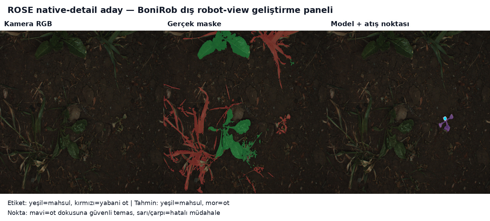
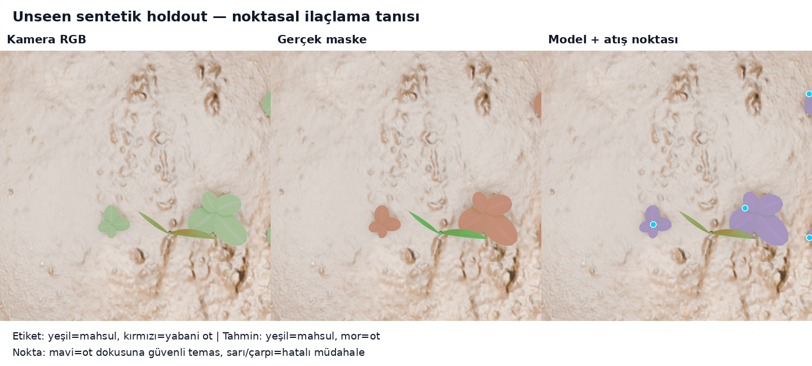

# Kontrollü spot-spray segmentasyon PoC'si — detaylı rapor

**Karar: Instance segmentation temeli korunur; mevcut model ile saha ateşlemesi NO-GO'dur.**

**Gerçek target-rig performansı henüz ölçülmedi.** PhenoBench tüketilmiş bir UAV kaynak/geliştirme paneli; BoniRob sabit eşikli, daha önce tüketilmiş tek tarla/session dış robot-view geliştirme panelidir. İkisi de önerilen hood, strobe, optik ve GSD düzeninin saha kanıtı değildir.

En önemli bulgu, küçük obje çözünürlüğünün tek darboğaz olmadığıdır. Seçilen model PhenoBench ≥82 px görünümünde P/R/F1 `0.8198/0.6980/0.7540` verirken, aynı kilitli eşiklerle BoniRob'da `0.2018/0.0576/0.0896` seviyesine düştü. Öncelik sırası domain uyumu, kontrollü optik/ışık ve temporal safety'dir.

## 1. Gerçek saha başarı sözleşmesi

Spot spray için ana metrik mIoU değil, uygun bir weed track'inde güvenli atış kararıdır:

- track action precision `≥0.98`; recall `≥0.95`; F1 `≥0.965`;
- crop-hit / attempted action `≤0.005`; duplicate shot `≤0.01`;
- her tarla ve worst-field ayrı rapor;
- sentetik skorun gerçek GO kararındaki ağırlığı `0`.

Bu gate geçse bile nozzle deposition, weed kill ve crop injury ayrı fiziksel deneydir.

Gösterilen P/R/F1 değerleri **tek-kare connected-region aksiyon proxy'sidir**; segmentation IoU, botanik-instance veya track metriği değildir. `≥82 px`, native 1024 rasterda `sqrt(exact GT weed bounding-box area)` tanımıdır; weed çapı veya fiziksel mm değildir. `Crop hit`, crop'a çarpan atış denemelerinin tüm atış denemelerine oranıdır. Gelecekteki `0,965` GO F1 ise ayrı bir track-level ölçümdür ve bu frame-level F1 değerleriyle doğrudan kıyaslanmaz.

## 2. Pre-real model-ceiling seçimi

Aynı başlangıç checkpoint'i, 1.487 örnek/epoch, 8 epoch, 1024 px, batch 3 ve seed 41 korundu. Tek fark, önceki adayın 80 V12 sentetik train karosu yerine 80 benzersiz native 1024×1024 ROSE robot-view train crop'u görmesidir.

| Panel | Model | Precision | Recall | F1 | Crop hit |
|---|---|---:|---:|---:|---:|
| PhenoBench | Önceki V12 | 0.8239 | 0.6485 | 0.7258 | 0.1132 |
| PhenoBench | Seçilen ROSE-native | 0.8198 | 0.6980 | 0.7540 | 0.1047 |
| BoniRob | Önceki V12 | 0.1376 | 0.0333 | 0.0536 | 0.1217 |
| BoniRob | Seçilen ROSE-native | 0.2018 | 0.0576 | 0.0896 | 0.1031 |

PhenoBench F1 farkı `+0.0282`; paired bootstrap medyanı `+0.0281`, %95 aralığı `[-0.0136, +0.0710]`. Aralık sıfırı keser. BoniRob F1 artışı yönsel olarak daha büyüktür fakat panel tüketilmiş tek session'dır. Seçilen model fixed-real eşikte V12 sentetik testte `0.0000` F1 ve sıfır atış verdi. Sentetik ağırlık `0`; spray kararı NO-GO olarak değişmedi.

## 3. Adil gerçek-tekrarı / gerçek+sentetik A/B (önceki aşama)

İki kol aynı başlangıç checkpoint'inden başladı, aynı 1.407 gerçek train karesini gördü ve epoch başına 1.487 örnek aldı. Kontrol 80 gerçek kareyi deterministik tekrar etti; aday bunun yerine 80 V12 sentetik train karesi gördü. İki kol 8 epoch, 1024 px ve seed 41 ile çalıştı.

| Model | Precision | Recall | F1 | Crop hit |
|---|---:|---:|---:|---:|
| Başlangıç e50 | 0.8542 | 0.6089 | 0.7110 | 0.0903 |
| Kontrol: gerçek tekrarı | 0.8170 | 0.6188 | 0.7042 | 0.1438 |
| Aday: gerçek + sentetik | 0.8239 | 0.6485 | 0.7258 | 0.1132 |

Aday–kontrol F1 farkı `+0.0215`. Paired bootstrap medyanı `+0.0215`, %95 aralığı `[-0.0202, +0.0642]`; adayın daha iyi olma olasılığı `0.854`. Aralık sıfırı kestiği ve tek seed olduğu için bu kesin kazanç değil, olumlu yön sinyalidir.

Ultralytics `val:false` talebine rağmen her iki kolda aynı otomatik final-validation raporunu çalıştırdı. Bu rapor gradientlere girmedi, sabit `last.pt` checkpoint'ini seçmedi ve test verisini okumadı. Tarihsel receipt'teki `real_val_test_not_touched` ifadesi validation için fazla güçlüdür; A/B adilliği korunmuştur.

## 4. Boyut tek açıklama değil

Boyut `sqrt(exact GT weed bounding-box area)` olarak native 1024 rasterda hesaplanır; fiziksel mm değildir.

| Alt boyut | Uygun weed | Precision | Recall | F1 | Crop hit |
|---:|---:|---:|---:|---:|---:|
| 0 px | 1754 | 0.8613 | 0.7081 | 0.7772 | 0.0340 |
| 28 px | 980 | 0.8701 | 0.7857 | 0.8257 | 0.0452 |
| 42 px | 625 | 0.8825 | 0.7568 | 0.8148 | 0.0485 |
| 56 px | 409 | 0.9069 | 0.7384 | 0.8140 | 0.0541 |
| 82 px | 202 | 0.8198 | 0.6980 | 0.7540 | 0.1047 |

≥82 px grubu daha iyi değildir; yalnız 202 örnektir ve crop'a yakın/karmaşık büyük otları da içerir. Optik ayrıntı gereklidir fakat domain ve crop–weed ayrımı aynı derecede kritiktir.

## 5. BoniRob dış robot-view geliştirme paneli

BoniRob paneli 283 ardışık kare, tek tarla ve tek session'dan gelir ve daha önce geliştirme çalışmalarında tüketilmiştir. Deployment/final saha kanıtı değildir. PhenoBench'te kilitlenen eşiklere BoniRob tuning'i yapılmamıştır.

| Model | Precision | Recall | F1 | Crop hit | Toprak |
|---|---:|---:|---:|---:|---:|
| Başlangıç e50 | 0.2252 | 0.0640 | 0.0997 | 0.0541 | 0.7207 |
| Kontrol: gerçek tekrarı | 0.1577 | 0.0487 | 0.0744 | 0.0664 | 0.7759 |
| Aday: gerçek + sentetik | 0.1376 | 0.0333 | 0.0536 | 0.1217 | 0.7407 |
| Aday: gerçek + ROSE native | 0.2018 | 0.0576 | 0.0896 | 0.1031 | 0.6951 |

Seçilen modelin weed doku Dice/IoU değeri `0.1527/0.0827`. ≥82 px regionlarda action recall `0.0576`. Görseller ara sıra doğru weed temasını ve ayrı bir safety hatasını birlikte gösterir; toplam panel sonucu hâlâ ağır domain açığıdır.

## 6. V12 sentetik kalite ve unseen test

V12: `80/16/16` train/val/test karesi; rol seedleri ve asset/yüzey kaynakları ayrık. Poligon reconstruction IoU p05 `0.9728`; crop/weed yeşil-dominant oranları `0.9620/0.7958`.

İlk HSV paketi manuel kontrolde mavi/mor bitki ürettiği için reddedildi. Dönüşüm düzeltildi, yeşil-dominance regression testi eklendi ve paket yeniden üretildi. Final pakette bu hata yoktur.

Connected region botanik instance değildir; bazı prosedürel bitkiler basit ve ışık fiziksel radyometriye kalibre değildir. Bu yüzden sentetik skor gerçek model seçiminde kullanılmaz.

| Inference boyutu | Precision | Recall | F1 | Crop hit |
|---:|---:|---:|---:|---:|
| 512 | 0.7097 | 0.7857 | 0.7458 | 0.0968 |
| 768 | 0.6087 | 1.0000 | 0.7568 | 0.1304 |
| 1024 | 0.6579 | 0.8929 | 0.7576 | 0.0526 |
| 1152 | 0.7273 | 0.8571 | 0.7869 | 0.1212 |

1152 yazılım resize'ıdır ve yeni optik ayrıntı yaratmaz. Bu tablo önceki V12-destekli modelindir; seçilen ROSE-native aday fixed-real eşikte V12 ≥82 px testinde `0.0000` F1 verdi. Bu domain uzmanlaşması uyarısıdır.

## 7. Dondurulacak inference ortamı

- Basler `a2A2464-77ucPRO` 5 MP renkli global-shutter + fabrika IR-cut;
- Basler `C23-0824-5M-P` 8,06 mm lens, `f/5,6`, fokus/iris kilitli;
- merkezlenmiş native `2048×2048` ROI; `(200,0)` ofset; dijital resize yok;
- ölçülmüş `474–484 mm` FOV: GSD `0,231–0,236 mm/px`; 10 mm `≥42,3 px`, 20 mm `≥84,6 px`;
- `520–590 mm` ayarlı çalışma mesafesi; nominal `555,6 mm`;
- tek kamera, `15 Hz`, `170 µs` poz; 1,0 m/s'de analitik blur `0,719 px`;
- dört diffuse LED bölgesi, kamera ExposureActive ile `150 µs` strobe;
- `600×600 mm` mat hood, çift esnek etek/labirent ve değiştirilebilir eğik AR pencere;
- dört native 1024 core + gerçek komşu pikselden 64 px halo; dış 64 px no-fire/abstain;
- dünya koordinatında distance + mask-IoU tracking, 3/5 onay, crop veto, tek track/tek atış.

RTX 3090 halo benchmark'ında batch-4 p95 servis süresi `52,68 ms` oldu. Ölçülen model yolu preprocessing, forward pass, NMS, mask construction ve result transfer'ı kapsar. Tek kamera 15 Hz satırı p95 `%79,0` compute kullanımı ve `13,99 ms` compute-only artıkla geçer; 20 Hz `%105,4` ile geçmez. Kamera acquisition, tracking, scheduling, actuation ve spray fiziği dahil değildir. Bu zincirle 15 Hz E2E tekrar geçmeden baseline sistem düzeyinde kanıtlanmış sayılmaz. İkinci kamera aynı RTX 3090'a eklenmez; her yeni bay ayrı USB root ve bağımsız kanıtlı accelerator kapasitesi ister.

Baseline incremental BOM `3.115–6.545 USD`, `%15` contingency ile `3.582–7.527 USD`'dir; mevcut RTX 3090 yeniden kullanılır, vergi/kargo dahil değildir. Exact BOM, optik türetim ve A–F kabul kapıları [`CONTROLLED_CAPTURE_OPTIMIZATION_V2.md`](../../CONTROLLED_CAPTURE_OPTIMIZATION_V2.md) ile makine-okunur [`controlled_capture_optimization_v2.json`](../controlled_capture_optimization_v2.json) içindedir.

Kaynaklar: [Basler PRO teknik dokümanı](https://docs.baslerweb.com/a2a2464-77ucpro), [C23 lens teknik dokümanı](https://docs.baslerweb.com/c23-0824-5m-p), [Basler triggered acquisition](https://docs.baslerweb.com/triggered-image-acquisition), [FLIR challenger spec](https://softwareservices.flir.com/BFS-U3-51S5/latest/Model/spec.html), [polarizasyon](https://www.edmundoptics.com/knowledge-center/application-notes/imaging/machine-vision-filter-technology/).

## 8. Segmentasyon ve tracking kararı

Adil target-trained detection/segmentation kıyasındaki action sonucu segmentasyonu tercih ettirdi. Segmentasyon crop veto, nozzle footprint ve ileride lazer/mekanik için daha zengin geometri taşır. Detection'a dönmek domain uyumu sorununu çözmez.

Tracking geçici false-positive'leri ve duplicate atışı azaltabilir. Fakat BoniRob'taki `%5,8` recall sistematik sınıf kaçırmasıdır; tracking görünmeyen weed'i yaratamaz. Kazanç gerçek video track testiyle ölçülmeli, varsayılmamalıdır.

## 9. En etkili sonraki kanıt

1. Rig'i dokuz görüntü bölgesinde 10 mm ≥41 px, fokus/MTF, distortion ve ≤0,75 px blur gate'lerinden geçir.
2. Nozzle footprint, latency ve registration p95'i su-duyarlı kâğıt/fluorescent dye ile ölç; no-fire alanını sonra dondur.
3. Aynı donanımla en az 3 tarla ve 4 session topla. Etiket: crop/weed instance mask, track ID, partial/occlusion; metadata: poz, gain, mesafe, crop evresi, weed mm.
4. Split'i field + session + video track seviyesinde yap; komşu kare sızıntısını engelle.
5. Mevcut modeli crop-yakın hard-negative, ıslak/kuru toprak, gölge ve büyüme evresi dengesiyle fine-tune et.
6. Ayrı session testinde tek-kare ve track-action P/R/F1, crop-hit, duplicate ve worst-field değerlerini raporla.
7. Kontrollü RGB tavanı kalırsa daha büyük backbone veya NIR/red-edge A/B aç.

## 10. Rakip ceiling'i

[Ecorobotix ARA](https://ecorobotix.com/crop-care/ara-620-uhp-sprayer/) gündüz/gece, alt koruyucu örtü ve RGB+3D modüller kullanıyor. [Greeneye](https://greeneye.ag/trials/) vendor deneyinde %95,7 weed detection; [Bilberry](https://bilberry.io/faq/) >5 cm weed için >%90 hit bildiriyor. [Verdant](https://www.verdantrobotics.com/faqs) yüksek çözünürlük, spatial tracking ve hareket telafisini vurguluyor. Payda, action F1, crop-hit ve güven aralığı aynı olmadığı için bunlar bizim gate ile bire bir kıyas değildir; kontrollü görüntüleme + temporal konumlamanın doğru ticari desen olduğunu destekler.

## 11. Son karar

Mevcut model saha için yeterli değildir. Segmentasyon temeli, compute kapasitesi ve sentetik pipeline kullanılabilir durumdadır. Eksik olan temel parça, tasarlanan kontrollü kamerayla aynı dağılımdan gelen gerçek crop/weed track verisidir. En yüksek getirili adım yeni model aramak değil, rig + pilot gerçek veri A/B'sidir.

Tam değerler ve SHA-256 makbuzları [`metrics_summary.json`](metrics_summary.json) içindedir.
